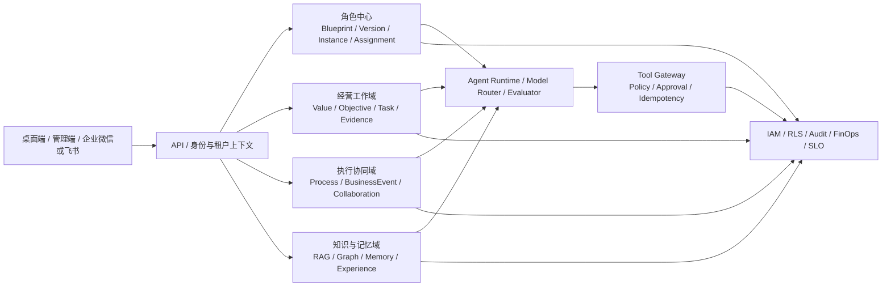

# BMS-AI V2.0 实施计划与需求追踪基线

> 状态：后续 P0 代码与本地自动化门禁通过；新增迁移的隔离数据库复验待数据库服务恢复，Electron UAT 与外部联网验收待完成，企业生产为 No-Go
> 基线日期：2026-07-29
> 需求来源：`企业协同智能系统_技术需求与实现方案_修订增强版.docx`（V2.0）
> 适用仓库：`enterprise-intelligent-agent`

## 0. 当前不可用功能修复版

前一候选版已经完成开发 CSP/空态、审计 Actor/ACL、Outbox delivery、SSE、可信 Token
证据等修复，并在全新隔离数据库完成迁移、Seed、PostgreSQL、备份恢复和只读治理演练。
本次后续 P0 又补齐流程实例对终态 Task 的推进保护、知识候选图谱/治理快照与精确候选预览、
Outbox 精确消费者及 `FACT_ONLY` 前缀目录、密码恢复加密持久投递、Trace/Metric 独立 stale
门禁，以及供应商 `terminal_only` 展示。当前目录共有 91 个 migration；新增迁移尚未在
隔离数据库部署，因为本机 `127.0.0.1:55433` 无 PostgreSQL 监听且 Docker backend 调用超时。
为遵守不中断开发服务的约束，本轮没有重启 Docker 或现有 API。

管理端 dev `4274` 已登录并巡检 overview、knowledge、agents、organization，preview `4273`
已打开且控制台无 CSP 错误；这份浏览器证据来自前一候选版。Electron 交互 UAT 尚未完成，
因此不得把管理端基础巡检扩大为“当前增量客户端验收通过”。

当前发布口径：

- 管理端只把智能体 `ONLINE` 枚举显示为“配置已启用”，不把它当作模型供应商在线；
- 飞书未配置时显示“未配置/同步不可用”，绑定验证不等于同步成功；曾暴露的 Secret
  必须先在飞书后台轮换，系统不从聊天或历史内容复用；
- Manus 没有真实 delta 时只显示 `terminal_only`，不能拆分终态文本伪造流式；
- 非空指定模型向量、真实 Reranker 和企业问题集未通过时，只能显示“语义未就绪/词法降级”，
  不能标记 `HYBRID` 或企业生产可用；
- 企业 IdP、邮件、对象存储、OCR、OTLP/SIEM 等未联网验收时统一保持“未配置/不可用/证据不足”；
- 存量治理必须先运行隔离恢复库只读 dry-run；本轮演练确认事务只读且未执行任何 mutation，
  但不能据此授权对源环境直接 Apply。

### 0.1 基线证据与当前增量门禁

- 前一候选版在全新隔离数据库 `enterprise_agent_defect_fix_final_20260729_1140` 从零部署
  87 个 migration，Seed 连续执行两次成功；这是历史基线证据，不覆盖当前新增的 4 个
  migration；
- PostgreSQL 集成门禁 154/154 通过，覆盖 RLS、ACL、外键、认证、会话、Agent Run、
  Outbox delivery、知识入库、流程、图谱和 FinOps；
- 当前 JavaScript/TypeScript 共 1738 项通过：Contracts 179、Admin 151、Desktop 164、
  API 1244；AI Runtime 246 项通过；语义验收 27/27 通过；
- 当前 Typecheck、Lint、Prettier、生产构建和 Prisma validate 全部通过；17 个基础设施
  脚本测试全部通过，其中恢复 SQL 门禁 777 项、PostgreSQL 客户端门禁 100 项；
- 常规 Prisma generate 已生成新客户端代码，但在替换被运行中 API 占用的
  `query_engine-windows.dll.node` 时收到 Windows `EPERM`；本轮没有为清除文件锁而停止服务；
- 独立验收服务已启动在 API `3300`、管理端 preview `4273`、管理端 dev `4274` 和
  AI Runtime `8200`；原有 `3000/4173/8100` 服务未停止、未重启、未修改；
- 管理端 dev `4274` 已登录并巡检 overview、knowledge、agents、organization；preview
  `4273` 已打开且控制台无 CSP 错误；Electron 交互 UAT 仍待完成；
- 两个受保护验收库 `enterprise_agent_acceptance` 与
  `enterprise_agent_vector_acceptance` 均未访问或修改。

### 0.2 备份、恢复与无损治理证据

- 本轮备份 SHA-256 为
  `211fe10add482c7cc6f033c5cdb2b4dbe3e57acd8a71b55dbfbf8c7a6a99e1e7`；
- 两次隔离恢复均为 `restore-verified`，ACL、RLS、外键、角色权限和用量约束等 34/34
  项恢复检查全部通过；
- 只读治理演练返回 `read-only-dry-run-complete`，数据库事务为只读，
  `mutationsPerformed=0`、`historyDeleted=false`；
- 演练只证明当前恢复样本可安全评估，不证明生产异地恢复、PITR、真实业务存量修复或
  故障切换已完成。

### 0.3 仍阻断企业生产的边界

1. 当前 91 个 migration 尚未在新的隔离数据库顺序部署；数据库集成、RLS/ACL、备份恢复
   必须在 `55433` 数据库服务恢复后重跑。前一版 87 个 migration 的证据不能替代本次复验。
2. 管理端浏览器基础巡检已完成，但当前增量的浏览器回归和 Electron 交互 UAT尚未完成。
3. 真实 Manus 增量流和逐 Run Token、Embedding、Reranker、飞书、企业 IdP、邮件、
   对象存储、OCR、OTLP/SIEM 均未完成联网验收。
4. 非空真实向量、企业问题集、权限化引用、Rerank 效果、容量和延迟仍无生产证据。
5. 异地恢复、PITR、生产故障切换、高可用、红队、性能、长稳和签名桌面端自动更新尚未验收。

因此本轮当前结论是：**后续 P0 代码和本地自动化通过；当前新增迁移的数据库复验、Electron
客户端和外部能力未验收，企业生产保持 No-Go。**

## 1. 实施目标

本计划把新版方案转化为可开发、可测试、可审计、可回滚的工程批次。最终必须跑通：

`价值 → 战略 → 目标 → 任务 → 流程 → 协同 → 成果 → 指标 → 复盘 → 经验`

员工侧必须形成：

`有效角色任命 → Role-Agent 工作台 → 权限化检索 → 计划/协同/工具 → 证据交付 → 纠偏反馈`

这里的“完整实现”不以页面数量或 CRUD 数量判断，而以下列结果判断：

1. 文档中的每个需求编号都有代码、数据模型、测试和验收证据。
2. 关键业务对象是关系数据库中的版本化主数据，不能只存在于 Prompt、向量库或临时上下文中。
3. 所有敏感读取和执行同时受租户、员工、角色任命、组织/项目、数据标签、任务上下文和动作风险约束。
4. AI 输出、引用、工具调用、审批、成本和反馈可追溯到不可变运行快照。
5. 未达到安全、AI 质量、SLO 和灾备门槛的能力不能标记为“在线”或“已发布”。

## 2. 范围与边界

### 2.1 MVP 范围

遵循需求文档的单闭环策略：

- 1 个客户价值场景；
- 1 个战略目标；
- 1 条端到端流程；
- 3～5 个角色；
- 1 个试点组织；
- 验证目标、任务、流程、协同、纠偏、成果、成本和经验的完整闭环。

建议试点采用“企业客户 AI 项目交付”：

`需求确认 → 方案 → 计划 → 研发 → 验收 → 复盘`

首批角色为客户经理、解决方案经理、项目经理、AI 研发工程师和交付工程师。

### 2.2 首期明确不做

- 不替换 ERP、CRM、HRIS、OA、财务和现有 BPM；
- 不允许 AI 独立作出预算、合同、人事或客户权益等高风险决策；
- 不一次性覆盖所有岗位和全部六大管理系统；
- 不以 Token 使用量直接评价员工绩效；
- 不让模型或 Agent Runtime 成为流程状态、任命、目标和预算的权威数据源。

## 3. 架构落位

### 3.1 现有 Agent 表的兼容映射

为保护历史会话、Agent Run 和已发布配置，首期不破坏性重命名现有表：

| 新版领域概念        | 当前物理模型       | 实施方式                                                             |
| ------------------- | ------------------ | -------------------------------------------------------------------- |
| Role Blueprint      | `agent_templates`  | 增加领域外观与结构化角色定义；不再把 Blueprint 等同于 Prompt         |
| Role Version        | `agent_versions`   | 复用 `DRAFT/TESTING/PUBLISHED/RETIRED`，补评审、差异、灰度和影响分析 |
| Role-Agent Instance | `agent_instances`  | 复用运行实例，固化版本与配置快照                                     |
| Role Assignment     | `role_assignments` | 新增正式任命模型，承载人员、任期、范围、来源、代理/交接和回收        |
| Agent execution     | `agent_runs`       | 继续承载模型运行；后续关联业务任务、流程步骤和不可变执行快照         |

任何新领域表都必须采用：

- `tenant_id`；
- 租户复合候选键与复合外键；
- `ENABLE/FORCE ROW LEVEL SECURITY`；
- 精确 ACL；
- 审计和 Outbox；
- 乐观并发或状态机 CAS；
- 备份恢复门禁；
- 跨租户负向集成测试。

## 4. 现状与差距矩阵

| 能力域             | 当前工程状态            | 已形成的代码闭环                                                           | 仍未关闭的验收边界                                                   | 优先级 |
| ------------------ | ----------------------- | -------------------------------------------------------------------------- | -------------------------------------------------------------------- | ------ |
| 多租户与数据库安全 | 仓库门禁通过            | 复合租户外键、FORCE RLS、职责 ACL、恢复门禁和负向测试                      | 历史生产库升级、目标环境恢复与安全签字                               | P0     |
| 认证与企业身份     | 仓库门禁通过 + 外部验收 | 邀请/找回/限速、MFA、设备/Refresh Family、OIDC/SAML/SCIM 管理面            | 生产邮件 Outbox、真实 IdP 签名/元数据/SCIM 兼容和密钥运维            | P0/P1  |
| 组织与飞书目录     | 仓库门禁通过 + 外部验收 | 组织/成员/雇佣、用户绑定、加密凭据、权限探测、预览/增量同步和失败诊断      | 真实企业飞书凭据、目录变化/离职回收和生产网络验收                    | P0/P1  |
| Agent 配置与运行   | 仓库门禁通过 + 外部验收 | Blueprint/Version/Instance、发布评审、Run 快照、流式事件、取消/重试/对账   | 增量流式、真实供应商故障/停止语义、长时稳定和账单核对                | P0     |
| 角色任命与授权     | 仓库门禁通过 + 人工 UAT | 多人/多角色、有效期、临时/代理/交接、生命周期 Worker、默认拒绝统一授权     | 目标客户端撤销时延和真实业务任命工作台                               | P0     |
| 企业语义主链       | 仓库门禁通过 + 业务签字 | Value、Strategy、Objective、Metric、Task、Deliverable、Evidence 版本化主链 | 目标客户端业务闭环和业务 Owner 数据签字                              | P0/P1  |
| 流程与业务事件     | 仓库门禁通过            | 流程定义/实例/步骤、正式 BusinessEvent、SLA、补偿、DLQ 和人工重放          | 真实业务流量、运行时 SLA 与人工重放 UAT                              | P0     |
| Agent 协同与纠偏   | 仓库门禁通过 + 人工 UAT | 结构化 Request/Commit/Deliver/Accept/Reject/Escalate/Cancel 和反馈复核     | 桌面真实任务协作 UAT、业务停止条件和质量评估                         | P0     |
| Tool Gateway       | 仓库门禁通过 + 外部验收 | Registry、Schema、组合身份、风险策略、审批、dry-run、幂等、对账和补偿      | 生产业务适配器、出站网络、外部失败补偿和高风险审批 UAT               | P0     |
| 知识入库与 RAG     | 仓库门禁通过 + 外部阻断 | 文件/网页版本、异步摄取、切片、权限前置混合检索、引用、复核和降级          | 生产存储/解析/OCR、非空真实 Embedding/Reranker、企业问题集和容量门禁 |
| 知识图谱           | 仓库门禁通过 + 人工 UAT | 实体/提及/关系/证据、本体/谓词、合并、时态、冲突和人工校正治理             | 管理端真实冲突校正与业务 Owner 签字                                  | P1     |
| 分层记忆           | 仓库门禁通过 + 人工 UAT | 企业/角色/员工/任务/会话记忆、用途授权、TTL、纠正、删除、封存和交接        | 目标客户端撤销后访问回收和跨用户/跨任务人工负向 UAT                  | P0     |
| 经验蒸馏           | 仓库门禁通过 + 人工 UAT | 候选、脱敏、结构化、专家审核、验证、发布、知识投影、回放和退休             | 真实专家审核、员工端使用和回滚 UAT                                   | P0     |
| AI 评测            | 仓库门禁通过 + 业务签字 | 数据集/版本、运行、指标、证明、发布阻断及回答/纠偏坏例回流                 | 真实企业评测集阈值和业务/安全共同签字                                | P0     |
| 配额与 FinOps      | 仓库门禁通过 + 外部验收 | 预留/结算、价格/预算、成本分摊、收益/ROI、预警、路由建议和独立成本复核     | 供应商账单、可信 Token 回执和人工成本凭证核对                        | P0/P1  |
| 运维与审计治理     | 仓库门禁通过 + 外部验收 | 健康/readiness、Trace/指标、哈希链审计、受控导出、备份恢复脚本和核心探针   | 清理 Outbox/用量告警；生产 OTLP/SIEM、异地/PITR、HA 与灾备演练       | P0/P1  |

## 5. 分批实施路线

### 5.1 P0：试点 No-Go 阻断项

#### 批次 P0-1：角色中心与统一授权

范围：

- Role Blueprint 结构化定义；
- Blueprint 评审与版本发布；
- Role-Agent Instance；
- Role Assignment 创建、有效期、撤销；
- 一人多角色、一角色多人；
- 临时任命、代理和交接；
- 统一 `AuthorizationDecision`，采用默认拒绝；
- 角色工作台展示当前角色、职责、权限、范围、版本和任期。

退出条件：

- 任命生效后 5 分钟内可使用对应 Role-Agent；
- 撤销后权限和员工私有记忆访问立即失效；
- 角色不能自我提权；
- 跨租户、跨组织、过期任命和未发布版本全部被拒绝；
- 历史运行仍可复现当时的版本与配置。

对应需求：RA-001、RA-002、RA-003、RA-004、RA-009、RA-011。

#### 批次 P0-2：企业语义主链

范围：

- ValueDefinition / ValueVersion / ValueMetric / ValueConstraint；
- Strategy / Objective / ObjectiveRelation；
- 最小 MetricDefinition / MetricObservation；
- Task / TaskDependency / Deliverable / Acceptance；
- Evidence / EvidenceLink；
- 目标树、任务工作台和全链追溯 API；
- 关键对象唯一编码、Owner、版本、生效期和权限标签。

退出条件：

- 关键任务 100% 关联有效目标、价值和流程；
- 目标可追溯上级目标、战略、价值项和责任角色；
- 交付物、验收结果和关键判断具有版本化证据；
- 向量库不可用时结构化主链仍正常工作。

对应需求：RA-005、VAL-001、STR-001、STR-002。

#### 批次 P0-3：流程、事件与结构化协同

范围：

- ProcessDefinition / ProcessVersion / ProcessNode；
- ProcessInstance / StepInstance；
- 首版支持串行、条件、人工审批、Agent 执行、暂停/恢复、超时和补偿；
- 正式 BusinessEvent 信封；
- `eventType/schemaVersion/aggregate/idempotencyKey/correlationId/causationId`；
- 协同状态机：Request、Commit、Deliver、Accept、Reject、Escalate、Cancel；
- Outbox lease、消费者去重、指数退避、DLQ 和人工重放。

数据库授权边界：

- 数据库负责租户 RLS、任命/雇佣/组织单元/角色版本有效性、权限标签覆盖、不可变任命快照、任务与业务对象同租户关联，以及命令/消息/反馈账本对聚合状态的完整回放；
- `organizationScope` 和动作词汇仍是版本化 JSON 契约，数据库不猜测其业务含义。应用授权层必须先对单一可信 grant 完成组织、任务和动作检查，之后才允许进入 `enterprise_agent_process` 能力角色事务；
- DLQ 人工重放的操作者身份由 API 授权结果、不可变 Actor 快照、Audit 与 BusinessEvent 同事务留痕；数据库继续强制租户、外键、版本 CAS、重放次数和状态转换。

退出条件：

- 流程引擎是正式状态权威；
- 人员变化后新任务按当前有效任命正确路由；
- 相同幂等键只产生一次业务副作用；
- 流程状态、业务事件、审计与 Outbox 在同一事务边界；
- 正常、超时、退回、转办、并发、补偿和恢复测试通过。

对应需求：RA-006、RA-007、PRO-001、PRO-002。

#### 批次 P0-4：Agent Runtime 与 Tool Gateway

范围：

- Run 状态机 CAS、幂等生成、停止、超时、有限重试和断线恢复；
- 保存 Role/Prompt/Model/Knowledge/Tool/Policy 版本快照；
- Tool Registry 与唯一 Tool Gateway；
- 员工＋角色任命组合身份；
- JSON Schema、参数边界、租户白名单、出站域名白名单和 SSRF 防护；
- 只读、草稿、确认后执行、高风险审批四级动作；
- dry-run、幂等、超时、熔断、补偿、执行回执；
- 申请/审批/执行/验收职责分离。

退出条件：

- 工具成功率不低于 99%（不含外部系统故障）；
- 高风险未确认执行数为 0；
- 断线重连不重复生成或执行工具；
- 每次执行可查到调用者、任命、工具版本、参数摘要、审批人、结果、耗时和成本。
- 工具回执必须区分缺失计量与已证实零费用；缺失计量只能由已批准、已生效且带版本哈希的
  价格快照结算，不能以 `0` 冒充供应商回执。

对应需求：RA-008、RA-011。

#### 批次 P0-5：企业知识、分层记忆与经验蒸馏

范围：

- PDF、Word、Excel、网页和扫描件的受控解析；
- OCR、复杂表格、解析质量评分和人工失败处置；
- 真实 Embedding、关键词＋向量混合检索、Reranker；
- 召回前权限过滤、生成后敏感检查、无证据拒答；
- 文档/版本/切片级引用；
- 企业、角色、员工、任务和会话五层记忆；
- 记忆候选确认、来源、TTL、纠正、删除、封存和交接策略；
- 经验候选、脱敏、专家审核、发布、回放、复用和回滚。

退出条件：

- 同义改写和跨文档关系问题达到企业问题集门槛；
- 越权切片和个人记忆泄露为 0；
- 关键回答引用完整率 100%；
- 未经审核的经验不得进入生产知识域；
- 任命撤销后个人记忆不转移给继任者。

对应需求：RA-004、RA-009、RA-010、RA-011。

#### 批次 P0-6：员工工作台与一个完整连接器

范围：

- 我的角色、目标、任务、协同、纠偏、成长、经验和 AI 用量；
- 生成中、停止、重试、引用原文、反馈和网络恢复；
- 选择企业微信或飞书完成一个生产级连接器；
- 绑定、凭据加密、权限检查、同步预览、增量游标、幂等、重试、死信、字段映射和来源追踪；
- 组织变更和离职触发任命与权限回收。

退出条件：

- 员工可从角色工作台完成一条真实任务，而非只聊天；
- 凭据永不回显；
- 重复同步不重复创建数据；
- 删除、改名、调岗和失败记录均有明确策略与单条诊断；
- 连接器故障时不影响结构化任务和已有知识读取。

#### 批次 P0-7：评测、SLO、安全与试点 UAT

范围：

- 版本化 AI 评测集、人工标注、坏例回流；
- 角色、事实、引用、目标关联、工具、纠偏、拒答、安全和成本评测；
- 邀请邮件成功后管理端不得再次获得原始令牌或链接；人工交付仅作为短 TTL、一次性、已审计
  的显式回退路径。
- 结构化日志、Correlation ID、Run/Outbox/Tool/RAG 指标；
- 模型、Embedding、Reranker 独立熔断和明确降级；
- 自动备份、加密异地保留、PITR、RPO/RTO 演练；
- 邀请、密码找回、登录限速；
- 权限矩阵测试、红队、性能、灾备和业务 UAT。

退出条件见第 7 节总门禁。任何一项不通过，MVP 保持 No-Go。

### 5.2 P1：多角色协同与管理深化

下列能力中的营销、人力/组织、知识图谱、FinOps、企业身份、审计和管理总览已经提前形成
首版代码闭环，但仍按 P1 的规模化目标继续治理，不能因存在页面或 API 而视为生产完成：

- 战略、营销、流程、人力、组织和财经模块深化；
- BLM/BEM、BSC 因果指标和五看洞察审核；
- 产品×区域/客户目标矩阵；
- 铁三角共同目标与健康度；
- 知识本体、谓词、实体合并、时态和冲突治理；
- 模型价格快照、部门/项目成本分摊和收益归因；
- MFA、OIDC/SAML、SCIM、设备与登录会话；
- 审计查询导出、SIEM、不可篡改摘要链；
- OpenTelemetry、租户诊断、错误预算看板；
- 多连接器 SDK 和连接器运营后台。

对应需求：MKT-001、MKT-002、HR-001、ORG-001、FIN-001，以及 P0 能力的规模化治理。

### 5.3 P2：企业级规模化

- 全员角色覆盖和跨组织角色市场；
- 多流程编排和复杂补偿；
- 灰度、A/B、跨模型路由和自动质量回归；
- 多可用区、高可用和灾备；
- 数据保留、法务留存、合规导出；
- 完整价值归因、预算和 AI FinOps；
- 平台化工具生态与供应商退出方案。

## 6. 需求编号追踪

| 需求    | 实施批次         | 主要验收证据                           |
| ------- | ---------------- | -------------------------------------- |
| RA-001  | P0-1             | 角色版本差异、评审、发布、回滚         |
| RA-002  | P0-1             | 多角色/多人/临时/代理隔离测试          |
| RA-003  | P0-1             | 任命到工作台的端到端时延               |
| RA-004  | P0-1、P0-5       | 组合授权与知识泄露负向集               |
| RA-005  | P0-2             | Task→Objective→Value→Process 完整率    |
| RA-006  | P0-3             | 协同消息 Schema、CorrelationId、状态机 |
| RA-007  | P0-3             | 事件、依据、影响、建议、反馈闭环       |
| RA-008  | P0-4             | 风险分级、审批、禁止动作测试           |
| RA-009  | P0-1、P0-5       | 五层记忆及撤销后访问回收               |
| RA-010  | P0-5             | 经验候选到审核发布回滚                 |
| RA-011  | P0-1、P0-4、P0-5 | 运行版本快照与历史复现                 |
| RA-012  | P0-5、P0-7       | 反馈、复核和评测集回流                 |
| VAL-001 | P0-2             | 有效价值版本可被角色/目标/成果引用     |
| STR-001 | P0-2             | 战略、目标、关键任务、指标、预算关系   |
| STR-002 | P0-2/P1          | BSC 四维与领先/滞后关系                |
| MKT-001 | P1               | 事实、假设、证据与洞察审核             |
| MKT-002 | P1               | 产品×区域/客户目标分解                 |
| PRO-001 | P0-3             | 版本化流程、SLA、异常、补偿            |
| PRO-002 | P0-3             | 运行时解析有效任命                     |
| HR-001  | P1               | 能力等级、行为锚点、证据和人工复核     |
| ORG-001 | P1               | 铁三角共同目标、角色和健康度           |
| FIN-001 | P1               | 人/Agent 成本、成果与价值归因          |

## 7. 总验收门禁

### 7.1 功能与数据门禁

- 全部迁移可在空库顺序部署；
- 历史库升级无数据丢失；
- 关键状态机覆盖正常、并发、超时、取消、重试、补偿和恢复；
- 每个关键业务关系可追溯且受数据库约束；
- API、事件和 Schema 有兼容版本策略。

### 7.2 权限与安全门禁

- 未授权数据访问为 0；
- 跨租户直接 SQL 读取为 0；
- 知识和记忆在召回前完成权限过滤；
- 角色不能自我提权；
- 高风险动作未经另一审批人不得执行；
- Prompt 注入、恶意文件、SSRF、敏感信息和自主循环红队通过；
- 密钥只存在于服务端加密存储或 KMS，不写入前端、日志、Prompt 和仓库。

### 7.3 AI 质量门禁

| 指标               | MVP 门槛 |
| ------------------ | -------- |
| 角色边界遵循率     | ≥98%     |
| 事实准确率         | ≥95%     |
| 关键回答引用完整率 | 100%     |
| 目标关联准确率     | ≥95%     |
| 纠偏精确率         | ≥80%     |
| 纠偏误报率         | ≤20%     |
| 工具调用成功率     | ≥99%     |
| 高风险动作确认率   | 100%     |
| 知识泄露           | 0        |

### 7.4 SLO 与灾备门禁

- 核心服务月度可用性目标 ≥99.9%；
- 普通问答 P95 ≤8 秒，结构化查询 P95 ≤3 秒；
- 关键业务事件进入规则检测 P95 ≤60 秒；
- 正式流程状态一致率 ≥99.9%；
- 核心配置 RPO ≤15 分钟、RTO ≤4 小时；
- 模型、向量、业务系统和事件积压各自有可观察的降级状态；
- 恢复演练验证 ACL、RLS、外键、审计、业务主链和关键计数。

## 8. 工程 Definition of Done

每个需求只有同时满足以下条件才可关闭：

1. 领域模型和状态机已评审；
2. 数据迁移、约束、复合外键、RLS 和 ACL 完成；
3. 契约、服务、管理端/员工端入口和错误反馈完成；
4. 审计、Outbox、幂等、并发和失败恢复完成；
5. 单元、契约、集成、RLS 负向、E2E 和恢复测试完成；
6. AI 类需求具有固定评测集和阈值；
7. 指标、日志、告警和运行手册完成；
8. 生产构建和格式检查通过；
9. 历史兼容与回滚方案完成；
10. 页面状态与真实后端能力一致，不展示虚假“在线”。

## 9. 当前执行进度

当前不是“功能已上线”，而是“各需求域已形成仓库内代码闭环，当前本地自动化通过；前一
候选版具有隔离恢复和管理端浏览器证据”。当前新增迁移的数据库复验、Electron UAT 和生产
外部验收仍未关闭。后续若任何 migration、回归、恢复或 UAT 失败，对应条目立即回退为
`实施中`；真实外部系统没有验收证据时始终保留 `外部验收`。

### P0-1：角色中心与统一授权——仓库门禁通过，人工 UAT 待完成

- Role Blueprint 已结构化使命、职责、价值、能力、流程、工具和知识域，版本具备差异、
  maker-checker、发布、退休和安全回滚；
- 任命支持多人/多角色、临时、代理和交接，并通过独立生命周期能力角色处理生效、过期、
  撤销和递归回收；
- 统一 `AuthorizationDecision` 默认拒绝，知识、图扩展、任务、工具和 Run 派发消费同一
  可信任命及 obligations；桌面端提供“我的角色”工作台；
- 最终空库、RLS/ACL 负向集和历史快照门禁已通过；目标 Electron 环境仍须验证实际撤销
  时延和交互。

### P0-2：企业语义主链——仓库门禁通过，业务签字待完成

- Value/Version/Metric/Constraint、Strategy、Objective/Relation、
  MetricDefinition/Observation、Task/Dependency、Deliverable/Acceptance 和
  Evidence/Link 已形成版本化关系主链；
- 管理端与桌面任务工作台提供结构化读写入口，关键对象带租户关系、Owner、编码、修订、
  生效期、范围、审计和 Outbox；
- 全新库约束复验已通过；仍须完成目标客户端端到端追溯和业务 Owner 对真实试点数据的
  签字。

### P0-3：流程、事件与结构化协同——代码门禁通过，新增迁移待数据库复验

- Process Definition/Version/Node、Instance/Step、SLA、人工/Agent 执行、暂停/恢复、
  超时、重试和补偿已经落库；
- BusinessEvent、Outbox/Inbox/DLQ、结构化协同与纠偏反馈具备幂等、CAS、Actor 快照、
  人工重放和审计；
- 最终完整性加固 migration 已合入；双向 JSON/关系一致性、有效任命解析、attempt/retry、
  非法状态转换、并发和恢复门禁已在前一候选版隔离库通过；当前新增的终态 Task 推进保护、
  Outbox 前缀目录和安全回填仍需实库复验。

### P0-4：Agent Runtime 与 Tool Gateway——仓库门禁通过 + 外部验收

- Run 固化 Assignment/Role/Prompt/Model/Knowledge/Tool/Policy 快照，支持事件游标、
  流式增量、断线续传、取消、重试、UNKNOWN 对账及可信使用量边界；
- Tool Registry/Gateway 实现 JSON Schema、组合身份、风险分级、dry-run、确认/审批、
  幂等、执行回执、UNKNOWN 对账和补偿；
- API、Runtime 和桌面桥接的模拟/契约链已通过自动化回归；真实 Manus 主链、逐 Token
  流式、真实故障/停止语义、生产工具适配器、出站网络及高风险审批 UAT 仍须联网验收。

### P0-5：企业知识、分层记忆与经验蒸馏——仓库门禁通过，语义 RAG 外部阻断

- 文件/网页异步摄取、解析复核、切片、版本发布/回滚、权限前置混合检索、Reranker、
  引用与显式词法降级已经形成链路；生产持久化知识写入受 Worker readiness 门禁保护；
- 知识图谱具备本体/谓词、实体合并、时态、冲突和人工校正；五层记忆、经验审核/投影/
  回放和回答坏例回流已经落库并提供管理/员工入口；
- 真实非空 Embedding/Reranker、企业问题集、生产对象存储/KMS/病毒扫描/解析/OCR、
  越权红队和大规模容量仍是试点阻断项。

### P0-6：员工工作台与飞书连接器——仓库门禁通过 + 人工/外部验收

- 桌面端已提供角色、目标/任务、协同/纠偏、工具、记忆、经验和 AI 用量入口，写操作使用
  幂等键、期望修订和服务端确认状态；
- 飞书实现用户绑定、AES-GCM 凭据、权限探测、全量/增量同步、差异预览、失败诊断及
  来源追踪；目录成员不再获得部署级共享密码，只能通过一次性邀请或 SSO 激活；
- 仍须以真实企业飞书应用验证权限、增量游标、改名/调岗/删除/离职回收和生产网络，
  并完成桌面浏览器/Electron 业务 UAT。

### P0-7：评测、SLO、安全与试点 UAT——代码门禁通过，数据库/生产验收未完成

- 版本化评测集、运行证明、发布阻断、坏例回流、模型路由、管理总览、OpenTelemetry、
  审计检索/导出/哈希链、备份恢复脚本和核心探针已经具备代码与定向回归；
- 身份治理、FinOps、知识图谱等提前实现的 P1 首版也必须和 P0 使用同一总门禁，不能按
  单个模块测试结果直接标记上线；
- 前一候选版 87 个 migration 已在新独立数据库完成顺序部署、重复 Seed、RLS/ACL/跨租户/
  并发/恢复检查；当前目录为 91 个 migration，新增部分尚待实库复验；
- 当前 JS/TS 1738、AI Runtime 246、语义验收 27/27 通过，Typecheck、Lint、格式、
  生产构建、Prisma validate 和 17 个基础设施脚本通过；
- 独立 API/Admin/Runtime 已在 `3300/4273/4274/8200` 启动；管理端 dev `4274`
  已登录并巡检 overview、knowledge、agents、organization，preview `4273` 已打开且
  控制台无 CSP 错误；Electron 交互 UAT 尚未完成；
- 真实模型/Embedding/Reranker、飞书、IdP、邮件、OTLP/SIEM/告警、异地加密备份/PITR、
  生产业务工具、红队、性能和业务签字必须分别留存外部证据。

当前代码自动化已经关闭；当前新增 migration 的隔离数据库/恢复复验、非空语义 RAG、
Electron 人工 UAT 和必需外部验收全部关闭前，V2 企业生产结论保持 **No-Go**。

## 10. 建议排期与团队并行

按照需求文档基线：

- 阶段 0 业务与数据准备：3～4 周；
- 阶段 1 MVP：8～12 周；
- 阶段 2 多角色协同：12～16 周；
- 阶段 3 管理系统深化：4～8 个月；
- 阶段 4 规模化：持续。

MVP 建议至少并行四条工作流：

1. 角色/经营/流程领域与 API；
2. Agent Runtime、RAG、记忆与评测；
3. 桌面端、管理端和连接器；
4. IAM、安全、SRE、数据与测试。

业务 Sponsor、角色负责人、流程 Owner、数据 Owner 和安全负责人必须参与阶段 0；若角色、目标、流程、数据源、权限矩阵和验收集未签字，工程实现不得以猜测替代业务定义。
