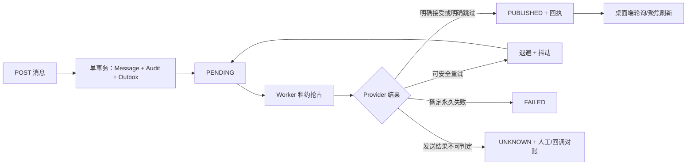

# ADR-0004：可靠 IM Outbox、腾讯云适配器与桌面同步

- 状态：Accepted
- 日期：2026-07-15
- 适用范围：`apps/api`、`apps/desktop`、PostgreSQL

## 背景

消息 API 已经能在同一数据库事务内写入权威消息账本、Audit 与 Outbox，但此前 Outbox 只停留在 `PENDING`，桌面端也只能依靠用户手动刷新。这会造成三个问题：API 返回成功后没有可验证的外部投递过程；多实例并发时缺少安全抢占与故障恢复；用户无法及时看到其他终端写入的新消息。

本决策把数据库消息账本继续定义为事实源，将腾讯云 IM 定义为可替换的传输通道。传输成功不能反向决定消息是否已经入账；传输失败也不能回滚已经提交的业务消息。

## 决策

### 1. 事件自包含

`message.created.v1` 在消息事务内固化以下数据：

- `messageId`、`conversationId`；
- 发送者 `type/id`；
- 当时仍活跃且排除发送者后的收件人 `type/id` 列表；
- 文本内容。

Worker 只读取 Outbox，不再读取 `messages`、`conversation_participants` 等业务表。这样既避免投递时参与者变化改变历史语义，也允许数据库把跨租户 Worker 的权限收窄到单张队列表。

### 2. 抢占、租约与并发

Worker 使用 `FOR UPDATE SKIP LOCKED` 按 `available_at/created_at/id` 有序批量领取事件，并在同一 SQL 中原子写入：

- `locked_by`、`locked_until`；
- `attempts = attempts + 1`；
- 首次领取时的 `first_attempted_at`。

只有仍持有相同 `locked_by` 的实例可以提交状态转换。进程崩溃后，其他实例可在 `locked_until` 到期后重领；旧实例的迟到更新返回 false，不会覆盖新租约持有者。

重试采用有上限的指数退避并加入抖动。租约 TTL 必须严格大于 Provider 总超时，避免一次仍在执行的请求被另一个实例提前领取。

### 3. 状态与回执

- `PENDING`：尚未最终确认，可能可领取或正在租约中。
- `PUBLISHED`：Provider 明确返回接受，或明确返回不适用于外部 IM 的跳过结果；必须同时写入 `published_at`、`provider_name`、`provider_receipt`。
- `FAILED`：请求校验、权限、包体或上游明确拒绝等确定性永久失败，或确定失败的重试已耗尽。
- `UNKNOWN`：请求可能已经到达上游，但因网络超时或无效响应无法确认，且已经不能继续安全重试。该状态不得自动重发，必须通过腾讯回调、上游消息标识或人工对账处理。

Provider 回执只保存经过白名单验证的结构化字段，不保存 Secret、UserSig、消息正文或未经清洗的上游响应。

### 4. Provider 边界

`ImDeliveryProvider` 接收稳定的 Outbox `event.id` 作为业务幂等键，同时接收当前 attempt、首次投递时间和 AbortSignal。

- `local`：仅用于开发/集成测试。真人收件人返回可审计的本地 accepted 回执；仅有 Agent 收件人时返回 `skipped/no_human_recipients`，不会声称已经发生云端投递。生产启用 Worker 时禁止选择该 Provider。
- `tencent`：只在服务端生成并缓存 UserSig；内部 UUID 经租户隔离的 SHA-256 映射为不超过 32 字节的稳定账号；`MsgSeq`、`MsgRandom` 和 URL random 从事件与收件人稳定派生；严格同时检查 HTTP、`ActionStatus` 和 `ErrorCode`；只允许配置腾讯官方 HTTPS 域名。

腾讯单聊去重键只有约 120 秒有效期。实现使用 110 秒安全窗口：积压事件的第一次投递仍可发送；只有已经尝试过且距离 `first_attempted_at` 超出窗口的事件才进入 `UNKNOWN`，不得盲目重发。

腾讯账号必须在正式发送前通过受控 provisioning 流程导入。账号不存在属于配置/预配失败，不由消息 Worker 无限自动创建账号。

### 5. 数据库角色与部署

新增 `enterprise_agent_outbox`：`NOLOGIN/NOSUPERUSER/NOCREATEDB/NOCREATEROLE/NOINHERIT/NOBYPASSRLS`。它只能：

- `SELECT outbox_events`；
- 更新状态机所需的指定列；
- 不能查询用户、消息、参与者、Audit 或 migration 元数据；
- 不能插入或删除 Outbox。

生产必须为 API 与 Worker 使用不同数据库用户名。API 连接只能切换到 `enterprise_agent_app`；Worker 连接只能切换到 `enterprise_agent_outbox`。API 部署应关闭 Worker 且不注入 `OUTBOX_DATABASE_URL`；独立 Worker 工作负载才持有该 Secret。当前代码允许开发时用同一 migration 登录配合 `SET LOCAL ROLE`，此行为不得复制到生产。

### 6. 桌面同步策略

在尚未接入腾讯客户端 SDK/WebSocket 前，桌面端以可控轮询形成近实时体验：

| 窗口状态    | 当前会话消息 | 会话列表 |
| ----------- | -----------: | -------: |
| 聚焦        |         2 秒 |    10 秒 |
| 可见但失焦  |        10 秒 |    30 秒 |
| 隐藏/最小化 |         暂停 |     暂停 |

窗口重新聚焦或网络恢复时立即刷新。后台刷新失败保留缓存并显示非阻断警告；首次加载失败仍展示完整错误。发送成功前取消同一会话的在途查询，避免旧响应短暂覆盖新消息。

## 结果

正向结果：

- API 成功、消息入账和外部传输三者语义被明确分离；
- 多 Worker 可水平扩展且能恢复崩溃租约；
- 每次最终状态都有数据库证据与安全回执；
- 桌面端无需手动刷新即可看到后端账本新增消息；
- 腾讯凭据不会进入 Electron 或 Renderer。

代价与后续：

- 当前轮询不是严格实时，多端在线状态、已读、撤回仍需腾讯客户端 SDK 或自建 WebSocket；
- `C2C.CallbackAfterSendMsg` 仍需持久化 Inbox、签名/时间窗校验和幂等约束后才能承担对账；
- 腾讯账号导入、回调控制台配置和真实凭据端到端验收仍是上线前置项；
- Agent 收件人只在 IM sink 中明确跳过，Agent Runtime 消费者和 Agent 回复入账属于独立事件消费链路。
