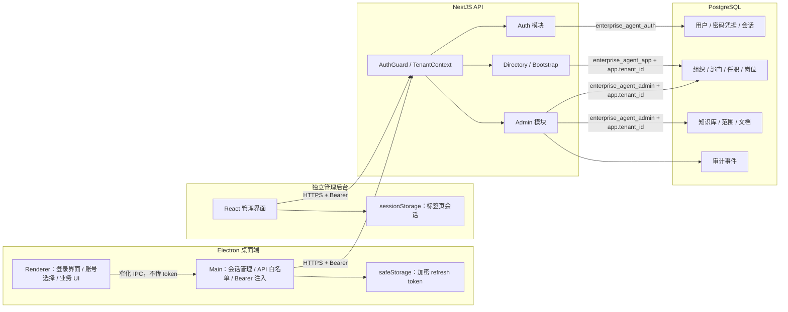

# ADR-0005：首方认证、动态组织管理与知识库治理闭环

- 状态：已接受并实现（MVP）
- 日期：2026-07-15
- 关联迁移：`20260715000600_auth_admin_knowledge`
- 关联应用：`apps/api`、`apps/desktop`、`apps/admin`、`packages/contracts`

## 1. 背景与问题

前一阶段已经具备真实 PostgreSQL 组织目录、Electron 通讯录、direct 会话、消息账本和可靠 IM Outbox，但存在三个直接影响产品可用性的问题：

1. 桌面端依赖开发身份，缺少登录、注册、退出和多账号切换；
2. 组织树虽然来自数据库，但没有管理入口和写接口，实际使用效果仍接近固定数据；
3. 没有独立管理后台，也没有可治理的企业知识库、文档版本和部门范围模型。

本决策为上述问题建立第一条可运行闭环。目标不是一次完成飞书级身份平台或 RAG 平台，而是先建立可信的账号、组织和知识元数据底座，后续能力必须在该底座上演进。

## 2. 决策摘要

采用以下实现：

- 在 NestJS API 中实现首方邮箱密码认证，使用不透明 access/refresh token 和服务端会话；
- “注册”语义限定为创建新企业，原子创建租户、组织、根部门、首位 `OWNER`、任职、凭据、会话和审计事件；
- 既有企业成员不开放公共自助加入，由 `OWNER` 或 `ADMIN` 在管理后台创建；
- Electron Main 负责登录、刷新、业务请求签名和多账号切换，Renderer 不接触 token；
- 新增独立 React/Vite 管理后台，维护组织、成员和知识库；
- 组织树由 PostgreSQL `org_units` 动态驱动，支持创建、改名、排序、移动和归档；
- 知识库先落地元数据、部门范围、文本/Markdown 内容、状态、版本、校验和与审计，不宣称已完成搜索或 RAG；
- 数据库新增独立 `enterprise_agent_auth` 与 `enterprise_agent_admin` 能力角色，继续使用 `FORCE RLS`、transaction-local 租户上下文和最小权限；
- 所有管理写操作与 `AuditEvent` 在同一数据库事务提交。

## 3. 已实现架构



桌面端和管理后台共享 `@enterprise/contracts` 的 Zod/TypeScript 契约。API 响应不包裹额外 `data` 字段，客户端在运行时校验响应，契约不匹配时明确失败。

## 4. 认证与会话

### 4.1 企业注册语义

`POST /api/v1/auth/register-tenant` 仅用于创建新企业。开启注册后，一个事务内完成：

1. 创建 `Tenant`；
2. 创建默认 `Organization`；
3. 创建同名根 `OrgUnit`；
4. 创建首位 `OWNER` 用户；
5. 写入 `PasswordCredential`；
6. 把所有者任职到根部门；
7. 创建 `AuthSession`；
8. 写入 `auth.tenant_registered` 审计事件。

任一步失败都会整体回滚。企业短地址 `tenantSlug` 全局唯一，登录时与邮箱共同定位账号。`REGISTRATION_MODE=disabled | open` 控制是否允许新企业注册；生产默认关闭，不应把开放注册当作成员邀请机制。

当前没有“通过企业码加入已有企业”的公共接口。已有企业的普通成员、管理员和知识管理员由管理后台创建并获得初始密码。

### 4.2 密码存储

密码使用 Node.js 内置 `scrypt`，编码中包含版本和参数：

- 版本：`v1`；
- `N=16384`、`r=8`、`p=1`；
- 16 字节随机盐；
- 64 字节派生密钥；
- 最大内存 64 MiB。

登录失败统一返回“企业、邮箱或密码错误”。找不到账号时仍验证固定 dummy hash，降低通过响应差异枚举账号的风险。数据库不保存明文密码。

当前已实现登录与密码恢复的全局网络桶、账号桶和枚举安全的忘记密码流程。验证码、MFA、邮件验证、密码历史、泄漏密码检测和企业密码策略仍是公网或正式生产开放前的必做项。

### 4.3 不透明 token 与服务端会话

登录和注册返回一对随机 token：

- access token：默认 15 分钟；
- refresh token：默认 30 天；
- 每个 token 使用 32 字节加密安全随机数；
- 数据库只存使用 `AUTH_TOKEN_PEPPER` 计算的 HMAC-SHA-256，不存 token 明文；
- refresh 时同时轮换 access/refresh token，保持同一个 `sessionId`；
- access 鉴权会检查会话未吊销、未过期、租户有效、用户有效，并读取用户当前角色；
- 退出登录写入 `revokedAt`；
- 管理员把成员改为 `INACTIVE` 或 `LOCKED` 时，同一事务吊销该成员全部未吊销会话。

密码恢复的一次性 token 同样只以 HMAC 形式参与认证校验。为避免 API 在邮件供应商调用前崩溃造成永久 `PENDING`，恢复通知另外写入受限、租约化的加密投递信封：信封只允许恢复投递 Worker 读取，达到终态或过期后立即清除密文和密钥元数据。数据库和日志均不得保存 token 明文；该信封是可恢复投递证据，不是可用于认证的第二份 token。

API 通过全局 `AuthGuard` 解析 `Authorization: Bearer ...`，并把经过验证的 `tenantId`、`userId`、角色和会话信息交给 `TenantContext`。健康检查以及注册、登录、刷新为公开端点，其余端点默认需要认证。

### 4.4 桌面端多账号切换

桌面端把凭据处理放在 Electron Main，而不是 Renderer：

- access token 只保存在 Main 进程内存；
- refresh token 使用 Electron `safeStorage` 加密后写入用户数据目录的 `accounts.v1.json`；
- Renderer 只能获得账号展示信息和当前 `sessionId`，无法读取 token；
- Renderer 的业务请求通过窄化 IPC 交给 Main，Main 只允许 bootstrap、会话和消息的固定路径/方法组合；
- 每个业务 IPC 都携带 Renderer 当前期望的 `sessionId`，Main 在取 token、刷新、401 重试和返回前复核，账号已切换时直接丢弃迟到请求；
- access token 临近过期或请求返回 401 时，Main 使用 refresh token 轮换会话并最多重试一次；
- 切换账号前先刷新目标会话，成功后才激活；
- 账号切换使用 generation 标记，丢弃旧账号切换过程中返回的迟到响应，避免跨账号 UI 污染；
- Main 的账号增删、失效和切换会通过不含 token 的状态事件通知 Renderer，Renderer 随即取消并清空旧账号查询缓存；
- 退出会尝试服务端吊销，再删除本地账号；离线时仍可完成本地退出。

当 `safeStorage` 不可用，或 Linux 仅能使用 `basic_text` 后端时，桌面端拒绝持久化 refresh token，账号只在当前进程内存中可用。若已经加载过账号后系统加密突然不可用，本地账号发生变更时会删除旧加密快照，避免旧凭据在加密恢复后重新出现，并且绝不回退为明文存储。离线退出若无法通知服务端，远端会话要到 access/refresh 生命周期结束后才完全失效，这是当前边界。

服务端 refresh 轮换先于客户端加密落盘完成；若响应丢失、进程在落盘前崩溃或磁盘写入失败，本地可能只剩已经失效的旧 refresh token，用户需要重新登录。生产阶段应为 refresh 增加幂等键或短期 successor 恢复窗口，在不允许旧 token 长期重放的前提下收敛该可用性风险。

### 4.5 管理后台会话边界

管理后台是独立浏览器应用。当前会话保存在当前标签页的 `sessionStorage`，401 时使用 refresh token 轮换并重试一次，关闭标签页后本地会话消失。

该实现满足本地和受控内网 MVP，但 refresh token 仍位于浏览器 JavaScript 可访问存储中，不是最终生产形态。正式公网部署应优先引入同源 BFF 或 `Secure + HttpOnly + SameSite` Cookie、严格 CSP、CSRF 防护和会话设备管理。

## 5. 管理后台与权限

管理后台位于 `apps/admin`，默认开发地址为 `http://127.0.0.1:4173`，通过 `/api` 代理或 `VITE_API_BASE_URL` 调用 API。它与桌面端分开部署，避免把企业管理能力放进普通桌面业务界面。

当前角色矩阵：

| 能力               | OWNER | ADMIN | KNOWLEDGE_ADMIN | MEMBER |
| ------------------ | ----- | ----- | --------------- | ------ |
| 查看组织/部门/成员 | 允许  | 允许  | 允许            | 拒绝   |
| 修改企业与组织树   | 允许  | 允许  | 拒绝            | 拒绝   |
| 创建和调整成员     | 允许  | 允许  | 拒绝            | 拒绝   |
| 授予或管理 OWNER   | 允许  | 拒绝  | 拒绝            | 拒绝   |
| 管理知识库与文档   | 允许  | 允许  | 允许            | 拒绝   |

前端菜单隐藏只是体验优化，最终授权由 API 服务层强制执行。服务端还保证：

- `ADMIN` 不能授予 `OWNER`，也不能修改现有 `OWNER`；
- 租户必须始终至少保留一个有效 `OWNER`；
- 普通成员访问任何管理端点得到 403；
- 跨租户 ID 与本租户不存在的 ID 统一表现为 404，减少对象枚举信息。

MVP 使用每个用户一个租户角色，还没有资源级自定义角色、权限组、条件策略、审批流或 OpenFGA 策略执行。

## 6. 动态组织树

### 6.1 数据来源

桌面端组织树不再来自前端常量。`GET /api/v1/bootstrap` 通过 Prisma Directory Repository 查询当前租户 `ACTIVE` 的 `org_units`、用户、任职和岗位。管理后台修改成功后，桌面端重新加载 bootstrap 即可看到新结构。

导航项仍属于桌面产品配置，不等于组织数据；当前固定导航与动态部门树是两个不同概念。

### 6.2 已实现操作

- 修改企业名称、法定名称和时区；
- 创建顶级或子部门；
- 修改部门名称和排序；
- 移动部门到新父节点或顶级；
- 归档部门；
- 创建成员账号、初始密码和任职；
- 调整成员显示名、角色、状态、部门和职位名称。

组织、部门和知识库使用 `version`，知识文档使用 `documentVersion`。更新和归档必须提交 `expectedVersion`；版本不一致返回 409，要求客户端刷新后重试。

### 6.3 防环和归档约束

部门移动采用双层防护：

1. 服务层遍历目标父节点的祖先链，拒绝自引用和移动到后代；
2. PostgreSQL trigger 使用组织级事务 advisory lock 串行化树变更，再用递归查询拒绝环。

部门“删除”是软归档，不执行物理删除。存在以下占用时返回 409：

- 活跃子部门；
- 未终止任职；
- 岗位；
- 知识库部门范围。

因此操作顺序应为：先转移成员和岗位、调整知识库范围、处理子部门，再归档目标部门。桌面目录只读取 `ACTIVE` 部门。

## 7. 知识库治理 MVP

### 7.1 已实现模型

`KnowledgeBase` 包含稳定 key、名称、描述、状态、创建者、版本和时间戳。状态为：

- `DRAFT`：草稿；
- `ACTIVE`：启用；
- `ARCHIVED`：归档。

`KnowledgeBaseOrgUnit` 把知识库关联到一个或多个部门，当前创建的范围默认 `includeChildren=true`。

`KnowledgeDocument` 包含标题、来源类型、MIME 类型、文件名、文本内容、SHA-256 校验和、状态、文档版本、创建者和时间戳。状态为：

- `DRAFT`：编辑中；
- `READY`：内容准备完成；
- `ARCHIVED`：归档。

管理后台当前聚焦纯文本和 Markdown 的创建、编辑、状态切换和归档。API/模型为 `FILE` 元数据预留了字段，但尚无文件上传、对象存储或解析流水线。

### 7.2 一致性与审计

- 知识库 key 在租户内唯一；
- 部门范围只能引用当前租户的有效部门；
- 范围去重后写入；
- 文本变更重新计算 SHA-256；
- 知识库和文档更新使用乐观锁；
- 文档删除采用 `ARCHIVED`；
- 创建、更新和归档与审计事件同事务提交。

### 7.3 当前不具备的能力

知识库“已启用”目前仅代表治理状态，不代表内容已经进入检索系统。当前没有：

- 文件直传、对象存储、病毒扫描、OCR 或格式解析；
- 文档快照表和完整版本历史；
- 分块、Embedding、向量索引或全文索引；
- 搜索 API、召回排序、引用证据或答案生成；
- Agent Runtime 对知识库的读取链路；
- 查询时基于成员组织路径执行知识范围授权；
- 索引任务队列、失败重试、删除传播和索引对账；
- 知识审批、敏感信息识别、保留策略和法律留置。

因此当前版本不能对外宣称“知识库已支持 RAG”。它完成的是 RAG 之前必须稳定的租户、组织、权限范围、内容状态、版本和审计底座。

## 8. API 清单

认证接口：

| 方法 | 路径                           | 认证                   | 说明                         |
| ---- | ------------------------------ | ---------------------- | ---------------------------- |
| POST | `/api/v1/auth/register-tenant` | 公开、受配置开关控制   | 创建新企业和首位 OWNER       |
| POST | `/api/v1/auth/login`           | 公开                   | 企业短地址 + 邮箱 + 密码登录 |
| POST | `/api/v1/auth/refresh`         | 公开，需 refresh token | 轮换 token 对                |
| GET  | `/api/v1/auth/me`              | Bearer                 | 当前会话                     |
| POST | `/api/v1/auth/logout`          | Bearer                 | 吊销当前会话                 |

组织与成员接口：

| 方法      | 路径                                              | 说明                       |
| --------- | ------------------------------------------------- | -------------------------- |
| GET/PATCH | `/api/v1/admin/organization`                      | 读取组织快照；修改企业资料 |
| POST      | `/api/v1/admin/org-units`                         | 创建部门                   |
| PATCH     | `/api/v1/admin/org-units/:id`                     | 改名、排序或移动           |
| DELETE    | `/api/v1/admin/org-units/:id?expectedVersion=...` | 归档部门                   |
| POST      | `/api/v1/admin/members`                           | 创建成员、凭据和任职       |
| PATCH     | `/api/v1/admin/members/:id`                       | 调整成员、角色、状态或任职 |

知识接口：

| 方法     | 路径                                                                                       | 说明                 |
| -------- | ------------------------------------------------------------------------------------------ | -------------------- |
| GET/POST | `/api/v1/admin/knowledge-bases`                                                            | 列表或创建知识库     |
| PATCH    | `/api/v1/admin/knowledge-bases/:id`                                                        | 修改知识库和部门范围 |
| POST     | `/api/v1/admin/knowledge-bases/:knowledgeBaseId/documents`                                 | 创建文档             |
| PATCH    | `/api/v1/admin/knowledge-bases/:knowledgeBaseId/documents/:documentId`                     | 更新文档             |
| DELETE   | `/api/v1/admin/knowledge-bases/:knowledgeBaseId/documents/:documentId?expectedVersion=...` | 归档文档             |

## 9. 数据库角色与 RLS

### 9.1 能力角色

| 角色                           | 主要职责                             | 跨租户能力                              |
| ------------------------------ | ------------------------------------ | --------------------------------------- |
| `enterprise_agent_app`         | 桌面业务读写、会话与消息账本         | 无，必须设置当前租户                    |
| `enterprise_agent_auth`        | 注册、登录、token/session 解析       | 仅身份发现所需表；权限受表级 GRANT 限制 |
| `enterprise_agent_admin`       | 当前租户的组织、成员、知识和审计写入 | 无，必须设置当前租户                    |
| `enterprise_agent_provisioner` | 受控 seed/provisioning               | 仅初始化所需表                          |
| `enterprise_agent_outbox`      | 跨租户领取和更新投递队列             | 仅 Outbox 状态机允许的列                |

这些角色均为 `NOLOGIN`、`NOSUPERUSER`、`NOBYPASSRLS` 的能力角色。生产连接登录只能被授予其进程所需的一个能力角色，不能复用超级用户。

### 9.2 事务模式

普通业务和管理事务遵循：

1. 开启事务；
2. `SET LOCAL ROLE enterprise_agent_app` 或 `enterprise_agent_admin`；
3. `set_config('app.tenant_id', tenantId, true)`；
4. 执行业务查询/写入；
5. 提交后自动清除 role 和租户上下文。

租户表使用 `ENABLE/FORCE ROW LEVEL SECURITY` 和限制性 `tenant_isolation` 策略。应用查询仍显式携带 `tenantId`，复合外键继续保证关联记录属于同一租户/组织；RLS 是额外的数据库防线，而不是应用条件的替代品。

认证需要在已知租户前按企业短地址定位身份，因此使用单独的 `enterprise_agent_auth`。它不是通用跨租户角色，只拥有认证和注册所需表的明确 GRANT。

## 10. 部署说明

### 10.1 本地开发

认证和管理能力要求 `REPOSITORY_DRIVER=prisma`。推荐顺序：

```powershell
Copy-Item .env.example .env
pnpm install
pnpm setup:electron
pnpm dev:infra
pnpm db:migrate
pnpm db:seed
pnpm dev
```

本地地址：

- API：`http://127.0.0.1:3000`；
- 管理后台：`http://127.0.0.1:4173`；
- AI Runtime：`http://127.0.0.1:8100`；
- Electron 桌面端：由 Vite/Electron 开发进程启动。

seed 账号只供本地验证：企业短地址 `future-collaboration`，密码 `DevPassword!2026`；`lin.xiao@example.local` 为 OWNER，`zhou.rui@example.local` 为 ADMIN，`chen.yao@example.local` 为 MEMBER。不得把示例密码或 seed 凭据带入生产。

### 10.2 生产部署要求

生产至少拆分：

- API 服务；
- 管理后台静态资源；
- Electron 安装包/更新源；
- PostgreSQL；
- Redis；
- Outbox Worker（当前与 API 进程同包，可独立演进）；
- AI Runtime（当前尚未与 API 可信联通）。

必须满足：

- 全链路 HTTPS，管理后台和 API 使用受控域名/CORS；
- `REGISTRATION_MODE=disabled`，除非已有明确的企业注册审核和反滥用控制；
- 使用至少 32 字符的随机 `AUTH_TOKEN_PEPPER`，通过 Secret 管理器注入；
- `DATABASE_URL`、`AUTH_DATABASE_URL`、`ADMIN_DATABASE_URL` 使用不同数据库用户名；
- 启用 Outbox 时 `OUTBOX_DATABASE_URL` 再使用独立用户名；
- 业务登录不是 superuser，且无 `BYPASSRLS`；
- Migration 使用独立发布身份，不与运行时共享；
- 备份同时覆盖身份、组织、知识内容和审计表，并验证恢复；
- 在公网开放前补齐限流、MFA/SSO、密码重置、浏览器会话加固、安全日志和告警。

环境校验会在生产 Prisma 模式下拒绝缺失的 `AUTH_DATABASE_URL`/`ADMIN_DATABASE_URL`，并拒绝它们与普通 `DATABASE_URL` 使用相同用户名。

## 11. 后续 RAG 实施路线

后续按以下顺序演进，不绕过当前治理模型：

### 阶段 A：摄取与原文治理

- 对象存储直传和短期上传凭证；
- 文件类型/大小白名单、病毒扫描和内容安全；
- PDF、Office、图片 OCR 和网页解析；
- 原文件、抽取文本、解析器版本和不可变文档快照；
- 使用 Outbox/任务表驱动可重试摄取状态机。

### 阶段 B：索引流水线

- 以 `tenantId + knowledgeBaseId + documentId + documentVersion` 作为幂等键；
- 可配置分块、标题层级和元数据继承；
- Embedding 模型版本化；
- 建立向量索引和全文索引，保存 chunk 到原文偏移；
- READY、ARCHIVED 和范围变更触发增量索引/删除传播；
- 建立数据库与索引的对账任务。

### 阶段 C：权限过滤检索

检索前先解析当前成员的有效任职和部门祖先/后代关系，只允许：

- 当前租户；
- `ACTIVE` 知识库；
- `READY` 文档；
- 与成员部门范围匹配的知识库；
- 未被归档或删除传播中的版本。

权限过滤必须进入检索查询本身，不能先跨范围召回后再由模型“自行忽略”。返回结果应携带文档、版本、chunk、原文位置和权限判定信息。

### 阶段 D：Agent Runtime 集成

- API 到 AI Runtime 的服务身份和请求签名；
- 持久化 Agent Run、步骤、预算、取消和超时；
- 检索工具只接受服务端下发的授权范围；
- 生成回答时返回可点击引用；
- 对越权、提示注入、低召回和无证据回答建立评测集；
- 工具调用和敏感知识访问进入审批/审计闭环。

## 12. 结果与取舍

正向结果：

- 用户可以真实登录、退出和在桌面端切换多个企业账号；
- 组织树由管理后台动态维护，桌面端消费同一权威数据；
- 企业有独立的知识治理入口和可演进的数据模型；
- 身份、管理和普通业务使用不同数据库能力边界；
- 管理写入具备乐观锁、软归档和审计。

当前取舍：

- 邮箱密码认证先解决本地和受控企业 MVP，尚未替代正式 OIDC/SAML/SCIM；
- 管理后台会话存储适合受控环境，公网需要 BFF/HttpOnly Cookie 加固；
- 每用户单一租户角色简单可用，但不支持复杂资源授权；
- 知识内容先存文本，尚未形成文件摄取、索引或 RAG；
- 组织管理当前以单租户首个组织为管理对象，多法人/多组织集团能力尚未建模成完整产品流程。

以上边界属于本 ADR 的组成部分。后续文档和产品展示不得把路线图能力描述为当前已交付能力。
