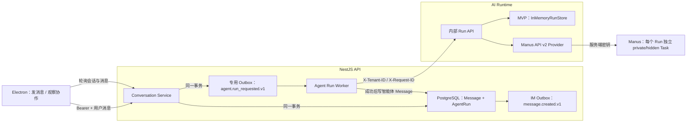
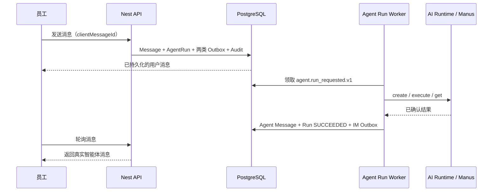
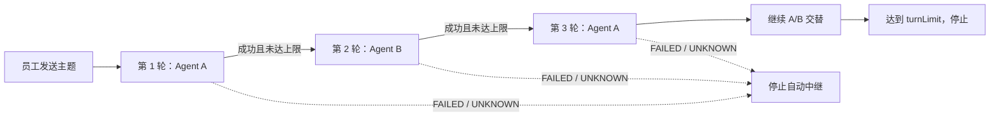

# ADR-0006：Manus 智能体运行与有限轮次中继编排

- 状态：已接受并实现（MVP）
- 日期：2026-07-15
- 关联迁移：`20260715000700_agent_run_orchestration`
- 关联应用：`apps/api`、`apps/desktop`、`services/ai-runtime`、`packages/contracts`

## 1. 背景与问题

前一阶段已经具备租户隔离的会话、消息账本、个人智能体元数据和独立 AI Runtime，但智能体会话仍只保存员工消息，不会形成可信的模型回复。若由桌面端直接调用模型或 Manus，会立即产生以下问题：

1. Provider 密钥暴露到不可信客户端；
2. 消息成功落库与模型任务创建之间没有原子边界，失败后容易漏执行或重复执行；
3. 远程请求超时无法证明任务是否创建，盲目重试可能重复扣费；
4. 智能体回复绕过 PostgreSQL 权威消息账本、租户 RLS、审计和 IM Outbox；
5. 两个智能体互相回复时缺少明确顺序和停止条件，可能产生无限循环；
6. 账号级 Manus 主任务会混合不同企业、会话和 Run 的上下文。

本决策建立员工到智能体、以及两个智能体有限轮次协作的第一条后端闭环。目标是让每一次执行都有租户、请求人、输入消息、目标智能体版本、状态和幂等标识，并确保不确定状态优先停止，而不是用重复执行换取表面可用性。

## 2. 决策摘要

采用以下实现：

- AI Runtime 新增 `manus` Provider，使用 Manus API v2；
- 每个平台 Run 创建一个独立 Manus Task，不复用账号级默认主任务；
- Manus Task 固定为 `private`、隐藏于普通任务列表、非交互模式；
- NestJS 使用 PostgreSQL `AgentRun` 作为业务侧权威执行账本；
- 员工消息、初始 `AgentRun`、专用 `agent.run_requested.v1` Outbox 事件和审计在同一事务写入；
- Agent Run Worker 只消费专用事件，通过 AI Runtime 创建、执行和查询 Run；
- 员工到单个智能体只执行一轮；
- `agent_pair` 会话显式固定智能体 A、智能体 B 和 2～8 的有限轮次，默认 4 轮；
- 中继严格按 A、B、A、B 顺序执行，每个成功输出才允许创建唯一下一轮；
- 对无法确认是否已创建或执行的请求标记 `UNKNOWN`，停止自动重建和自动中继；
- `AgentRun`、会话、消息、智能体和版本继续使用租户复合外键、`FORCE RLS` 与 transaction-local 租户上下文；
- Provider 密钥只存在于 AI Runtime 服务端进程环境，桌面端、管理后台、Nest API、数据库和文档均不保存密钥值。

## 3. 架构与职责边界



职责划分如下：

- 桌面端只选择联系对象、创建会话、发送主题和展示服务端消息，不调用 Manus，也不伪造回复；
- NestJS 负责用户授权、会话参与者、消息账本、智能体版本快照、Run 状态、有限轮次和 Outbox 编排；
- AI Runtime 负责一次 Run 的 Provider 调用、超时、预算检查、取消和 Provider 错误脱敏；
- Manus 只负责平台显式创建的独立远程 Task；
- PostgreSQL 是业务可见消息和编排状态的权威来源，Manus Task 列表不是业务数据库。

## 4. Manus API v2 Provider

### 4.1 配置与密钥边界

显式设置 `AI_RUNTIME_DRIVER=manus` 才启用 Manus。`MANUS_API_KEY` 只允许通过 AI Runtime 的进程环境或 Secret 管理器注入；示例环境文件只保留空变量名。

Provider 还接受受控的 Profile、可选 Project ID、轮询间隔和最长等待时间配置。API 根地址只允许 Manus 官方 HTTPS Origin，防止高权限密钥被发送到任意可配置主机。密钥仅进入 `x-manus-api-key` 请求头，日志、异常、HTTP 响应、数据库字段和审计元数据均不得包含密钥或 Provider 原始错误正文。

生产环境完全禁止从仓库 `.env` 自动加载 Runtime 密钥。开发环境的 dotenv 加载也是非覆盖式的，已由容器或进程注入的值始终优先。

### 4.2 每个 Run 独立远程 Task

不复用 Manus 账号级 `agent-default-main_task`。每个平台 Run 执行：

1. 调用 `/v2/task.create` 创建新 Task；
2. 固定 `share_visibility=private`；
3. 固定 `hide_in_task_list=true`；
4. 固定 `interactive_mode=false`；
5. 显式传入空 `connectors`，不继承 Manus 账号或 Project 的默认连接器；
6. 标题只使用本地 Run UUID 形成 `enterprise-run-<run_id>`，便于对账且不携带业务正文；
7. 使用返回的 `task_id` 轮询该 Task 的消息和状态；
8. `stopped` 时读取最新 assistant 消息，`waiting`、`error` 和异常状态映射为脱敏错误；
9. 本地超时、取消或解析失败时 best-effort 调用 `task.stop`。

`private` 和 `hidden` 降低账号侧误分享与任务列表污染风险，但不代表数据没有离开本平台。发送到 Manus 的内容已经跨越企业平台安全边界，生产启用前仍需完成数据分级、供应商协议、地域、留存和删除策略审查。

### 4.3 轮询、等待和计量

当前 Manus v2 采用异步 Task 轮询，没有接入 webhook。实际等待上限取平台 Run 超时与 Runtime 最长等待配置的较小值。HTTP 429 只进行有限次指数退避并加入抖动；耗尽后返回可识别的限流错误。新建 Task 在事件读取副本上可能短暂不可见，`task.listMessages` 的 404、`not_found` 与 `failed_precondition` 会进行最多五次短退避读取；该恢复路径始终复用同一 `task_id`，绝不再次调用 `task.create`。

Manus 当前提供的是账号 credits，不是可直接映射为输入/输出 token 和货币 micros 的计量。MVP 不伪造 token 或成本，相关数值保持为 0。因此平台配置的 token 和货币预算不是 Manus 供应商侧硬限制；正式计费控制必须扩展 provider-specific usage、credits 定价和账单对账。

## 5. NestJS AgentRun 与专用 Outbox

### 5.1 权威 Run 账本

`AgentRun` 记录：

- 当前租户、会话、输入消息和请求员工；
- 目标 `AgentInstance` 与不可变的 `AgentVersion` 引用；
- `USER_MESSAGE` 或 `RELAY_TURN` 触发类型；
- 当前轮次、轮次上限和父 Run；
- `QUEUED`、`DISPATCHING`、`RUNNING`、`SUCCEEDED`、`FAILED`、`UNKNOWN`、`CANCELLED` 状态；
- Runtime 外部 Run ID、平台幂等键、策略快照、尝试次数和乐观版本；
- 脱敏错误码、调度/开始/完成时间和输出消息引用。

策略快照在排队时保存智能体版本、模型策略、工具策略、知识范围和是否为 relay。后续智能体发布新版本不会静默改变已排队 Run 的执行身份。

数据库约束保证：

- 同一个输入消息与目标智能体只产生一个 Run；
- 每个输出消息最多属于一个 Run；
- 每个父 Run 最多产生一个子 Run；
- 租户内幂等键唯一；
- Provider 外部 Run ID 唯一；
- `turnIndex` 必须在 1～`turnLimit` 内；
- 首轮必须是 `USER_MESSAGE` 且没有父 Run；后续轮必须是 `RELAY_TURN` 且引用父 Run。

### 5.2 原子入队

员工发送消息时，一个应用事务依次完成：

1. 验证员工仍是会话参与者；
2. 使用 `clientMessageId` 幂等写入用户消息；
3. 写入普通 `message.created.v1` IM Outbox；
4. 对单智能体会话，或尚未启动的 `agent_pair` 会话，创建首个 `AgentRun`；
5. 写入 `agent.run_requested.v1` 专用 Outbox；
6. 写入 `message.create` 与 `agent.run.request` 审计事件。

消息、Run、两个 Outbox 事件和审计要么一起提交，要么一起回滚。客户端超时后使用相同 `clientMessageId` 重试不会创建第二条消息或第二个 Run。

### 5.3 专用 Worker 语义

Agent Run Worker 与 IM 投递 Worker 复用可靠 Outbox 基础设施，但具有独立事件类型、领取查询、配置、并发和处理逻辑。它只领取 `agent.run_requested.v1`，不会把模型执行混入 `message.created.v1` 的 IM Provider。

Worker 先通过受限跨租户 Outbox 身份领取事件和短租约，再使用事件的 `tenantId` 进入 `enterprise_agent_app` 与 `app.tenant_id` 事务读取对应 Run。Outbox 身份不能读取消息正文、智能体 Prompt 或其他业务表。事件 payload 只保存 `runId`，不复制消息正文、Prompt 或密钥。

处理过程为：

1. 校验事件类型、aggregate ID 和 payload 中的 `runId` 一致；
2. 在租户事务中准备 Run，读取已固定的智能体版本和允许的有限上下文；
3. 调用 AI Runtime 创建 Run，并把已确认的外部 Run ID 绑定到 `AgentRun`；
4. 调用 execute；若返回运行中则按受控策略查询，不重复 create；
5. 成功时同事务写入智能体消息、Run 终态、普通 IM Outbox 和必要的下一轮 Run；
6. 明确失败写入 `FAILED`；无法确认远端事实时写入 `UNKNOWN`；
7. 只有状态与租约仍匹配的 Worker 可以完成 Outbox 状态转换，迟到 Worker 不得覆盖新状态。

## 6. 员工到单个智能体

员工从通讯录选择某成员的可联系智能体后，服务端创建或复用当前员工与该智能体的 direct 会话。员工发送文本消息会创建一个 `turnLimit=1` 的 Run：



桌面端只展示消息账本中的回复。Provider 超时、失败或 Runtime 不可用不会让 Renderer 生成占位式 AI 答案。

## 7. 显式 agent_pair 有限轮次

### 7.1 会话配置

`CreateConversationRequest.target` 支持：

```text
type = agent_pair
agentIds = [agentAId, agentBId]
turnLimit = 2..8（默认 4）
```

两个 ID 必须不同，且都必须是当前租户内员工可联系的有效智能体。会话持久化 `relayAgentAId`、`relayAgentBId` 和 `relayTurnLimit`，数据库再次检查 A/B 不同且轮次在 2～8 内。A/B 顺序属于协作语义的一部分，不在服务端自动排序。

桌面端只把在职成员名下、当前员工有联系权限且状态为 `online` 的智能体列入选择器。服务端授权仍是最终边界，前端过滤不是权限控制。

### 7.2 中继状态机

员工是观察者和主题发起者，不作为智能体之间的自动回复节点。首次主题固定触发 A，A 成功后触发 B，随后继续交替，达到 `turnLimit` 后停止：



每轮输出先作为真实 `Message(senderType=AGENT)` 写入同一会话，下一轮才把这条消息作为输入并通过唯一 `parentRunId` 创建。下一轮 Run 与其 Outbox 在完成上一轮的同一事务产生，因此不会出现“消息已展示但下一轮永久漏排”的中间状态。

当前 MVP 的任一含智能体会话同一时刻只允许一个活跃 Run；`agent_pair` 则把这个槽位用于一条有限 Run 链。数据库部分唯一索引与会话级事务锁共同串行化链路：存在 `QUEUED`、`DISPATCHING`、`RUNNING` 或 `UNKNOWN` Run 时，新主题返回 409 且连同用户消息一起回滚；上一条单聊 Run 或协作链明确完成或失败后，可以在同一会话发起新主题。暂停、继续和人工插话后恢复仍需要后续显式产品语义。

## 8. UNKNOWN 与不盲目重建

`UNKNOWN` 表示平台无法证明远端操作“发生”或“未发生”，不是普通可重试失败。典型场景包括：

- Nest 调用 AI Runtime 创建 Run 时连接中断，Runtime 可能已经创建记录；
- AI Runtime 调用 Manus `task.create` 后响应丢失，远端 Task 可能已经开始执行和计费；
- 已知外部 Run ID 返回 404、响应结构错配或其他不可对账事实，无法证明当前最终状态；
- 已进入 `DISPATCHING`，但没有可确认的外部 Run ID。

处理原则：

1. 若已有可信外部 Run ID，优先 GET 对账，不再次 create；TIMEOUT、UNAVAILABLE、408、429 和 5xx 保持 `RUNNING + PENDING` 并延后安全 GET；
2. 若没有可信外部 ID 且创建结果不确定，AgentRun 与专用 Outbox 进入 `UNKNOWN`；
3. `UNKNOWN` 不自动创建新平台 Run、不自动创建新 Manus Task、不写智能体回复、不继续 agent_pair 下一轮；
4. 日志和状态只保存安全错误码，不保存 Provider 响应正文；
5. 后续由对账任务或管理员基于本地 Run UUID、唯一远程标题和 Manus Task 列表进行人工/自动 reconciliation。

Manus v2 当前没有平台可用的远程创建幂等键。`enterprise-run-<run_id>` 只能辅助查找和对账，不能被当作供应商强幂等保证。只有明确证明远端不存在，或明确接管既有 Task 后，才能恢复执行。

## 9. 租户、权限与数据边界

### 9.1 PostgreSQL

- `agent_runs` 启用并强制 `FORCE ROW LEVEL SECURITY`；
- 普通 Run 读写必须使用 `enterprise_agent_app` 并在事务中设置 `app.tenant_id`；
- Run 到会话、输入/输出消息、请求人、智能体、版本和父 Run 均使用包含 `tenant_id` 的复合外键；
- 会话到 relay A/B 也使用租户复合外键，跨租户智能体无法进入会话；
- Outbox Worker 的跨租户角色只具有领取和更新队列所需最小列权限，不具有通用业务表访问权；
- 会话列表和消息 API 仍要求当前员工是未离开的会话参与者；跨租户或无权访问统一表现为 404。

### 9.2 服务与 Provider

- 桌面 Renderer、Electron Main 和 Nest API 都不接触 Manus Key；
- Nest 只把当前 Run 所需的 Prompt、有限消息上下文和零附件请求发送给 AI Runtime；
- AI Runtime 使用请求的 `X-Tenant-ID` 做 RunStore 隔离，并拒绝请求头与请求体租户不一致；
- Manus 每个 Task 独立，不共享平台会话上下文；
- 当前 `private/hidden` 只是 Manus 侧可见性设置，不替代平台租户授权和供应商数据治理。

## 10. 当前 MVP 限制

当前已经可以完成员工消息触发智能体回复，以及两个智能体按有限轮次交替协作，但仍有以下明确边界：

- AI Runtime 使用 `InMemoryRunStore`，进程重启会丢失 Runtime 内部 Run；生产模式已禁止该配置；
- Nest `AgentRun` 已持久化，但 Runtime 侧尚无 PostgreSQL RunStore 和跨实例执行租约；
- Nest 到 AI Runtime 只有租户/请求 ID 请求头，没有服务 JWT、mTLS、请求签名或网络级服务身份；仅适合本机或受控内网；
- Manus 使用轮询，没有 webhook、事件回调 Inbox 或流式输出；桌面端也通过会话/消息轮询刷新；
- Runtime 请求固定为空附件；尚未支持对象存储 Asset、病毒扫描、内容解析或附件授权；
- 知识库尚未进入检索、Embedding、向量索引或 RAG，智能体不能读取当前知识库；
- 平台请求固定 `max_tool_calls=0`、空 connectors 且通过指令禁止外部工具，但 Manus 当前调用面没有可验证的“禁用全部内建 skills/tools”硬开关；尚无可信工具计量、人工审批、敏感操作确认或恢复流程，生产需使用隔离账号/Project 并增加服务端 allowlist；
- 没有租户级并发配额、Manus credits 预算、计费对账、熔断和供应商降级；
- `UNKNOWN` 目前需要运维检查，尚无自动 reconciliation 控制台；
- agent_pair 同一时刻只允许一条有限链；明确终态后可发起新主题，但尚不支持暂停、继续或人工插话后恢复；
- 没有 Provider webhook 签名验证、重放防护、事件去重和乱序处理，因为当前尚未接入 webhook；
- 未完成面向生产的数据外发审批、DLP、地域与留存策略闭环。

以上能力不得在产品说明中描述为已经交付。

## 11. 生产演进路线

### 阶段 A：持久化与服务身份

- 为 AI Runtime 实现 PostgreSQL RunStore、乐观锁和执行租约；
- 使用服务 JWT 或 SPIFFE/mTLS 建立 Nest 到 Runtime 的双向身份；
- 将 Agent Run Worker 独立部署，限制数据库角色、出网目标和并发；
- 增加租户级并发、速率、每日 credits 和紧急停机开关；
- Secret 只由 KMS/Secret Manager 注入，并建立轮换、审计和泄漏响应。

### 阶段 B：对账与可靠事件

- 为 `DISPATCHING/UNKNOWN` 建立定期 reconciliation；
- 持久化远程 task ID、创建阶段和最后已确认状态；
- 使用本地 Run UUID 和远程标题辅助 Manus Task 对账；
- 若 Manus 提供正式幂等键或 webhook，优先采用供应商保证；
- webhook 必须经过签名验证、时间窗、重放防护、事件 ID 去重、乱序合并和租户映射；
- 建立 Run、远程 Task、消息账本和 credits 账单的日常对账。

### 阶段 C：实时体验与可运营性

- 由 Worker 发布 Run/Message 事件，经 WebSocket 或 SSE 推送桌面端；
- 提供取消、超时、重试审批、UNKNOWN 处置和 agent_pair 继续/停止操作；
- 增加 OpenTelemetry trace、Run 时延、排队、失败类型、未知率和 credits 指标；
- 按租户、智能体版本和 Provider 建立告警与容量策略。

### 阶段 D：企业知识与工具

- 接入受权限过滤的知识检索，只向 Runtime 下发已授权 chunk 与引用；
- 对附件使用平台内部 `asset_id`，禁止 Runtime 任意抓取外部 URL；
- 工具调用按版本化 allowlist、参数 Schema、幂等键和最小服务权限执行；
- 高风险写操作进入人工审批，审批、拒绝、超时和执行结果全部审计；
- 建立提示注入、越权召回、敏感信息外发和无证据回答的评测集。

## 12. 结果与取舍

正向结果：

- 员工到智能体已经形成服务端持久化、可审计、可恢复判断的执行链；
- 两个智能体的协作对象、顺序和最大轮次均显式固定，不存在无限自触发；
- 每个平台 Run 使用独立 Manus Task，避免账号级主任务串上下文；
- 消息与 Run 入队原子提交，模型输出回到同一消息账本；
- 不确定分发以 `UNKNOWN` 停止，优先避免重复执行和扣费；
- Manus 密钥不进入任何客户端或业务数据库。

当前取舍：

- 轮询实现简单且易验证，但实时性和 Provider 请求成本不如可信 webhook；
- AI Runtime 内存存储适合本地 MVP，但不支持生产重启恢复和多实例；
- 单链 agent_pair 先保证有限、有序和幂等，牺牲了复杂多人/多主题协作；
- 工具、附件和 RAG 暂不接入，确保当前外发内容边界可解释；
- `UNKNOWN` 会降低部分自动恢复率，但比无法证明时重复创建远程任务更安全。

这些限制和安全边界属于本 ADR 的组成部分。后续实现不得通过客户端直连 Provider、复用账号级 Manus 主任务、绕过 AgentRun/Outbox，或把 `UNKNOWN` 当作普通失败自动重建。
