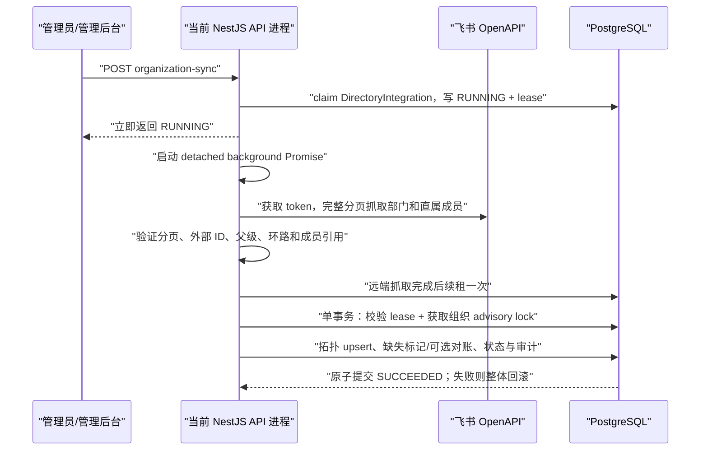

# ADR-0007：飞书通讯录单向同步与组织数据所有权

- 状态：已接受（MVP 已实现）
- 日期：2026-07-15
- 关联应用：`apps/api`、`apps/admin`、`packages/contracts`
- 关联决策：ADR-0003、ADR-0005

## 1. 背景与目标

平台已经具备 PostgreSQL 权威组织树、成员任职、租户 RLS、管理后台和审计。企业若已经在飞书维护部门与成员，再由管理员手工录入，会产生重复劳动、离职遗漏，以及两个主数据源互相覆盖的问题。

本决策建立“一个飞书企业自建应用 → 一个指定本地租户”的只读通讯录同步链路。同步将飞书部门、成员及任职投影到本地目录，同时明确字段所有权。该能力不是飞书登录、SSO、双向通讯录编辑、SCIM 或事件级实时同步。

当前 MVP 已实现：

- 服务端配置与租户绑定；
- 飞书全量部门、直属成员分页抓取；
- 外部 ID 绑定、幂等 upsert、多部门任职和主部门；
- 管理后台状态查看与人工触发；
- 可选的远端缺失二阶段对账；
- 租户隔离、组织写入互斥、凭据隔离和应用身份防误接管。

## 2. 决策摘要

- 只支持飞书企业自建应用，并以应用身份获取 `tenant_access_token`。
- 飞书是部门层级、成员资料和任职字段的上游；本系统继续管理角色、登录凭据、知识库、智能体、会话与审计。
- MVP 由 NestJS 服务端环境变量配置单一目标租户，默认关闭；启用时要求 `REPOSITORY_DRIVER=prisma`。
- App ID、App Secret 和短期 token 仅存在于服务端。App Secret 和 token 不写入数据库、日志、审计、Electron 或管理后台前端。
- 出站 Origin 固定为 `https://open.feishu.cn`，拒绝 HTTP、端口、路径、查询参数、内嵌凭据和相似域名。
- 完整远端抓取与快照验证发生在数据库事务外；验证成功后，全部本地变更在一个数据库事务中应用。
- 当前调度不是持久化任务队列：`DirectoryIntegration` 保存连接级状态和租约，当前 API 进程以后台 Promise 执行本次同步。
- 同步 apply 与管理后台的组织修改共用组织级 PostgreSQL transaction advisory lock，避免组织树并发写入。
- 远端缺失对账默认关闭。开启后也不会在第一次缺失时立即停用，而是用持久化 `missingSinceAt` 做至少一小时、两次成功快照的确认。
- App ID 的 SHA-256 指纹持久化到连接状态；换成其他 App ID 时拒绝继续写入，防止不同飞书企业或应用误接管既有映射。
- API 业务码非零、分页中断、游标循环、外部 ID 冲突、父部门缺失或组织树成环均使整次同步失败，不能用部分结果覆盖本地目录。

## 3. 官方 API、ID 类型与权限

### 3.1 调用接口

MVP 调用以下飞书开放平台接口：

1. [自建应用获取 tenant_access_token](https://open.feishu.cn/document/server-docs/authentication-management/access-token/tenant_access_token_internal)：`POST /open-apis/auth/v3/tenant_access_token/internal`，请求体中的 `app_id`、`app_secret` 只由服务端注入；
2. [获取单个部门信息](https://open.feishu.cn/document/server-docs/contact-v3/department/get)：`GET /open-apis/contact/v3/departments/0`，读取根部门；
3. [获取子部门列表](https://open.feishu.cn/document/server-docs/contact-v3/department/children)：`GET /open-apis/contact/v3/departments/0/children`，优先以 `fetch_child=true` 完整分页；若飞书返回不支持递归查询的业务码 `43010`，则降级为逐层广度优先分页；
4. [获取部门直属用户列表](https://open.feishu.cn/document/server-docs/contact-v3/user/find_by_department)：对已发现的每个部门（包含根部门）完整分页，随后按用户外部 ID 合并多部门关系；
5. [部门资源字段说明](https://open.feishu.cn/document/server-docs/contact-v3/department/field-overview)与[用户资源字段说明](https://open.feishu.cn/document/server-docs/contact-v3/user/field-overview)：用于字段解析和外部身份选择。

所有通讯录请求必须显式使用：

```text
department_id_type=open_department_id
user_id_type=user_id
```

部门外部主键为 `open_department_id`，用户外部主键为 `user_id`。当前实现不使用 `open_id`，也不得在同一连接中混用 `user_id`、`open_id` 和 `union_id`。手机号、邮箱和姓名都不是幂等身份。

分页必须完整消费 `page_token` 并检测重复游标。HTTP `200` 不代表业务成功，响应 `code` 必须为 `0`。`tenant_access_token` 仅按官方过期时间在进程内缓存并提前刷新，认证过期时允许刷新后重试一次；token 不持久化，进程退出即丢弃。

### 3.2 应用权限与数据范围

应用只申请只读通讯录权限。按当前同步字段，建议至少核对以下权限是否已经开通：

- `contact:contact.base:readonly`；
- `contact:department.base:readonly`；
- `contact:department.organize:readonly`；
- `contact:user.base:readonly`；
- `contact:user.department:readonly`；
- `contact:user.employee:readonly`；
- `contact:user.employee_id:readonly`；
- 若同步工作邮箱，再开通对应邮箱字段的只读权限。

最终权限名称和字段授权以飞书接口文档当前要求为准，不申请“更新通讯录”权限。

接口权限之外，还必须在飞书开发者后台配置应用身份的数据权限。飞书的[应用数据权限说明](https://open.feishu.cn/document/home/introduction-to-scope-and-authorization/configure-app-data-permissions)和[通讯录权限范围说明](https://open.feishu.cn/document/server-docs/contact-v3/scope/scope_authority)说明应用只能读取授权范围内的数据。当前实现按全量组织快照处理，因此生产接入必须把通讯录权限范围配置为“全部成员”，并在首次同步前核对根部门、部门数和成员数。

如果权限范围被缩小，飞书可能返回“业务成功但数据不完整”的快照。为降低误停用风险，缺失对账默认关闭，并使用第 8 节的二阶段确认；但权限范围是否完整仍属于部署前置条件，不能只依赖技术保护替代运维核验。

## 4. 服务端配置契约

| 变量                                  | 默认值                   | 约束与语义                                                                                   |
| ------------------------------------- | ------------------------ | -------------------------------------------------------------------------------------------- |
| `FEISHU_DIRECTORY_SYNC_ENABLED`       | `false`                  | 总开关；为 `true` 时要求 Prisma、目标租户、App ID 和 App Secret 均有效                       |
| `FEISHU_DIRECTORY_RECONCILE_REMOVALS` | `false`                  | 是否对已确认远端缺失的飞书绑定执行终止任职、停用成员和归档部门；建议完成多轮只读核验后再开启 |
| `FEISHU_DIRECTORY_TARGET_TENANT_SLUG` | 空                       | 唯一目标租户 slug；必须与本地组织的 `externalKey` 精确匹配                                   |
| `FEISHU_APP_ID`                       | 空                       | 企业自建应用 App ID，仅服务端可见；其 SHA-256 指纹用于连接身份防误接管                       |
| `FEISHU_APP_SECRET`                   | 空                       | 企业自建应用 App Secret，仅通过本地 `.env` 或生产 Secret 注入，不持久化                      |
| `FEISHU_API_BASE_URL`                 | `https://open.feishu.cn` | 必须精确等于官方 HTTPS Origin                                                                |
| `FEISHU_HTTP_TIMEOUT_MS`              | `10000`                  | 单次飞书 HTTP 请求超时，范围 500～60000 ms                                                   |
| `FEISHU_SYNC_LEASE_MS`                | `1800000`                | 同步租约，范围 900000～3600000 ms，且必须大于单次 HTTP 超时                                  |

该环境变量方案有意限定为单 API 部署配置、单飞书连接 MVP。多租户 SaaS 阶段应把连接元数据迁移到租户隔离的连接配置模型，并把密钥保存为 KMS/Vault 引用或经 envelope encryption 加密的密文，不能复制多组 `FEISHU_*` 环境变量。

飞书同步只负责组织与成员目录，不授予密码登录能力。新导入成员默认没有
`password_credentials` 记录，不能使用任何部署级共享密码登录；管理员必须向该成员的唯一
有效工作邮箱签发一次性邀请，或由企业已配置的 SSO 完成身份激活。旧版
`FEISHU_DIRECTORY_INITIAL_PASSWORD` 已废弃并被服务忽略；已有本地密码凭据不会被同步创建、
覆盖或删除。

### 4.1 凭据与连接身份

- `.env` 只允许用于本地开发且必须被版本控制忽略；生产使用 Secret Manager、KMS、Vault、Kubernetes Secret 或部署平台等价能力注入。
- 禁止创建 `VITE_FEISHU_*`，禁止从管理 API 返回 App Secret，禁止把凭据写入 Electron `safeStorage`。
- 数据库只保存 `SHA-256(FEISHU_APP_ID)` 的 64 位十六进制 `connectorFingerprint`，不保存 App ID 全值，更不保存 App Secret 或 token。
- 首次 claim 时记录指纹；后续 App ID 指纹不一致时，状态查询显示失败，触发同步返回冲突。轮换同一应用的 App Secret 不改变指纹，可以正常继续同步。
- 确需更换 App ID 时，必须先核实新应用所属企业、数据权限和既有外部 ID 映射，再通过受控迁移或显式重绑流程处理，不能直接改环境变量后强行覆盖。

## 5. 管理 API 与状态模型

管理端提供：

- `GET /api/v1/admin/integrations/feishu/organization-sync`：读取配置和最近同步状态；
- `POST /api/v1/admin/integrations/feishu/organization-sync`：claim 租约并触发一次后台同步，立即返回 `RUNNING` 状态。

两个接口都要求组织写权限，即租户角色为 `OWNER` 或 `ADMIN`。接口绝不返回 App ID、App Secret、token 或原始飞书响应。

对外状态为 `NOT_CONFIGURED | READY | RUNNING | SUCCEEDED | FAILED`。当前并没有独立、逐次累积的 `SyncRun` 表；`run.id` 对应连接状态记录，用于展示当前或最近一次结果。`DirectoryIntegration` 是每租户、每 provider 的连接级状态行，保存：

- provider、目标组织和 App ID 指纹；
- `status`、`leaseOwner`、`leaseExpiresAt`；
- 最近开始、结束和成功时间；
- 脱敏错误码、部门/成员聚合计数和乐观锁版本。

因此当前 UI 展示的是“当前连接的最近状态”，不是长期运行历史。长期趋势应由后续指标系统或独立的不可变同步运行表提供。

## 6. 本地数据映射与字段所有权

外部 ID 通过显式绑定表映射到本地 UUID：

- `DirectoryOrgUnitBinding`：`open_department_id → OrgUnit`；
- `DirectoryUserBinding`：`user_id → User`；
- `DirectoryEmploymentBinding`：`user_id + open_department_id → Employment`。

根部门 `0` 绑定现有本地根组织单元，不创建第二个根。绑定表记录 `lastSeenAt`、`missingSinceAt`，并通过包含 `tenantId`、连接、组织和本地实体的复合外键约束归属，所有相关表均受租户隔离与 RLS 保护。

### 6.1 飞书管理的字段

- 部门名称、父部门、显示顺序和有效状态；
- 成员显示名、头像、工作手机号和工作邮箱；
- 成员所属部门、主部门、职务、工号、城市、用工类型和在职状态。

当飞书可选字段没有返回时，同步保留已有本地值，避免字段权限暂时缺失导致清空。飞书明确返回的权威值才更新对应字段。

### 6.2 本系统管理的字段

- `TenantRole`，包括 `OWNER`、`ADMIN`、`KNOWLEDGE_ADMIN` 和 `MEMBER`；
- `PasswordCredential`、Session、MFA 和后续 SSO 绑定；
- 知识库范围、文档、智能体模板/版本/实例；
- 会话、消息、Agent Run、审计和人工备注。

新导入用户固定为 `MEMBER`，且不创建 `PasswordCredential`。无凭据成员即使通过唯一工作邮箱被认证查询命中，也只能走固定假哈希校验并统一返回登录失败；管理员向其唯一有效工作邮箱签发的一次性邀请被消费后，系统才创建首个本地密码凭据。已接入企业 SSO 的成员可继续使用 SSO，已有本地密码绝不创建、覆盖或删除。无论飞书返回什么资料，同步都不能提升角色或自动接管本地特权账号，`LOCKED` 状态也不会被同步解锁。

飞书邮箱与本地账号邮箱相同也不自动合并。新用户内部仍使用基于外部 ID 稳定生成的 `@external.invalid` 隔离邮箱，真实工作邮箱保存在任职资料；登录时优先匹配本地账号邮箱，只有不存在本地直接匹配且工作邮箱唯一时才回退到飞书员工，避免同邮箱账号接管。手机号不得作为登录名或外部主键。

一个飞书用户可属于多个部门，本地保存全部有效任职并标记唯一主部门。同步只操作该飞书连接拥有的绑定，不改动手工创建部门、其他来源任职、知识库范围和历史业务数据。

## 7. 实际执行流程、事务与并发



### 7.1 claim 与后台执行

1. POST 请求先在短事务中查找或创建 `DirectoryIntegration`。
2. 若已有 `RUNNING` 且 `leaseExpiresAt` 尚未到期，则拒绝并发触发。
3. claim 使用状态、租约、随机 `leaseOwner` 和版本号做连接级互斥；成功后 API 立即返回。
4. 同一 API 进程通过未等待的后台 Promise 执行 `fetch → validate → renew → apply`，异常由同步服务捕获并写入脱敏失败状态。

这不是 durable queue/worker：没有持久化待执行队列、独立 Worker 领取、进程恢复或自动重放。API 进程在后台 Promise 完成前退出时，本次执行会中止，`DirectoryIntegration` 可能暂时保持 `RUNNING`；状态读取在租约过期后将其解释为失败，管理员可在租约过期后重新触发。当前版本不会在重启时立即自动接管未完成任务，也不会等待旧租约自动结束后自行重试。

### 7.2 租约语义

- claim 时生成初始租约，长度为 `FEISHU_SYNC_LEASE_MS`。
- 当前实现不会在每一页远端请求后续租；只有完整抓取和快照验证成功后、进入本地 apply 前续租一次。
- 续租和 apply 均要求 `status=RUNNING`、`leaseOwner` 匹配且租约仍未过期。
- apply 事务提交最终 `SUCCEEDED` 时再次验证租约；失去租约的旧执行不能提交成功状态。
- 运维应根据真实组织规模和飞书 API 延迟选择 15～60 分钟租约。如果一次完整抓取可能超过租约上限，应先拆分/升级为持久化任务架构，而不是无限增大事务或绕过租约。

### 7.3 单事务 apply 与组织写入互斥

远程 HTTP 调用绝不持有数据库事务。只有完整快照通过验证后才进入一次租户事务，按以下顺序处理：

1. 核对连接状态、租约 owner 和过期时间；
2. 获取以 `tenantId + organizationId` 派生的 PostgreSQL transaction advisory lock；
3. 绑定本地根部门；
4. 按父子拓扑 upsert 部门；
5. upsert 用户、多部门任职、主部门和绑定；
6. 标记本快照缺失项，并按配置决定是否执行二阶段对账；
7. 更新组织版本、连接成功状态、汇总计数和管理审计；
8. 原子提交。

管理后台新增、移动、修改、归档部门及成员写操作使用同一组织 advisory lock，因此不会与飞书 apply 交叉修改组织树。外部 ID 唯一约束和 upsert 保证同一快照重复执行不会创建重复实体。

## 8. 远端缺失与二阶段对账

`FEISHU_DIRECTORY_RECONCILE_REMOVALS=false` 是默认且推荐的初次上线模式。无论开关是否开启，成功全量快照发现某个既有飞书绑定缺失时会设置持久化 `missingSinceAt`；若后续快照重新发现该对象，则立即把 `missingSinceAt` 清空。开关关闭时只记录缺失，不终止任职、不停用成员、不归档部门。

开关开启后，只有同时满足以下条件才执行软对账：

1. 当前完整快照再次确认该绑定缺失；
2. `missingSinceAt` 已经存在；
3. 当前同步开始时间距离首次缺失至少一小时；
4. 本地对象确实属于当前飞书连接；
5. 对成员和部门分别满足安全约束。

具体动作：

- 缺失成员-部门关系：将对应任职置为 `TERMINATED`，清除主部门标记和工号；
- 缺失用户：只有角色仍为 `MEMBER`、没有其他 `ACTIVE/PENDING` 任职且当前为 `ACTIVE` 时，才置为 `INACTIVE` 并撤销有效 Session；不会自动停用 `OWNER`、`ADMIN` 或 `KNOWLEDGE_ADMIN`；
- 缺失部门：按叶子到根顺序处理，只有没有活动子部门且没有未终止任职时才软归档；根部门 `0` 不参与归档；
- 不物理删除任何部门、用户、任职、知识库范围、会话或历史记录。

由于 `missingSinceAt` 在开关关闭时也会持久化，打开删除对账前必须先检查缺失标记及最近成功快照。若某项已经缺失超过一小时，开启后下一次仍缺失的成功同步可能立即执行软对账。

## 9. 失败、重试和安全边界

- 429、可恢复 5xx、网络错误和超时使用有上限的退避重试；认证 token 失效会刷新后重试。权限不足、非零业务码和数据校验失败不盲目重试。
- 远端抓取或验证失败时，本地组织数据零变化；若 apply 事务中任一写入失败，整次目录变更回滚。
- 失败状态在独立短事务中记录脱敏错误码。日志只记录聚合信息和安全错误码，不记录 token、secret 或成员 PII。
- API Base URL 做精确 Origin 白名单校验，防止 SSRF 和凭据外送；TLS 使用系统信任链。
- 新增目录连接和绑定表启用并强制 RLS；普通应用连接不能绕过租户上下文读取其他租户数据。
- `FEISHU_DIRECTORY_TARGET_TENANT_SLUG` 在每次状态查询和任务 claim 时与当前组织绑定核对，防止误写其他租户。

## 10. 部署与运维步骤

### 10.1 飞书侧准备

1. 创建企业自建应用，记录 App ID 和 App Secret。
2. 按第 3.2 节开通只读通讯录权限，发布应用版本。
3. 把应用身份的通讯录数据权限范围设置为“全部成员”。
4. 记录飞书实际根部门、部门数量、成员数量以及一个多部门成员，用作首次验收基线。

### 10.2 平台侧启用

1. 确认目标本地租户 slug 与组织 `externalKey` 一致，数据库迁移已应用，`REPOSITORY_DRIVER=prisma`。
2. 通过安全配置注入 `FEISHU_APP_ID`、`FEISHU_APP_SECRET`、目标租户 slug；首次保持 `FEISHU_DIRECTORY_RECONCILE_REMOVALS=false`。
3. 设置 `FEISHU_DIRECTORY_SYNC_ENABLED=true`，重启 API，使环境变量通过启动校验。
4. 以 `OWNER` 或 `ADMIN` 打开组织管理页，确认状态为“已配置/READY”，再触发同步。
5. 轮询 GET 状态直到 `SUCCEEDED` 或 `FAILED`；若 API 在执行中重启，等待 lease 过期后人工重试。
6. 对比部门数、成员数、多部门任职、主部门、无邮箱成员、角色和知识库权限；确认本地管理员角色与密码未被修改。
7. 至少完成两轮全量同步并验证幂等，再评估是否开启缺失对账。
8. 开启 `FEISHU_DIRECTORY_RECONCILE_REMOVALS=true` 前检查已有 `missingSinceAt`、飞书数据权限范围和最近成功时间，准备数据库备份与回滚方案。

### 10.3 日常运维与故障处理

- `NOT_CONFIGURED`：检查总开关、Prisma、目标租户 slug、App ID 和 App Secret；前端无法补录这些凭据。
- App ID 指纹不一致：停止重试，核对是否换了应用或企业；按受控重绑流程处理。
- `RUNNING` 长时间不结束：先检查 API 是否重启或网络是否阻塞；不得直接并发触发，待 lease 过期后再重试。
- 权限错误或人数明显偏少：检查应用权限、版本发布状态和“全部成员”数据范围；保持删除对账关闭。
- App Secret 泄露：在飞书后台轮换同一 App ID 的 Secret，更新服务端 Secret 并滚动重启；无需改变连接指纹。
- 周期调度当前应调用 POST 并轮询 GET，且调度间隔必须大于最坏执行时间；在引入 durable worker 前，不保证 API 重启期间的自动恢复。

## 11. 验收标准

必须覆盖以下测试和人工验收：

- 配置默认关闭；启用时拒绝 memory driver、缺少目标租户、App ID、App Secret，以及超出范围或不大于 HTTP 超时的 lease；
- 只接受 `https://open.feishu.cn`，拒绝 HTTP、相似域名、端口、子路径、查询参数和内嵌凭据；
- 所有请求使用 `user_id_type=user_id` 与 `department_id_type=open_department_id`；
- token、部门和用户分页，递归部门查询 `43010` 降级，HTTP 200 非零业务码、429、5xx、超时和循环游标；
- 部门乱序、改名、移动、缺失父级、环路和超大排序值；
- 多部门用户、主部门、无邮箱用户、离职、可选字段缺失和本地邮箱冲突；
- 本地邮箱冲突不合并账户，新用户创建为无密码凭据的 `MEMBER`，仅能通过一次性邀请或企业 SSO 激活；已有密码不被覆盖，不能提升或停用特权角色；
- 同一快照重复同步无重复行；远端部分失败时本地零变化；
- 并发触发只有一个 claim 成功，失去 lease 的执行不能提交；API 重启后租约过期可人工重试；
- 同步 apply 与管理后台组织写操作由同一 advisory lock 串行化；
- 删除对账关闭时只有 `missingSinceAt` 标记；开启时第一次缺失不改变业务状态，一小时后第二次成功快照才执行软对账；
- 只归档当前连接拥有且无活动子项的部门，本地手工部门、知识库范围和历史数据不受影响；
- App ID 指纹变化拒绝同步；secret、token、完整 App ID 不出现在响应、日志、审计和前端构建物；
- RLS 跨租户访问被拒绝；同步成功后 `/api/v1/bootstrap` 返回更新后的部门和成员。

## 12. 非目标、已知限制与后续演进

本 ADR 不包含：

- 飞书 OAuth 登录、账号自动绑定、OIDC/SAML 或桌面单点登录；
- 从本平台回写飞书通讯录；
- 飞书事件订阅、回调验签、增量 Inbox 和删除事件实时处理；
- 多飞书租户、多连接管理和商店应用安装流程；
- 主管关系、用户组、职级、工作序列和飞书人事全字段同步；
- 用飞书通讯录权限替代本系统 RBAC 或知识库 ACL；
- durable 同步队列、独立 Worker、进程重启续跑和完整同步历史。

下一阶段应优先把后台 Promise 升级为持久化任务和独立 Worker，支持心跳续租、进程恢复、每次运行的不可变历史与指标；大规模组织可增加 staging/generation 表，在保持完整快照原子语义的前提下分批处理。随后再增加经过验签、去重和可重放的事件 Inbox。事件只用于降低延迟，周期性全量对账仍需保留，以修复漏事件和权限范围变化。
