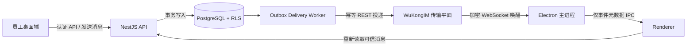

# Octo IM / WuKongIM 企业集成与验收报告

日期：2026-08-04
项目：enterprise-intelligent-agent
审计对象：Mininglamp-OSS/octo-im，提交 `613fc2b2b3a4c23054385ee3f8238fc44a8f68e7`

## 1. 目标与结论

本轮目标是把现有简易 IM 的实时传输能力替换为成熟的开源消息引擎，同时保留本项目已有的
NestJS、PostgreSQL、租户隔离、RLS、审计、Outbox、人与智能体共享会话和 Agent Run 语义。

已完成一个可运行、可测试的直接文本会话集成闭环：消息先在 PostgreSQL 事务内持久化并写入
Outbox，Worker 再将消息幂等投递到 WuKongIM；桌面主进程通过 WuKongIM 加密 WebSocket 接收
低延迟通知，Renderer 收到通知后重新读取本项目 API，绝不把传输层消息直接当成可信业务数据。

当前结论是“开发/隔离试点可用，生产 No-Go”。它还不能被描述为已经具备 Octo/WuKongIM 的
全部聊天功能，也不能替换本项目的 PostgreSQL 权威消息库。生产阻断项包括上游认证钩子未接通、
源码许可证文件缺失，以及群聊、富媒体、已读回执、全文搜索等产品能力尚未完成端到端接入。

## 2. 上游审计事实

- Octo IM 当前代码实际使用 Go 1.23、Pebble KV、Raft/多 Raft 和自定义 WKProto；它不是
  PostgreSQL 应用，也不是 NestJS 模块。
- 直接把上游存储层重写为 PostgreSQL 会破坏其消息序号、分片、复制和故障恢复语义，因此本轮
  采用外接传输平面，而不是复制或翻译上游核心代码。
- 上游 REST 包含用户 Token、发送消息、频道订阅者、会话同步和历史同步等接口；本次只把已验证
  的用户会话、直接消息发送和历史召回接入产品主链路。
- 审计提交在 `WK_GATEWAY_TOKEN_AUTH_ON=true` 时会因缺少 verifier hooks 拒绝启动；本地实测
  `/user/token` 在不带内部 Token Header 时仍返回 HTTP 200。开发容器因此只能绑定 loopback，
  不能原样进入生产。
- 仓库 README 声称 Apache 2.0，但审计提交和上游仓库根目录均没有 LICENSE、COPYING 或
  NOTICE 文件，GitHub License API 也未识别许可证。本项目没有复制或 vendoring 其源码，仅用
  固定提交在 Docker 构建阶段拉取，并通过公开接口适配。上线或再分发前仍须由法务/上游维护者
  明确授权。
- 桌面端使用 `wukongimjssdk@1.3.5`，包元数据声明 ISC。README 推荐的
  `easyjssdk@2.0.1` 与审计提交的加密握手不兼容，真实连接失败，因此没有采用。

## 3. 集成架构

边界规则：

1. PostgreSQL 保留租户、会话参与人、消息正文、智能体运行、审计和业务关系的最终权威。
2. WuKongIM 负责低延迟投递、离线传输副本和连接管理，不拥有业务授权决策。
3. Electron Renderer 不接触 REST 管理 Token，也不直接相信 WebSocket 中的消息正文。
4. WuKong UID 使用租户域内 HMAC/哈希映射，不暴露内部 UUID；client message number 由事件和
   接收者稳定生成，重复投递不会产生第二条上游消息。
5. Provider 超时、网络中断和 5xx 进入 UNKNOWN/可重试语义；确定拒绝进入 FAILED，避免盲目
   重放可能已经成功的消息。

## 4. 已实现功能

### 4.1 服务端

- `IM_PROVIDER=wukong` 环境契约、HTTPS/WSS 和超时约束。
- WuKongIM REST Outbox Provider，支持多接收人逐一投递、接收人去重、Agent-only 跳过、
  请求/响应大小限制、取消、超时、错误分类和精确 Snowflake ID 解析。
- 当前登录用户的实时会话引导 API；服务端生成租户隔离 UID 与 Token，且响应禁止缓存。
- 继续复用既有 `message.created.v1`、Outbox 租约、尝试次数、UNKNOWN 对账和 PostgreSQL RLS。

### 4.2 桌面端

- Electron 主进程持有实时 Token、建立 WuKongIM WebSocket、处理断线/销毁和账号切换。
- Preload 暴露最小 IPC 订阅接口；每个窗口只允许一个实时订阅，Renderer 不能传入任意地址。
- Renderer 收到消息通知后失效会话/消息查询，再从 Nest API 读取可信结果。
- 人与成员智能体继续共用同一个会话窗口，可明确选择“发给成员”或“询问某成员的智能体”；
  发给智能体的消息及回答对该成员本人可见。

### 4.3 本地运行和验收工具

- `infra/docker-compose.wukongim.dev.yml` 固定到已审计提交，REST/TCP/WebSocket 仅绑定本机。
- `pnpm dev:im` 启动隔离 IM 节点。
- `pnpm --filter @enterprise/desktop test:im:acceptance` 执行真实协议握手、送达、幂等和召回。
- `pnpm test:im:load` 调用上游 `wkbench`，报告导出到忽略版本控制的
  `.data/wukongim-load-report`。

## 5. 功能覆盖矩阵

| 能力                               | 状态           | 说明                                                 |
| ---------------------------------- | -------------- | ---------------------------------------------------- |
| 单聊文本消息                       | 已完成         | PostgreSQL 权威写入、Outbox 投递、WebSocket 唤醒     |
| 人/智能体共享窗口                  | 已完成         | 发送目标可切换，成员能看到与其智能体的交流           |
| 消息幂等                           | 已完成         | PostgreSQL 唯一约束 + 上游稳定 client message number |
| 离线持久化与历史召回               | 已验证         | 上游 `/channel/messagesync` 真实验收通过             |
| 超时、重试、UNKNOWN                | 已完成         | 沿用 Outbox 投递状态机                               |
| 租户隔离                           | 已完成于业务层 | RLS/权限仍在 NestJS/PostgreSQL；上游 UID 不泄露 UUID |
| 群聊与成员管理                     | 未接入         | 上游具备频道/订阅者能力，产品契约目前仅允许 direct   |
| 图片、文件、语音、视频             | 未接入         | 需要对象存储、病毒扫描、权限 URL 和内容消息类型      |
| 已读/未读、回执、@提醒             | 未接入         | 需 PostgreSQL 投影、同步游标和 UI 状态               |
| 消息分页、搜索、置顶、归档、免打扰 | 未接入         | 现有接口仍为基础列表，未形成完整日常 IM 体验         |
| 编辑、撤回、引用回复、转发         | 未接入         | 需要消息版本/事件契约和审计策略                      |
| 在线状态、多设备、踢下线           | 部分底座       | 上游具备能力，但尚未接入产品权限和 UI                |
| 移动推送/系统通知                  | 未接入         | 需要 APNS/FCM/厂商推送凭据和通知策略                 |
| Webhook 入站对账                   | 未接入         | 需要签名、去重、重放保护和 Inbox 状态机              |
| IM 管理后台与内容治理              | 未接入         | 需敏感词、封禁、举报、保留策略和审计导出             |

因此，“全部 IM 功能”仍是后续项目，而不是本轮已完成事实。当前代码刻意没有用假按钮、假回执或
传输层直接展示来冒充完成。

## 6. 实际测试结果

### 6.1 自动化和构建

- Contracts：37 个测试文件，213/213 通过。
- Desktop：42 个测试文件，178/178 通过。
- API：207 个测试文件通过、23 个按环境跳过；1290/1290 已执行测试通过、155 个按环境跳过。
- 全仓 TypeScript typecheck：5/5 任务通过。
- 生产构建：Contracts、API、Admin、Desktop 4/4 通过。
- 使用 `IM_PROVIDER=wukong` 启动生产构建产物后，`/health/live` 返回 `ok`，
  `/health/ready` 返回 HTTP 200；WuKongIM 容器同时保持 healthy。
- WuKong Provider/实时会话专项测试覆盖租户映射、去重、超大响应、精确 Snowflake ID、限流、
  不可用状态、无 UUID 泄露和失败关闭。

API 全量测试第一次因当前 `.env` 中“Rerank 开启但语义检索关闭”的不一致组合在收集阶段失败；
将测试环境显式统一为语义检索和 Rerank 均关闭后完整通过。该次失败没有被计入通过数字。

### 6.2 真实协议验收

使用实际容器和 `wukongimjssdk` 完成：

1. 创建发送者和接收者会话；
2. 加密 WebSocket 握手成功；
3. REST 发送后接收端实时收到相同发送者和正文；
4. 相同 `client_msg_no` 重放返回完全相同的 19 位 Snowflake message ID；
5. `/channel/messagesync` 能从持久化历史中召回该消息。

最新真实 message ID 示例为 `2084470779122028544`；测试使用原始 JSON 十进制 Token 解析，
没有经过 JavaScript 不安全整数舍入。

### 6.3 压力测试

环境：单个本地 Docker 节点、person profile、128 字节确定性 payload、真实 WKProto TCP、
每档预热 3 秒、测量 10 秒、冷却 1 秒，硬阈值为连接错误率 0、sendack 错误率 0。

| 提供 QPS | 实际 QPS |     P50 |      P95 |       P99 | 结果          |
| -------: | -------: | ------: | -------: | --------: | ------------- |
|      100 |      100 | 4.09 ms |  5.21 ms |   6.37 ms | 通过          |
|      200 |      200 | 4.12 ms |  7.42 ms |   9.90 ms | 通过          |
|      400 |      400 | 4.20 ms | 14.84 ms | 200.70 ms | 通过          |
|      800 |        0 |       - |        - |         - | Worker 硬失败 |

可证明的单节点稳定上限是 400 QPS，不是 800 QPS。800 QPS 档会准备 1600 个在线用户，压测
Worker 在正式测量前失败，报告没有显示连接或 sendack 错误，不能据此推断服务端极限。后续应在
独立 Linux 压测机、三节点集群和真实 PostgreSQL/Outbox 链路上运行 30–60 分钟稳态、峰值、
断网重连、节点故障和恢复测试。

## 7. 安全、许可证和生产阻断项

1. **上游认证**：审计版本不能开启网关 Token 校验，REST 也没有原生强制 Token。生产必须使用
   已接通 verifier 的上游版本/受控补丁，并在服务网格或反向代理上强制校验 Nest API 的内部
   凭据；REST、Manager、Bench API 不能暴露公网。API 配置会保持生产启动失败，直到独立验收后
   明确设置 `WUKONG_IM_VERIFIED_AUTH_ENABLED=true`。
2. **许可证**：必须取得包含明确 LICENSE/NOTICE 的上游发行物或书面许可。在此之前不得复制、
   修改后再分发上游源码或镜像。
3. **Webhook 对账**：当前仅靠 Outbox 主动投递回执，尚不能覆盖“上游已接收但本地超时”的最终
   对账。需要签名 Webhook + Inbox 去重后才能把 UNKNOWN 自动结算。
4. **传输内容隐私**：消息会形成上游持久化副本。生产需确定加密、保留/删除、备份、数据驻留和
   管理员访问策略，并提供租户删除联动。
5. **容量**：400 QPS 只代表本机单节点短时结果，不是企业 SLA。需按目标并发、日消息量、群规模
   和附件带宽建立容量模型。

## 8. 完成全部 IM 能力的实施顺序

### P0：生产安全门（必须先完成）

- 固定有明确许可证的上游发行版本；接通网关 Token verifier。
- REST 使用 mTLS/服务网格认证；关闭生产 Bench/Manager 公网入口。
- 增加签名 Webhook Inbox、UNKNOWN 对账、密钥轮换和故障演练。
- 真实 PostgreSQL + Outbox + WuKong 三节点的长稳压测与容量基线。

### P1：企业日常聊天闭环

- 会话/消息游标分页、未读计数、已读回执、会话搜索、置顶、归档、免打扰。
- 群聊、群成员/管理员、@成员/@智能体、群公告和退出/解散审计。
- 引用回复、编辑、撤回、转发、消息操作权限与完整审计。
- 对象存储直传、文件/图片/音视频消息、病毒扫描、下载授权和过期 URL。

### P2：多端与治理

- 在线状态、多设备同步、设备列表、踢下线、网络恢复和离线通知。
- 内容安全、敏感词、举报/封禁、保留与删除、法务留置和审计导出。
- Web/移动端 SDK、APNS/FCM/厂商推送和通知偏好。
- 群规模、热点频道、历史迁移、灾备、滚动升级和跨版本兼容测试。

## 9. 验收判断

- 开发环境直接文本实时聊天：通过。
- 人与成员智能体共享会话：通过，继续以 PostgreSQL 为可信记录。
- 单节点短时 400 QPS person 消息：通过。
- 全部 Octo/WuKongIM 功能：未达到。
- 企业生产上线：No-Go，必须先关闭第 7 节阻断项并完成 P1 主流程。
