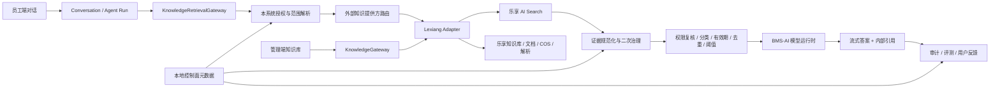

# 乐享外接知识库专用模块方案

- 状态：P0 连接、已有知识库导入与知识库生命周期已实现；文档托管和远程召回仍待实施
- 日期：2026-08-12
- 目标：由腾讯乐享负责知识库、文档、解析切片和召回；BMS-AI 保留知识治理、权限、智能体编排、证据处理、引用、审计和评测的控制权
- 首个供应商：腾讯乐享

## 1. 结论

本方案可行，而且与项目当前的知识独立边界一致。正确的接法不是让智能体直接调用乐享，也不是把乐享的最终问答结果直接展示给用户，而是在现有 `KnowledgeGateway` 后增加一个外部知识提供方适配层：

```text
员工提问
  -> Agent Run
  -> KnowledgeRetrievalGateway（现有公共边界不变）
  -> 本系统权限解析与知识范围路由
  -> 乐享 AI 搜索（只负责返回候选片段）
  -> 本系统二次权限、治理、质量与安全处理
  -> 本系统选定模型生成答案
  -> 本系统引用、审计、反馈与评测
```

边界分工如下：

| 能力                               | 权威方   | 说明                                           |
| ---------------------------------- | -------- | ---------------------------------------------- |
| 知识库与文件实体                   | 乐享     | 创建知识库、目录、在线文档和文件实体           |
| 文件存储                           | 乐享/COS | 文件按乐享签名上传到腾讯云 COS                 |
| 文档解析与切片                     | 乐享     | 不再自建主解析、Embedding 和向量索引链路       |
| 候选片段召回                       | 乐享     | 使用 `/cgi-bin/v1/ai/search`，不是普通节点搜索 |
| 租户、组织、岗位、项目、任务权限   | BMS-AI   | 本系统是业务授权权威来源                       |
| 智能体知识范围                     | BMS-AI   | 根据智能体、用户、项目和任务自动收敛           |
| 文档分类、有效期、责任人、数据标签 | BMS-AI   | 乐享标签可以同步，但不能成为本系统授权事实源   |
| 召回后二次过滤、去重和证据预算     | BMS-AI   | 不把供应商结果直接送入模型                     |
| 最终答案生成                       | BMS-AI   | 继续使用当前模型路由、流式输出、安全与成本治理 |
| 引用、审计、反馈和评测             | BMS-AI   | 记录可验证证据，不记录模型原始思维链           |

这意味着员工智能体与知识库仍然是低耦合模块。以后增加其他知识库供应商时，智能体和 Agent Run 不需要知道供应商名称。

## 2. 官方接口能力核查

### 2.1 已确认可用能力

| 场景               | 乐享接口                                                                  | 已确认的关键能力                                                                                         |
| ------------------ | ------------------------------------------------------------------------- | -------------------------------------------------------------------------------------------------------- |
| 凭证               | `POST /cgi-bin/token`                                                     | `client_credentials`；令牌有效期 7200 秒；取令牌限频 20 次/10 分钟，应缓存                               |
| 创建知识库         | `POST /cgi-bin/v1/kb/spaces`                                              | 创建团队知识库并返回 `space_id` 与根节点 `root_entry`                                                    |
| 知识库权限         | `/kb/spaces/{space_id}/subject`                                           | 支持成员、部门和角色；角色包括 manager/editor/downloader/viewer                                          |
| 创建目录或在线文档 | `POST /cgi-bin/v1/kb/entries`                                             | `folder`、`page` 等节点类型                                                                              |
| 在线文档内容       | `/kb/page/entries/{entry_id}/blocks/...`                                  | 支持创建、更新、移动和删除内容块                                                                         |
| 文件上传           | `POST /kb/files/upload-params` + COS `PUT` + `POST /kb/entries?state=...` | 先取签名，再流式上传 COS，最后关联知识实体                                                               |
| 多类型文件         | `POST /kb/entries`                                                        | 官方列出文档、表格、幻灯片、PDF、TXT、图片、视频和音频等类型；实际 AI 解析能力与大小上限仍需真实租户测试 |
| 获取解析切片       | `GET /kb/entries/{entry_id}/chunked-content`                              | 返回 60 分钟有效的 JSONL 下载地址；字段包含 `page_content`、`org_data` 和 `page_nums`                    |
| AI 召回            | `POST /cgi-bin/v1/ai/search`                                              | 返回 rerank 后片段，`top_n` 最大 50，`targets` 最大 20；当前官方文档登记 `space` 与 `team` 范围          |
| 普通知识搜索       | `POST /kb/entries/search`                                                 | 标题或内容分词命中，只返回节点元数据；适合管理端查找，不适合作为智能体主召回                             |
| 操作日志           | `GET /kb/operation-logs`                                                  | 支持按时间和游标拉取知识与权限操作，可用于对账和增量同步                                                 |

官方参考：

- [开始开发与 access_token](https://lexiang.tencent.com/wiki/api/)
- [团队知识库接口](https://lexiang.tencent.com/wiki/api/15001.html)
- [知识节点接口](https://lexiang.tencent.com/wiki/api/15003.html)
- [本地文件上传](https://lexiang.tencent.com/wiki/api/12004.html)
- [在线文档块接口](https://lexiang.tencent.com/wiki/api/15016.html)
- [AI 搜索](https://lexiang.tencent.com/wiki/api/40004.html)
- [获取知识解析切片](https://lexiang.tencent.com/wiki/api/15014.html)
- [操作日志接口](https://lexiang.tencent.com/wiki/api/15011.html)

### 2.2 为什么主链路用 AI 搜索，不用 AI 问答

乐享 `/ai/qa` 会在乐享内部完成检索和模型回答。若把它作为主链路，会出现两个问题：

1. 最终答案和模型策略被供应商接管，本系统的模型路由、Prompt、安全、成本和答案格式难以统一治理。
2. 若再让本系统模型加工一次，会形成双模型调用，增加延迟和事实变形风险。

因此主链路只使用 `/ai/search` 取得候选证据；最终答案仍由 BMS-AI 的 Agent Run 生成。`/ai/qa` 只可作为接入诊断或效果对照工具，不进入默认生产问答链路。

### 2.3 当前官方契约的缺口

AI 搜索响应文档只明确返回 `title`、`content`、`url` 和可选 `score`，没有明确返回 `space_id`、`entry_id`、内容版本、页码或切片 ID。请求已可用 `targets.type=space` 收敛到单个知识库，但响应侧的稳定文档身份缺口仍会影响文档级权限复核和稳定引用。

上线前必须完成下面任一项，不允许根据标题猜测文档身份：

1. 由乐享确认 AI 搜索响应可以稳定返回或扩展 `entry_id`、`space_id`；这是首选方案。
2. 用真实租户验证 `url` 中的页面标识是否属于稳定、受支持的契约，并取得供应商书面确认。
3. 如果供应商不能提供稳定资源标识，只允许以已验证的乐享 `space_id` 为 target 发起单知识库召回，并把返回片段限制在该本地绑定范围；无法证明映射时拒绝外部召回。

另一个已确认限制是 `targets` 最多 20 个。团队范围超过 20 个时，必须由本系统先做范围路由或分批检索，绝不能省略 `targets` 后搜索全站。

## 3. 目标架构



### 3.1 不增加第二套公共知识网关

继续保留现有三类公共边界：

- `KnowledgeGateway`：知识库和文档管理。
- `KnowledgeRetrievalGateway`：召回和证据复核。
- `KnowledgeEvaluationGateway`：评测快照与语料读取。

外部供应商适配只存在于知识边界内部。Agent Run、项目、桌面端和管理端都不能导入 `LexiangClient`，也不能读取乐享 AppSecret、access token 或远端 ID。

### 3.2 知识边界内部新增模块

建议新增一个 `knowledge-provider` 模块，而不是把乐享逻辑散落到现有 ingestion、retrieval 和 admin 代码中：

```text
apps/api/src/modules/knowledge-provider/
├─ domain/
│  ├─ external-knowledge-provider.port.ts
│  └─ provider-capabilities.ts
├─ application/
│  ├─ knowledge-provider-routing.service.ts
│  ├─ external-knowledge-command.service.ts
│  ├─ external-knowledge-retrieval.service.ts
│  ├─ external-identity-binding.service.ts
│  └─ external-knowledge-reconciliation.worker.ts
└─ infrastructure/lexiang/
   ├─ lexiang.client.ts
   ├─ lexiang-token.provider.ts
   ├─ lexiang-catalog.adapter.ts
   ├─ lexiang-retrieval.adapter.ts
   └─ lexiang-response.schemas.ts
```

只先实现乐享适配器，不建设动态插件市场、脚本扩展系统或通用工作流引擎。未来第二个供应商到来时，再根据真实差异扩展端口。

### 3.3 内部端口最小能力

不把所有供应商功能塞进一个巨型接口，内部只拆成两类：

```ts
interface ExternalKnowledgeCatalogProvider {
  testConnection(input: ConnectionContext): Promise<ConnectionHealth>;
  listSpaces(input: ListSpacesInput): Promise<ListSpacesResult>;
  createSpace(input: CreateSpaceInput): Promise<ExternalSpace>;
  createFolder(input: CreateFolderInput): Promise<ExternalEntry>;
  createPage(input: CreatePageInput): Promise<ExternalEntry>;
  uploadFile(input: UploadExternalFileInput): Promise<ExternalEntry>;
  getEntry(input: GetExternalEntryInput): Promise<ExternalEntry>;
  listOperationLogs(input: OperationLogCursorInput): Promise<OperationLogPage>;
}

interface ExternalKnowledgeRetrievalProvider {
  searchEvidence(input: ExternalEvidenceSearchInput): Promise<ExternalEvidenceSearchResult>;
}
```

DTO 必须传输中立。乐享的 `space_id`、`entry_id`、COS 地址、`state` 和 page token 只能保存在适配器或外部绑定记录中，不暴露给 Agent Run。

## 4. 本地控制面数据

外接知识库不等于本地不存任何数据。本地仍必须保存足够的控制面事实，才能执行自己的权限、治理、审计和引用；但不再复制原文件、完整切片、Embedding 和向量索引。

### 4.1 建议数据模型

| 模型                            | 关键字段                                                                                                    | 用途                                                           |
| ------------------------------- | ----------------------------------------------------------------------------------------------------------- | -------------------------------------------------------------- |
| `KnowledgeProviderConnection`   | `tenantId`、`provider=LEXIANG`、`status`、`credentialReference`、`configVersion`、`lastHealthAt`            | 租户级乐享连接；只保存密钥引用或受控密文，不保存明文 AppSecret |
| `KnowledgeExternalSpaceBinding` | `knowledgeBaseId`、`connectionId`、`externalTeamId`、`externalSpaceId`、`externalRootEntryId`、`syncStatus` | 将本地稳定 UUID 与乐享知识库绑定                               |
| `KnowledgeExternalEntryBinding` | `documentId`、`knowledgeBaseId`、`externalEntryId`、`canonicalUri`、`remoteUpdatedAt`、`status`             | 本地文档治理记录与乐享节点的稳定映射                           |
| `KnowledgeProviderUserBinding`  | `userId`、`connectionId`、`externalStaffId`、`status`、`verifiedAt`                                         | 历史兼容记录；不再作为正式检索或本地员工授权的前置条件         |
| `KnowledgeProviderOperation`    | `operationType`、`aggregateId`、`status`、`attempts`、`providerRequestId`、`lastErrorCode`                  | 跟踪创建、上传、更新和补偿；原始供应商响应与凭证不得入库       |

现有 `KnowledgeBase`、`KnowledgeDocument` 和 `KnowledgeDocumentVersion` 继续保存名称、业务归属、分类、有效期、责任人、数据标签和治理版本。外接文档的 `objectKey`、`contentText`、本地 chunk 和 embedding 可以为空；其物化模式应明确标记为 `EXTERNAL_REFERENCE`，避免被现有本地 ingestion worker 误处理。

现有 `KnowledgeSourceConnector` 是“把外部清单导入本地并由本地切片”的入口，语义与本方案相反，不应把乐享远程召回硬塞进该模型。

### 4.2 稳定 ID 与证据 ID

外部 ID 不直接当作本系统 UUID：

- 本地知识库、文档和版本继续使用本系统 UUID。
- 远端 ID 仅存在于绑定表中。
- 召回片段的 `chunkId` 可由 `bindingId + contentHash` 生成确定性 UUID。
- `contentHash` 由规范化后的片段正文计算。
- `governanceHash` 来自本地当前文档治理版本。
- 引用打开时只提交本地 `documentId`；API 再次鉴权后跳转到乐享页面，前端不直接信任供应商 URL。

这样可继续复用当前 Agent Run 的 `[SOURCE:<chunkId>]` 证据机制和 `areChunksAccessible` 二次复核。

## 5. 权限与治理策略

### 5.1 双重权限门

每次召回必须经过两次本地授权，并利用乐享账号权限形成第三层防护：

1. **召回前本地授权**：根据租户、有效任职、部门、成员白名单、项目、任务、角色智能体绑定、数据标签和提问输入分类，得到允许的本地知识库集合。
2. **乐享连接访问**：使用连接级 `operatorStaffId` 作为乐享 API 的统一访问身份，并显式传入本地已授权知识库对应的单一空间 `target`；永远不允许用户自行提交这个 Header，也不允许省略 `targets` 搜全站。该身份不映射 BMS 员工，也不参与 BMS 权限判定。
3. **召回后本地复核**：结果必须映射回允许的本地知识库/文档，并通过分类上限、治理审批、有效期、归档状态、项目/任务范围和 Prompt 注入防护。
4. **模型派发前复核**：继续调用现有 `areChunksAccessible`，防止召回与模型派发之间权限或治理状态发生变化。

默认不使用 `system-bot`。连接访问身份、连接凭据或明确空间 target 任一不可用时拒绝外部知识召回；BMS 用户停用、无有效任职、本地知识库无权或跨租户时同样在外发前拒绝。

### 5.2 本地权限与乐享权限的关系

BMS-AI 权限是本系统内的业务权威来源；乐享权限是存储侧纵深防御。两者不是互相替代关系。

有一个必须提前说明的边界：如果员工可以绕过 BMS-AI，直接登录乐享网页或调用乐享 API，那么仅在 BMS-AI 做本地权限判断无法阻止其直接访问。此时必须把本地知识库/文档权限同步到乐享，或者将对应乐享知识库限制为服务专用、禁止员工直达。

P0 建议先使用知识库级授权。文档级例外只有在下面任一条件满足后才开放：

- 乐享 AI 搜索能稳定返回 `entry_id` 和所属 `space_id`；或
- 本地文档权限被同步到乐享，并通过真实账号验证；或
- 调用目标被收敛到明确的 `kb_entry`，且不超过接口的 20 个 target 限制。

### 5.3 权限漂移治理

官方文档未显示面向知识变更的标准推送回调，因此先使用操作日志游标增量拉取：

- 每 1～5 分钟拉取一次知识和权限操作日志。
- 游标、日志 ID 和远端更新时间用于去重，按至少一次处理设计。
- 发现权限、知识库或文档被乐享侧直接修改时，更新本地影子元数据并提高 `governanceRevision`。
- 无法解析或映射的权限变更进入“待核对”，相关文档默认暂停召回，而不是继续放行。
- 每日执行一次全量权限对账，输出差异但不静默覆盖本地策略。

## 6. 关键业务流程

### 6.1 首次连接

1. 管理员在“高级设置 → 知识来源”选择“腾讯乐享”。
2. 填写 AppKey、AppSecret；后端加密或写入 Secret/Vault，只返回指纹和连接状态。
3. 调用 token 接口并拉取允许的团队/知识库验证授权范围。
4. 自动导入知识库目录元数据，不下载原文件或完整切片。
5. 管理员为导入的知识库设置公司/部门/成员/项目范围；系统保存本地治理策略。

连接测试必须验证：凭证有效、AppKey 接口权限、知识授权范围、AI 助手权限、指定测试成员能执行 AI 搜索，以及本系统出口 IP 是否满足乐享可信 IP 配置。

### 6.2 创建知识库

1. 管理员仍使用当前“创建知识库”表单，只填写名称、业务归属和访问范围。
2. 本系统完成创建权限校验并先以 `DRAFT` 保存本地知识库、组织范围和成员范围。
3. 适配器调用乐享 `POST /cgi-bin/v1/kb/spaces`，固定传入 `visible_type=0`、两个继承策略均为 `none`，仅给配置的操作成员 `manager` 权限。
4. 创建响应返回后立即保存 `space_id` 和 `root_entry`，再调用详情接口校验团队、远端身份和隐私策略。
5. 校验成功后本地知识库才进入请求的 `ACTIVE` 状态；失败时保持 `DRAFT/SYNC_FAILED`，页面展示错误并允许安全重试。

乐享创建接口没有文档化的幂等键。本实现把本地知识库 UUID 作为远端名称的稳定管理后缀；存在历史绑定但没有 `space_id` 时，重试会先分页读取团队知识库并按该唯一后缀对账，找到后补存身份，不会直接再次创建。删除也先执行同一对账，因此即使创建响应丢失，仍能定位并删除对应远端库。

### 6.3 上传文件

1. 本系统校验上传者、目标知识库、扩展名、MIME、大小、恶意文件和数据分类。
2. 调用 `/kb/files/upload-params` 获取上传 URL、动态 Headers、令牌和 `state`。
3. 文件以流方式直传 COS；不能把大文件整体读入 Node.js Buffer。
4. 调用 `/kb/entries?state=...&space_id=...` 创建乐享知识实体。
5. 保存本地文档元数据、SHA-256、外部绑定和治理版本，不保留重复原文件。
6. 后台轮询解析就绪；通过 `/chunked-content` 抽取 JSONL 的统计信息，检查空片段率、页码覆盖、切片数量和异常字符。
7. 质量合格后文档进入 `READY`；解析未完成显示“乐享处理中”，超时显示“需要处理”，不会让用户面对内部 Job/Queue 状态。

不同文件类型和大小的实际 AI 解析上限必须用企业真实乐享租户测试。官方只说明与站内能力一致，不能把扩展名支持直接表述为已经完成高质量 AI 解析。

### 6.4 智能体召回

```text
用户提问
  1. 输入安全与分类
  2. 本地解析可访问知识库
  3. 根据智能体/项目/任务自动选择最相关范围
  4. 内部 UUID 映射到乐享 targets（最多 20 个）
  5. 使用连接级乐享访问身份调用 /ai/search
  6. Zod 校验响应，规范化 Markdown 和分数
  7. 映射回本地文档，未知来源 fail closed
  8. 本地权限、分类、有效期、治理状态复核
  9. 去重、文档多样性和 Token 预算裁剪
 10. 模型派发前再次复核
 11. 交给本系统模型流式回答并生成内部引用
```

默认参数建议：

- `top_n=16`、`with_score=true`，最终保留 6～8 个证据片段。
- 单篇文档最多保留 2～3 个片段，避免一个文档垄断上下文。
- 先使用乐享的 rerank 分数；只有离线评测证明有收益时才启用本地二次 rerank，避免无收益的额外延迟。
- 问题最长按官方 1024 字符约束；超长对话先由本系统提炼检索问题，不把完整会话发送给乐享。
- 检索数据始终按不可信企业内容包装，延续当前 Prompt 注入隔离规则。

### 6.5 超过 20 个知识范围

普通员工不手工选择 20 个知识库。系统按以下优先级自动路由：

1. 当前任务/项目明确绑定的知识库。
2. 当前智能体版本绑定的知识库。
3. 用户所属部门及岗位知识库。
4. 公司公共知识库。

仍超过 20 个时，使用本地知识库名称、标签、业务归属和近期使用情况选出前 20 个；只有在评测证明不会遗漏时才使用。若必须覆盖全部范围，则分成最多 20 个 target 的并发批次，合并后统一去重和截断，并设置总并发与总时限。

AI 搜索默认使用官方登记的 `{ type: 'space', id }`，其中 ID 只能来自本地已激活的远端绑定，不能由用户请求直接提交。只有当本地策略确认用户可以访问整个团队范围时才允许使用 `{ type: 'team', id }`；不能为了减少请求而扩大权限。

## 7. 延迟、可靠性与降级

### 7.1 目标时延

乐享官方文档没有给 AI 搜索 SLA，因此下面是我们自己的接入预算，不是对供应商性能的承诺：

| 阶段                         |                                 目标预算 |
| ---------------------------- | ---------------------------------------: |
| 本地输入安全、身份和权限解析 |                             P95 ≤ 150 ms |
| token 命中缓存               |                               P95 ≤ 5 ms |
| 乐享 AI 搜索                 | 接入验收后设 SLA；客户端单次截止建议 5 s |
| 本地证据复核、去重与裁剪     |                             P95 ≤ 100 ms |
| 外部召回总截止               |                     6～8 s，不能无限排队 |

access token 缓存到期前 5 分钟刷新，并使用 single-flight 防止并发刷新；401 只允许强制刷新后重试一次。搜索属于只读请求，网络或 5xx 只在总时限内重试一次；403 不重试；429 遵循退避并快速向上游返回明确状态。

### 7.2 熔断和失败语义

- 知识证据为强制要求：外部召回失败时在总截止内结束 Run，返回“企业知识服务暂时不可用”，不能继续显示十分钟“处理中”。
- 知识证据为可选：允许模型继续回答，但必须明确“本次未取得企业知识”，不得伪造企业引用。
- 供应商返回未知结构、未知来源或权限漂移：fail closed，丢弃该证据并记录安全指标。
- 不自动切换到权限语义不同的其他供应商，除非管理员配置了经过验证的等价来源。

### 7.3 缓存

P0 只缓存 access token、连接能力和非敏感目录元数据。召回正文默认不做跨用户缓存。

如后续需要结果缓存，缓存键至少包含 `tenantId + userId + identityRevision + authorizationRevision + sourceSetHash + queryHash + providerConfigVersion`，且模型派发前仍执行实时权限复核。权限变更无法可靠实时感知之前，不启用长 TTL 结果缓存。

## 8. 用户体验

### 8.1 普通员工

- 不显示“乐享 Provider”“target”“rerank”“access token”等内部概念。
- 不要求每次问答选择知识库；由智能体、项目和岗位上下文自动决定。
- 答案仍显示统一的企业知识引用，点击后经本系统鉴权再打开乐享原文。
- 错误信息使用“企业知识暂时不可用”“你目前没有该资料的访问权限”“资料仍在处理中”等业务语言。

### 8.2 管理员

知识库页面保持同一套创建、上传、范围和状态交互，只增加一个弱提示标签“乐享托管”。供应商连接放在高级设置中，用一次性向导完成：

1. 连接凭证。
2. 选择授权团队。
3. 导入或创建知识库。
4. 设置本地访问范围。
5. 用 BMS 有权与无权成员分别执行权限与召回测试。

管理端只突出两类需要处理的事项：连接异常、权限/内容对账异常。正常情况下不暴露分页游标、远端 ID、COS state 或操作日志细节，也不要求逐员工维护乐享身份。

## 9. 分阶段实施

### P0：可用闭环

1. 乐享连接、令牌缓存、健康检查和密钥保护。
2. 导入已有知识库及本地 UUID 映射。
3. 从管理端创建乐享知识库。
4. 多类型文件流式上传、在线文本/Markdown 文档创建。
5. 使用 `/ai/search` 召回片段并接入现有 `KnowledgeRetrievalGateway`。
6. 召回前授权、召回后二次治理、模型派发前复核。
7. 统一引用、审计、超时、熔断和清晰失败状态。
8. 操作日志增量同步和基本权限漂移告警。

### P1：治理增强

1. 文档更新、移动、归档、删除和在线文档块编辑。
2. 本地权限向乐享同步及双向差异对账。
3. 解析切片质量抽检、内容质量看板和失败重试。
4. 基于真实问答集调优 top_n、阈值和本地二次 rerank。
5. 用户反馈闭环和供应商 request_id 关联诊断。

### P2：多供应商

1. 接入第二个外部知识供应商验证内部端口是否足够。
2. 按知识库选择供应商，不让单个知识库同时存在两个权威存储。
3. 多来源并行召回、分数校准和统一引用。
4. 在权限与证据语义等价前，不建设自动跨供应商灾备切换。

## 10. 验收标准

### 10.1 功能

- 可在 BMS-AI 管理端创建乐享知识库并得到稳定本地 ID。
- 可上传至少 DOCX、XLSX、PPTX、PDF、TXT，并能区分“上传成功”“乐享解析中”“可召回”“解析失败”。
- 在线文档可创建并写入基本标题、段落、列表和代码块。
- 智能体能取得乐享 AI 搜索片段，由本系统模型回答并引用本地证据 ID。
- 乐享不可用时不出现无限 QUEUED/RUNNING；在约定截止内失败或明确降级。

### 10.2 权限与安全

- 用户不能通过请求参数伪造 `x-staff-id` 或扩大 `targets`。
- 离职、被禁用、本地权限已撤销和跨租户用户不能取得外部证据。
- 同一问题由有权用户和无权用户发起，返回证据集合必须不同且符合预期。
- 乐享返回未知或越界来源时，该来源不会进入模型上下文。
- AppSecret、access token、COS 临时令牌、预签名 URL 和原始供应商错误体不进入日志、审计或前端。
- 引用打开必须再次鉴权；复制本地引用 URL 给无权用户时应拒绝访问。

### 10.3 质量与性能

- 建立至少 100 条真实企业问题的评测集，覆盖制度、项目、表格、PPT、PDF 和跨文档问题。
- 分别记录 Recall@K、引用正确率、答案可支持率、拒答正确率和首字延迟。
- 不以“HTTP 200”或“返回了片段”作为高质量召回验收。
- AI 搜索 P50/P95/P99、超时率、429、401 刷新率和空召回率均可观测。
- 外部召回总截止不超过配置值，Agent Run 不因供应商长时间无响应无限占用队列。

## 11. 上线前必须向乐享确认的问题

1. AI 搜索能否返回稳定的 `entry_id`、所属 `space_id`、页码和内容版本；若当前没有，是否支持扩展字段。
2. AI 搜索的企业级 QPS、并发、日配额、P95/P99 延迟和超时 SLA。
3. `score` 的取值范围、跨请求可比性、模型升级策略和变更通知机制。
4. 各文件类型的 AI 解析大小上限、解析等待时间、失败码和重新解析方式。
5. 是否有知识库、节点、权限和解析完成事件的正式回调；若没有，操作日志的最大延迟和保留期。
6. AppKey 授权范围或知识权限修改后，对 AI 搜索生效的最大延迟。
7. 预签名上传 URL、下载 URL和切片 JSONL 的数据驻留、加密、保留和合规承诺。
8. 是否支持请求幂等键，特别是创建知识库、创建节点和关联上传文件。

其中第 1、2、4、6 项是生产上线门槛，不确认就不能承诺“高质量、稳定、低延迟”。

## 12. 对现有项目的实施影响

预计实施时需要修改或新增以下范围：

- `packages/contracts/src/`：外部知识连接、绑定、状态和公共管理 DTO；保持供应商中立。
- `apps/api/prisma/schema.prisma` 与新的前向 migration：连接、空间、节点、身份和操作绑定。
- `apps/api/src/modules/knowledge-gateway/`：增加按知识库 backend 路由的组合适配，不改变业务调用方依赖方向。
- `apps/api/src/modules/knowledge-provider/`：新增乐享专用适配与对账模块。
- `apps/api/src/modules/agent-run/`：只在证据 DTO 确有缺口时做最小扩展；继续使用现有召回和派发前复核流程。
- `apps/admin/src/features/`：连接向导、托管状态、连接访问身份和异常处理。
- `docs/adr/0008-knowledge-independent-business-boundary.md`：实施时登记新边界归属与依赖方向。
- `knowledge-boundary.architecture.spec.ts`：将新增 provider 模块纳入知识边界，禁止其他模块直接导入乐享适配器。

截至 2026-08-12，本节仍是技术与产品方案；后续实现进展在下方持续登记，并继续按“契约 → migration → provider adapter → Gateway 路由 → Agent Run 集成 → 管理端 → 真实租户验收”的顺序落地。

### 12.1 2026-08-13 实现进展

已完成首个管理闭环：

- 管理后台“知识中心 → 知识来源”可查看腾讯乐享入口。
- 企业所有者/管理员输入 AppKey、AppSecret 后，可先由后端只读发现团队和管理员候选；单一结果自动回填，多结果按名称选择，验证成功后再保存。发现阶段不持久化 AppSecret，也不创建知识库。
- 乐享在 AppKey 绑定团队或未授予“团队管理/获取团队列表”权限时会以 403 拒绝团队列表，且 access_token 不携带团队范围；此时页面明确提示补充接口权限，并只保留已绑定团队 ID 的人工兜底。管理员候选同理由“通讯录管理”权限控制。
- AppSecret 使用连接密钥环和租户/AppKey 绑定的 AES-GCM 密文持久化；API 只返回 AppKey 脱敏提示、凭据是否存在和健康状态。
- 支持重新检测连接、更新凭据和停用连接；存在未删除的托管库时禁止更换连接身份或停用，避免失去远端删除能力。
- 新增租户复合唯一键、`FORCE RLS` 和最小数据库授权；`knowledge-provider` 已登记为知识边界所有模块。
- 管理员可在新建知识库时选择“腾讯乐享知识库”；系统真实创建私有远端库、读取详情，并保存团队 ID、知识库 ID、根目录 ID、远端元数据、隐私参数和同步状态。
- 连接成功后立即执行一次已有知识库同步；知识库页面同时提供“同步乐享知识库”用于后续对账。系统分页读取绑定团队的全部知识库，逐个获取详情，并按乐享 `space_id` 幂等导入或刷新本地绑定。同步只读乐享，不会创建、改名、改权限或删除远端库。
- 新导入的已有乐享库以本地 `DRAFT` 创建，初始仅同步操作者可访问；管理员确认并设置本系统公司/部门/成员 ACL 后再启用，避免导入即扩大智能体检索范围。
- 已有乐享库如果仍是可见状态或继承团队管理员/成员权限，本地会保留其稳定绑定和远端元数据，但标记 `SYNC_FAILED/LEXIANG_SPACE_PRIVACY_MISMATCH` 并停止检索；同步操作不会静默覆盖乐享现有权限。
- 乐享侧不继承团队管理员或成员权限，仅操作成员保留管理权限；本系统的公司/部门/成员 ACL 继续作为员工检索授权事实。
- 删除本地托管库时先删除乐享对应库，远端失败则不归档本地库；404 视为已完成，所有成功与失败均进入租户审计。
- 创建请求使用稳定管理标记并在重试前分页对账，覆盖“乐享已创建但响应丢失”的重复创建风险；名称更新会保留该标记。
- 已按当前乐享官方契约校正 AI 搜索适配骨架：请求 target 使用 `{ type: 'space', id }`，响应只从 `data.list` 读取已登记字段；该适配器尚未接入公共检索网关。

本阶段完成的是连接与知识库生命周期，不把它表述为“乐享文档与智能体检索已经可用”。乐享文件上传/文档同步、远程召回接入 `KnowledgeRetrievalGateway`、真实 BMS 权限矩阵和生产出口 IP 仍须后续实施并使用真实乐享企业租户验收。

### 12.2 2026-08-13 创建后 500 故障复盘

真实租户创建乐享知识库时出现过“远端已经创建，但管理后台显示通用 500”的部分成功故障。核对本地绑定、远端身份和请求审计后确认：两次页面提交都已经取得不同的乐享 `space_id` 和根目录 ID；远端创建响应也已经证明知识库为不可见且不继承团队管理员/成员权限。故障发生在创建后的详情复核阶段，而不是乐享创建阶段。

根因由两个条件叠加形成：

- 乐享详情响应在该真实请求中省略了部分值为 `none` 的可选隐私字段；旧实现把“字段未回传”直接解释为“不满足私有策略”，产生 `LEXIANG_SPACE_PRIVACY_MISMATCH`。官方契约登记详情响应包含这些字段，因此这里按兼容性偏差处理，而不能把缺省值解释为远端公开。
- `provision` 与 `rename` 在 `try` 中直接返回异步 `completeSync`，没有等待 Promise；`completeSync` 的异步拒绝因此绕过同层 `catch`，页面收到通用 500，绑定则停留在 `PROVISIONING`。

修复后的规则为：

- 创建响应或此前成功复核已经保存的隐私事实可以作为详情缺省字段的回退值；详情明确返回非私有值时仍然 fail closed，标记 `SYNC_FAILED/LEXIANG_SPACE_PRIVACY_MISMATCH`，不会启用本地库。
- 详情缺省且本地也从未保存过私有事实时仍然失败，不根据供应商默认值猜测权限。
- 保存远端身份时不再用详情中的 `null` 覆盖此前已确认的隐私事实。
- `provision` 与 `rename` 显式等待 `completeSync`，确保异步隐私拒绝能被持久化为可诊断同步失败，而不是泄漏为通用 500。
- 重试已有绑定只读取原 `space_id` 并补齐本地状态，不再次调用创建接口。

修复后使用两条既有绑定做了真实重试：两条记录都复用各自已有的远端 ID，从 `PROVISIONING/SYNC_FAILED` 收敛为本地知识库和绑定均 `ACTIVE`，隐私事实保持 `0/none/none`，同步审计写入成功；整个修复过程没有创建第三个远端库，也没有删除任何远端库。第二次页面提交形成的重复知识库仍被如实保留，必须由管理员确认保留对象后再执行远端优先删除，不能由故障修复过程擅自清理。

### 12.3 2026-08-13 目录同步分页故障复盘

真实租户在删除两条重复库并重新创建知识库后，手动执行目录同步得到 `LEXIANG_SPACE_LIST_INVALID_RESPONSE`。请求核对确认乐享第一页返回 HTTP 200 和 4 条合法知识库记录，同时返回分页游标；使用该游标读取第二页时，乐享返回空数组但再次返回相同游标。旧客户端在识别空页之前先执行重复游标校验，因此把乐享的“空页 + 重复终止游标”误判为分页死循环，最终由未映射的供应商异常表现为通用 HTTP 500。

修复后，团队和知识库目录都以空页作为分页结束条件；只有非空页重复游标时才继续 fail closed，防止真实死循环。目录读取失败同时映射为明确的 HTTP 502 业务错误，不再向管理员展示无法判断原因的通用 500。该故障不由本地 ACL、连接凭据、刚删除的知识库或新建知识库本身引起。

### 12.4 2026-08-13 乐享文件夹与文档目录同步

知识库对账已从“只同步知识库空间”扩展为“递归同步空间内全部知识节点”。实现使用乐享知识节点列表接口，从知识库根目录开始按层分页读取文件夹和文档；分页、父子关系、移动、重命名和远端删除均以稳定的 `entry_id` 对账，不依赖显示名称判断身份。

本地继续复用现有 `KnowledgeFolder` 和 `KnowledgeDocument` 作为管理端目录投影，并新增知识边界内部的 `KnowledgeExternalEntryBinding` 保存远端知识库 ID、节点 ID、父节点 ID和本地文件夹/文档 ID映射。远端文件夹投影为本地文件夹；远端非文件夹节点投影为不带本地内容版本的 `DRAFT` 文档目录记录。再次同步时更新名称、目录位置和远端时间；远端已删除文档在本地归档，远端已删除且本地为空的文件夹移除。乐享托管目录禁止在本地执行删除文件夹、归档文档或上传新版本，避免形成双写冲突。

真实租户验收结果如下：

- 4 个当前乐享知识库共发现 629 个知识节点，其中 65 个文件夹、564 篇文档。
- “华为图片”同步 3 个文件夹、109 篇文档。
- “华为相关内容”同步 60 个文件夹、441 篇文档。
- “蓝血研究院资料”同步 2 个文件夹、14 篇文档。
- “咨询圈文库资料1”远端当前为空，因此同步 0 个文件夹、0 篇文档。
- 首次同步创建 564 条文档目录投影；第二次同步创建 0 条、更新 564 条，总绑定数仍为 629，证明按远端 ID 幂等且没有重复文档。

本阶段同步的是“可查看、可对账的目录元数据”，没有复制乐享文档正文、附件或解析切片，也没有把目录投影伪装成已经可被智能体召回的本地知识。要让这些文档真正参与回答，仍需将乐享 AI 搜索或受控正文读取接入 `KnowledgeRetrievalGateway`，并在返回证据进入模型前执行本地租户、当前用户的知识库 ACL 和来源范围复核。当前 3 个历史乐享知识库仍因远端隐私策略与托管策略不一致保持 `SYNC_FAILED/LEXIANG_SPACE_PRIVACY_MISMATCH`；目录允许对账，但不能因此绕过检索禁用状态。

### 12.5 2026-08-13 乐享托管库文件夹上传

管理端乐享托管知识库现支持选择本地文件夹并保留所选文件的目录与子目录层级上传。实现复用现有文件夹选择器和公共知识管理 HTTP API：服务端先按路径幂等创建缺失的乐享文件夹并同步本地影子目录，再逐个把文件上传到对应远端父节点。相同目录中的同名文件重试时使用乐享“重新上传文件”接口更新原节点，不新建同名影子记录。浏览器文件夹选择不会返回纯空目录；需要保留的空目录可使用同一页面的“新建文件夹”创建。

文件上传严格遵循乐享官方三步协议：先申请本地文件临时上传参数，再将二进制和服务端返回的全部动态请求头写入腾讯云 COS，最后使用临时 `state` 创建或更新知识节点。COS 目标必须是 HTTPS 且主机属于 `myqcloud.com`，请求不携带乐享 Bearer token；临时 URL、COS 安全令牌和文件正文不写入本地数据库、日志或审计。远端节点成功而本地新建影子失败时，系统尝试删除本次新建的远端节点作为补偿；补偿失败时后续目录同步仍可按远端 `entry_id` 收敛。

权限和状态规则保持 fail closed：只有本地具有知识库写权限且外部绑定为 `ACTIVE` 的请求可以上传；处于隐私范围不一致、连接异常、删除中或已删除状态的托管库不允许写入。上传后本地只新增不含 `objectKey`、正文、内容版本和切片的 `DRAFT` 文档影子，用于受本地 ACL 控制的目录查看；这项能力不等于乐享远端正文已经接入智能体检索。

当前支持乐享官方 `file` 类型登记的图片、Office/WPS 文档、表格、演示文稿、PDF 和 TXT 后缀；浏览器会提前跳过不支持格式，API 仍执行同一白名单校验。未在真实租户写入测试文件，避免为验收擅自创建业务资料；供应商上传权限、真实大文件上限、解析结果和生产网络出口仍需管理员提供专用测试文件夹后做端到端验收。

### 12.6 2026-08-13 已有知识库上传入口语义修复

管理端顶部“上传资料”原本始终进入“导入并新建知识库”流程，即使左侧已经选中一个空知识库，也会先调用知识库创建接口再上传文件。这是误创建新库的直接原因，与乐享文件夹或文件上传接口无关。

修复后，页面存在选中知识库时按钮显示“上传到当前库”，弹窗固定复用所选知识库 ID，并隐藏存放位置和访问范围选择；提交只调用该库的文档上传接口，不调用本地知识库创建或乐享知识库创建能力。没有选中知识库时按钮才显示“上传资料并新建库”，继续保留原有导入建库流程。需要保留本地目录层级时，仍从当前知识库的文档管理区使用“导入文件夹”；普通文件上传默认写入当前库根目录。前后端回归测试分别断言已有乐享库上传不会调用 `createKnowledgeBase` 或供应商 `provision`。

### 12.7 2026-08-13 乐享 AI 搜索接入公共检索网关

管理端乐享知识库“检索测试”此前仍调用本地切片检索；乐享同步文档只有目录投影，没有本地正文版本和切片，因此该入口无法返回乐享内容。页面所见的一次 HTTP 500 同时发生在开发 API 热重启窗口，Vite 代理日志记录为 `ECONNREFUSED 127.0.0.1:3000`；API 稳定后同一路径曾返回 HTTP 201，但仍只是本地空检索。这两个问题必须区分：前者是开发进程瞬时不可用，后者是远程检索能力没有接线。

现已将既有 `LexiangClient` 接入 `KnowledgeRetrievalGateway`。公共检索先使用本系统租户、用户、组织和知识库 ACL 解析可访问知识库，只把其中绑定状态为 `ACTIVE` 的乐享库转换为单一 `{ type: "space", id: externalSpaceId }` 搜索目标，再按[乐享 AI 搜索官方契约](https://lexiang.tencent.com/wiki/api/40004.html)调用 `POST /cgi-bin/v1/ai/search`。请求使用已加密保存的连接凭据换取 Token，`x-staff-id` 使用已验证的操作成员账号，`top_n` 受本系统上限和乐享最大 50 条限制，查询按官方 1024 字符上限截断；凭据、Token 和远端正文不写入日志。

乐享返回的标题、Markdown 片段、原文 URL 和相关性分数被转换为传输中立的公共检索证据，不向调用方暴露连接记录、数据库模型或远端存储实现。管理端明确显示“腾讯乐享当前内容（远程检索）”“腾讯乐享 AI 搜索”和外部检索诊断；403 会提示检查 AppKey 的“AI 助手”权限、可信 IP 和连接访问身份，其他供应商异常以稳定错误码降级返回，不再泄漏为通用 500。员工智能体走同一公共网关，远端证据进入模型前执行查询外发分类门禁，运行派发前再次复核本系统 ACL 和乐享绑定仍然有效。

### 12.8 2026-08-17 连接级访问身份与外部检索安全闭环

用户确认了最终身份语义：乐享 `staff-id` 是配置在外部知识连接上的 API 访问身份，不对应 BMS 用户、成员或数据库员工 ID。BMS 用户、有效任职、公司/部门/项目/成员范围继续由本地系统独立授权；正式检索不再读取 `KnowledgeProviderUserBinding`。历史表、迁移和兼容 API 暂时保留，但不再作为员工使用乐享知识库的前置条件，管理端也不再要求逐员工维护映射。

`KNOWLEDGE_LOCAL_BACKEND_ENABLED=false` 只禁用本地解析、向量化和索引，不关闭 `KnowledgeRetrievalGateway`。网关先按当前 BMS 用户计算可访问知识库，只把其中状态为 `ACTIVE` 的乐享库转换为明确的单一空间 target；适配器使用连接的 `operatorStaffId` 调用乐享。召回后和 Agent Run 派发前均按当前 BMS 用户重新校验本地 ACL、连接和空间绑定。连接身份不授予任何本地知识权限，禁止省略 target 搜全站或使用 system-bot。

2026-08-17 对 `lxyj` 的真实只读验收已通过：团队知识接口 712ms 可达；以连接级访问身份对唯一明确空间搜索“华为铁三角是什么”，2,795ms 返回 5 条结果，5 条均带分数、稳定 SHA-256 证据 ID、非空正文和 HTTPS 来源。随后通过正式 `KnowledgeRetrievalGateway` 验证本地权限：目标知识库为 `ACTIVE`，部门范围和成员范围均为空，因此按现有策略属于全公司可用；6 名有效在职员工全部获得该知识库，未知用户为 0；有效员工经网关再次召回 5 条乐享证据，模型派发前复核通过，未知用户复核拒绝；另一租户请求同一知识库时可访问范围和结果均为 0，且外部 provider 未执行。

上述结果证明“连接联通”和“本地权限边界”均已通过当前真实环境验证。仍未完成的是 Electron 中由 `lxyj` 员工发起的模型回答、引用显示和引用打开；不能用本次供应商召回或 Gateway 结果代替这三项 UI 验收。

## 13. 最终建议

首版不要追求“所有乐享功能完整镜像”。先把四件事做扎实：

1. 稳定的连接访问身份。
2. 严格限制检索范围。
3. AI 搜索片段进入模型前完成本地二次治理。
4. 外部故障在数秒内明确结束或降级。

这四项决定了外接知识库是否真的安全、好用和低耦合。在线块编辑、权限双向同步、多供应商编排都可以分阶段增加，但不能牺牲上述主链路。
