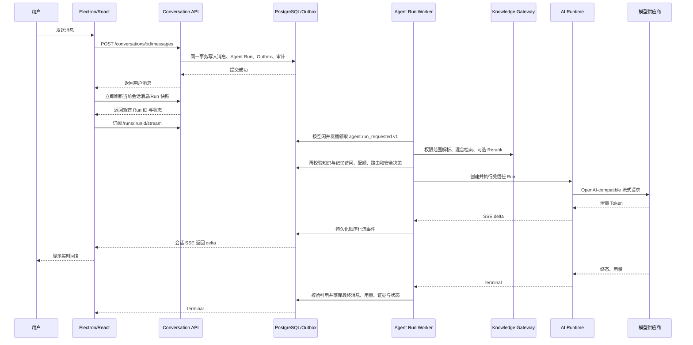

# 用户端智能体回复链路与首字延迟优化

日期：2026-08-12

## 1. 结论

本次优化不改变模型、Prompt、知识检索、Rerank、安全策略、权限过滤、引用校验或回答落库语义，主要删除三段与回答质量无关的等待：

1. 桌面端发送成功后立即刷新当前会话的消息/Run 快照，不再等待前台 2 秒、非焦点 10 秒的下一轮消息轮询才发现 Run。
2. 发送消息的 HTTP 请求不再重复执行 Runtime 就绪探测；Agent Run Worker 仍会在真正调用模型前执行完整就绪检查并失败关闭。
3. Agent Run Worker 不再等待一批模型请求全部结束后才继续领取任务，而是按空闲执行槽持续补位；默认并发槽由 1 调整为 4。

这三项改动不增加用户设置项或页面概念，用户仍然只执行“选择回复对象并发送消息”。

## 2. 优化后的真实调用链



## 3. 原流程中的等待点

### 3.1 桌面端知道消息已发送，但不知道 Run ID

消息创建接口只返回 `Message`。Agent Run 虽与消息在同一数据库事务创建，但桌面端原来只更新本地用户消息和会话列表，没有刷新当前会话的 `runs`。流式订阅依赖 `runs` 中的活动 Run，因此必须等消息轮询或 IM 失效通知。

原轮询策略：

- 窗口聚焦：2 秒；
- 窗口可见但未聚焦：10 秒；
- 窗口隐藏：停止轮询，待重新聚焦或实时通知。

本次在发送成功后立即失效并刷新当前活动消息查询。服务端事务已提交，因此该查询可以直接取得 Run ID 并开始 SSE 订阅。没有扩展跨端契约，也没有新增一次长期轮询。

### 3.2 同一个回答执行了两次 Agent 可运行性检查

显式选择 Agent 回复时，Conversation API 原来在写消息之前执行一次 `AgentOperationalReadinessService.inspectAgents`；Worker 准备好 Run 后又执行一次。前一次检查包含路由、目录、熔断、近期成功证据和 AI Runtime readiness，Runtime 探测的单次超时上限为 3 秒。

现在消息事务仍会校验：租户、会话参与者、回复目标、Agent 在线状态、发布版本、岗位分配、组织范围和可见性。Runtime/provider 的完整就绪检查只保留在 Worker 的模型调用前，检查失败仍会把 Run 标记为失败，绝不会绕过模型路由或安全边界。

### 3.3 Worker 的批次等待形成队头阻塞

原 Worker 每次领取最多 `concurrency` 条任务后，会等待整批任务的模型执行全部结束，再进行下一次领取。默认并发为 1，因此一个 20 秒回答会使后续所有用户至少先排队约 20 秒。即便并发配置大于 1，如果第一次轮询只领到一条任务，其余槽位也会一直空闲到该回答结束。

现在 Worker 维护当前活动任务集合，每 500 毫秒只按剩余空闲槽领取新任务：

```text
本次领取数 = max(0, 配置并发数 - 当前活动任务数)
```

默认并发为 4。每个会话已有“同一时刻只允许一个活动直接 Run”的数据库锁，租户 Token 配额、Run lease、模型路由熔断和取消通道继续生效。因此这里只提高不同会话之间的吞吐，不并行打乱同一会话的上下文顺序。

## 4. 对延迟的确定性影响

在不假设数据库、网络和模型速度的前提下，本次可以确定消除或压缩：

| 等待项                         | 原行为                                   | 新行为                                        | 确定性影响                                                      |
| ------------------------------ | ---------------------------------------- | --------------------------------------------- | --------------------------------------------------------------- |
| Run 发现                       | 等下一次消息轮询或 IM 通知               | 发送提交后立即刷新                            | 聚焦窗口消除最多约 2 秒纯等待；非焦点窗口消除最多约 10 秒纯等待 |
| 消息请求中的 Runtime readiness | 最长 3 秒探测，加数据库证据查询          | 移出 HTTP 关键路径，Worker 调用模型前保留一次 | 删除一次重复检查；消息先可靠提交，模型安全边界不变              |
| Worker 队头阻塞                | 整批完成后再领取，默认串行               | 每 500 毫秒按空闲槽补位，默认 4 槽            | 不再让一个长回答占住全部用户；空闲槽补位等待上限约为轮询周期    |
| 模型生成                       | 供应商 SSE                               | 不变                                          | 不用降低模型、上下文或输出上限换速度                            |
| 知识质量                       | 授权检索、RRF/Embedding/Rerank、引用校验 | 不变                                          | 无质量降级                                                      |

“最多约 2/10 秒”和“最长 3 秒”是由现有配置与代码路径推导的等待上限，不是线上真实模型压测数据。

## 5. 质量与安全不变量

- 知识进入模型前仍按租户、用户、组织和授权范围过滤。
- 检索后仍再次校验 chunk、文档版本、分类、治理哈希和内容哈希的可访问性。
- 记忆快照、Token 配额、模型路由、熔断、输入安全和输出安全仍在 Runtime dispatch 前执行。
- 最终回答仍必须通过来源标记与本次授权证据的绑定校验。
- Run、流式 delta、终态、最终消息、用量、模型尝试证据和审计仍持久化。
- 同一直接会话仍只允许一个活动 Run；取消 Worker 仍与长模型执行独立。

## 6. 验证结果

本次实际执行：

- API 针对性 Vitest：3 个文件、79 项通过；覆盖 Worker 空闲槽补位、消息路径不重复 readiness、环境默认并发。
- 桌面消息 Vitest：8 个文件、45 项通过；覆盖发送后立即刷新、流式状态、同步策略、消息 API 与交互辅助逻辑。
- API 完整 Vitest：243 个文件中 220 个通过、23 个跳过；1,359 项通过、155 项跳过。
- 桌面端完整 Vitest：45 个文件、184 项全部通过。
- `@enterprise/api` TypeScript 类型检查通过。
- `@enterprise/desktop` Node/Web TypeScript 类型检查通过。
- `@enterprise/api` Nest 构建通过。
- `@enterprise/desktop` Electron main、preload、renderer 生产构建通过。
- 相关文件 `git diff --check` 通过。

当前没有运行中的本地 API、PostgreSQL、AI Runtime、Electron 客户端和真实模型供应商，因此未完成真实首字时间、并发吞吐、供应商限流与 UI 实机验收。不能把上述单元/类型检查结果表述为生产性能已经达标。

## 7. 上线验收建议

在与生产相同的模型路由、知识规模和并发限制下记录以下分位数：

- `message_committed_at - send_started_at`：消息提交耗时；
- `run_claimed_at - message_committed_at`：队列等待；
- `runtime_dispatch_at - run_claimed_at`：权限、知识检索、安全与路由准备；
- `first_delta_at - runtime_dispatch_at`：模型首 Token；
- `first_render_at - first_delta_at`：流事件持久化、SSE 和客户端渲染；
- `terminal_at - send_started_at`：总回答耗时。

建议验收场景至少包含：单用户短问答、带知识检索问答、4 个不同会话并发、超过 4 个会话排队、模型 429/超时、SSE 断线重连、取消、权限在检索期间变化。Runtime 已有 `agent.run.first_token` 观测点，可优先复用，不必新增另一套指标系统。

生产环境如果显式配置了 `AGENT_RUN_WORKER_CONCURRENCY=1`，不会自动采用新的默认值；应先结合模型供应商并发额度、数据库连接池和 Token 预算完成压测，再调整为 4 或其他经过验证的值。

## 8. 2026-08-21：消息提交唤醒与真实流式打包增量

### 8.1 本轮目标与结果

本轮继续压缩“消息已经提交，但 Worker 还没开始处理”和“模型已经返回短句，但输出安全缓冲仍不显示”的等待，不改变消息幂等、知识权限、会话顺序、供应商路由或最终引用校验语义：

1. `ConversationService` 在消息、Agent Run 与 Outbox 的事务成功提交后，立即唤醒同进程的 `AgentRunWorker`。Worker 不再必然等待下一次 500 毫秒轮询；跨进程部署、通知丢失和进程恢复仍由原定时轮询兜底。
2. OpenAI-compatible 适配器继续消费供应商真实 SSE，但把同一个上游网络包中包含的多个极小 delta 合成一个 Runtime delta。这样减少“每个 Token 一次持久化/转发”的事务放大，不引入人为定时器，也不伪造逐字动画。
3. 增量输出安全缓冲由固定保留 512 字，调整为：完整句子或 Markdown 行可在安全检查通过后立即释放；未完成内容保留 128 字回看窗口，并继续对跨 delta 的凭据、个人信息和越权代表性动作实行阻断或脱敏。
4. 实机检查发现 `/api/v1/im/session` 使用的 `conversation.realtime.connect` 未登记到 fail-closed 授权动作集合，导致合法租户成员被 403 拒绝并退回消息轮询。本轮已登记该动作；它仍按会话类动作产生 `VERIFY_RESOURCE_MEMBERSHIP` 义务，跨租户和无效身份不会因此放开。
5. 桌面端首次申请实时会话遇到 503、429、网络中断等可恢复错误时，按 250 毫秒起步、最高 5 秒的指数退避自动重试，不再要求用户刷新页面；明确的不可恢复 4xx、账号切换、主动停止和 provider 明确返回 `unavailable` 仍立即结束。

优化后的关键时序是：

```text
消息/Run/Outbox 同事务提交
  → 同进程 Worker 立即唤醒（跨进程仍最多等待一个轮询周期）
  → 授权知识检索、Rerank、证据与路由准备
  → 供应商真实 SSE
  → 按上游网络包合并微小 delta
  → 增量输出安全检查
  → Runtime 流事件落库
  → 会话 SSE 按 runId 和 sequence 回放/推送
  → Electron 只拼接对应 runId 的增量
```

### 8.2 供应商能力边界

“系统支持流式”与“当前选中的供应商提供回答 Token 流”必须分开说明：

- OpenAI-compatible 路由走真实 `/chat/completions` SSE，能够在供应商产生首个内容包后开始显示。
- 当前本地配置使用 Manus 驱动。Manus 官方公开的任务生命周期是异步创建任务，再用 `task.listMessages` 读取任务消息；公开文档没有给出回答 Token SSE 契约。因此 Manus 适配器保持 `terminal_only`，只在远端任务形成可确认终态后输出，不能为了视觉效果把完整答案切成假 Token。参见 [Manus Task lifecycle](https://open.manus.ai/docs/v2/task-lifecycle) 与 [task.listMessages](https://open.manus.ai/docs/v2/task.listMessages)。

要在真实客户端看到类似豆包的持续逐段输出，需要把受信任路由配置到确实支持 SSE 的 OpenAI-compatible 模型端点，并同时具备有效的 Base URL、模型名、凭据、RPM/TPM 与并发额度。代码链路已就绪，但不能把未配置的真实供应商能力表述为已经验证。

### 8.3 本轮验证证据

本轮实际执行并通过：

- API 定向 Vitest：`AgentRunWorker` 与 `ConversationService` 共 52 项，覆盖事务提交后唤醒、并发槽、Run 状态和消息路径。
- API 授权与 IM 会话定向 Vitest：2 个文件、13 项通过，覆盖实时会话动作登记、会话权限义务与本地 provider 的诚实降级状态。
- API 流事件/仓储/游标定向 Vitest：3 个文件、38 项，覆盖 runId 隔离、sequence、断线回放与终态。
- AI Runtime 定向 Pytest：OpenAI-compatible provider 与 routed provider 共 41 项，覆盖真实 SSE 解码、同网络包微 delta 合并、短句提前释放以及跨 delta 安全阻断。
- AI Runtime 完整 Pytest：263 项通过；完整 Ruff 检查通过。
- 桌面流式、鉴权、消息 hooks 与工作区定向 Vitest：5 个文件、45 项通过。
- 桌面鉴权管理器与 IM 连接定向 Vitest：2 个文件、13 项通过，覆盖首次会话获取暂时失败后的自动重试和 local provider 正常降级。
- API TypeScript 类型检查与 Nest 构建通过。
- 桌面 Node/Web TypeScript 类型检查与 Electron main、preload、renderer 生产构建通过。
- 本地实际启动后，API `/health/live`、`/health/ready`、Runtime `/health/live`、`/health/ready` 与管理端均返回 200；Electron 窗口完成重新连接，工作台、智能体会话、知识引用、UNKNOWN/失败分支和输入区均可真实查看。

本轮没有向真实供应商新发测试问题，避免无必要的外部调用和计费。当前 Manus 路由的真实知识检索终态历史可以在客户端查看，但 OpenAI-compatible 真实首 Token 时间、100 人并发、供应商 429/限流和多副本 Worker 唤醒尚未做生产等价压测，不能宣称生产 P95 已达秒级。当前本地环境没有配置 `IM_PROVIDER=wukong` 及 WuKongIM 会话参数，因此实时会话授权缺陷已经修复，但跨用户的真实 WebSocket 到达时间仍需在 WuKongIM 环境验收；本地 provider 会明确返回不可用并继续使用数据库轮询。

### 8.4 受控灰度前的验收口径

至少分别记录以下阶段，避免把模型慢、知识检索慢和本地排队混成同一类问题：

- 消息提交到 Run 领取；
- Run 领取到知识检索完成；
- Runtime 派发到供应商首个真实 delta；
- 首个 Runtime delta 到 Electron 首次渲染；
- 完整回答终态耗时。

单进程 API + Worker 已可用进程内唤醒；如果将 Worker 独立成多个进程或多副本部署，而 500 毫秒轮询仍不满足目标，再在现有 PostgreSQL Outbox 上增加 `LISTEN/NOTIFY` 作为低延迟提示，Outbox 仍是事实来源。不要为这一提示额外引入第二套业务队列或把通知本身当作可靠消息。
