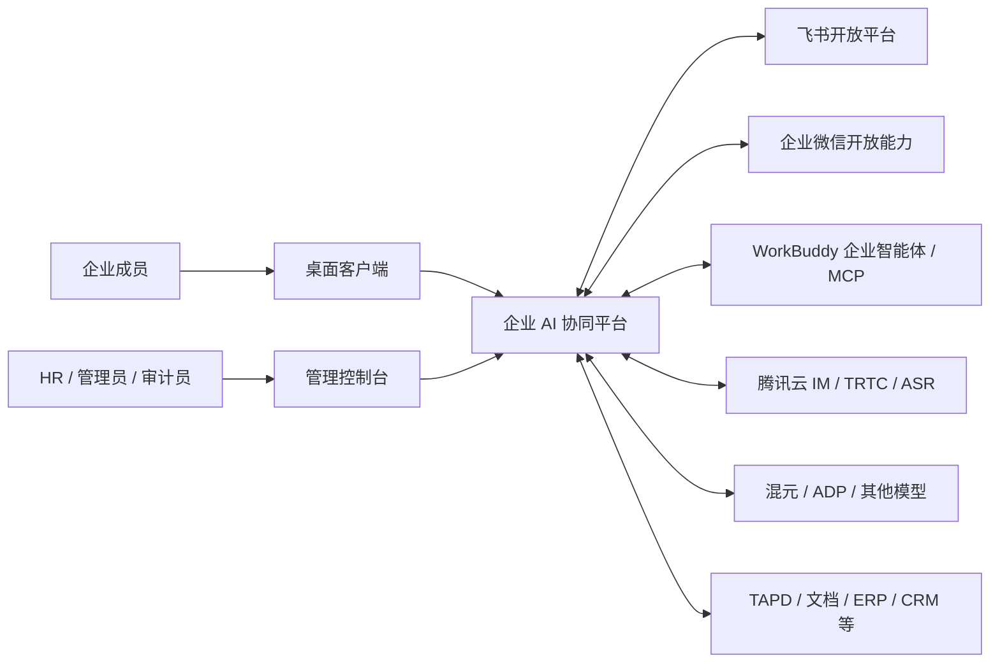
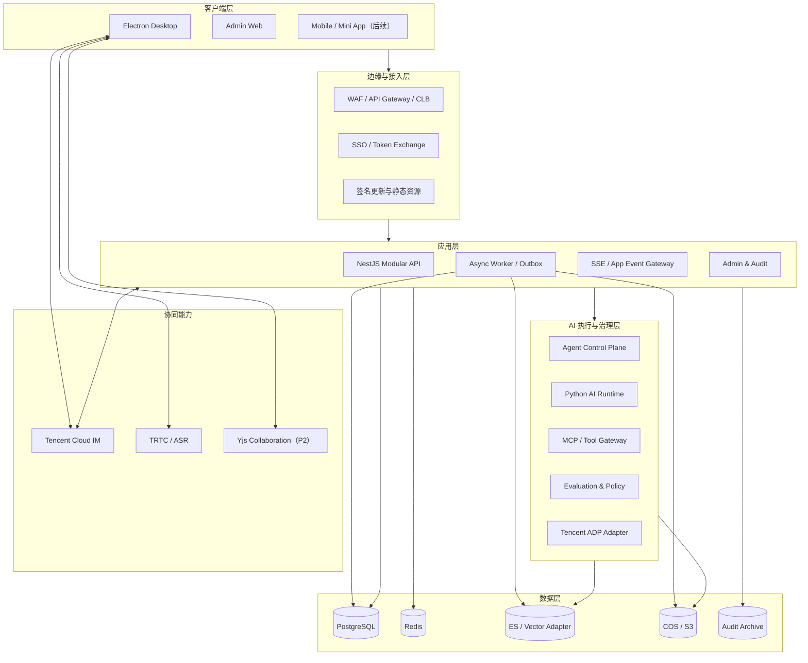
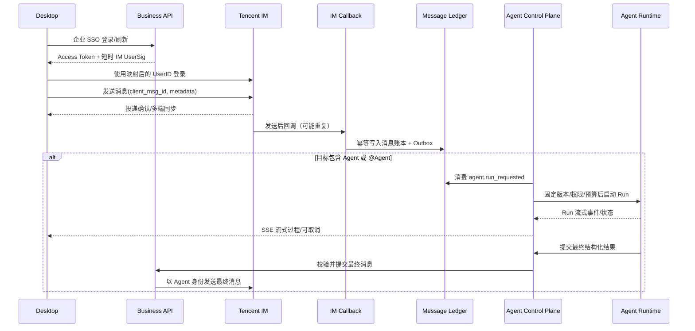
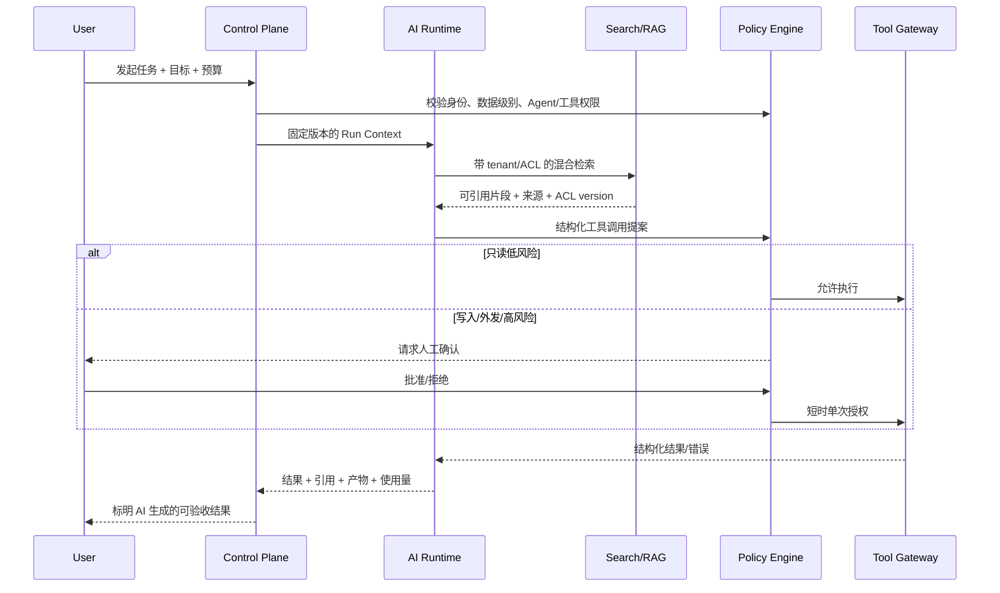
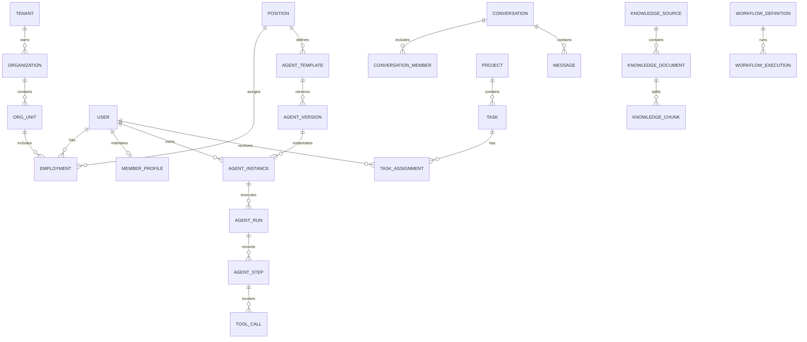
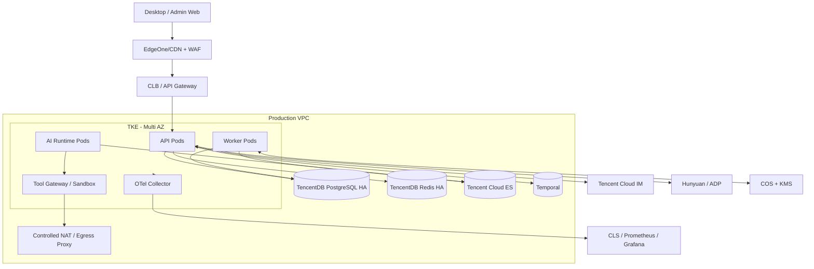

# 企业 AI 协同平台总体技术方案

> 文档版本：v1.0  
> 编制日期：2026-07-14  
> 文档状态：建议技术基线，待产品范围与 POC 验证后转为正式基线  
> 适用范围：Windows/macOS 桌面端、管理端、SaaS 后端、专有化后端、AI/Agent 平台  
> 目标读者：产品负责人、架构师、桌面端/后端/AI 工程师、测试、运维、安全与合规人员

## 1. 结论先行

本项目应建设为一个“企业协同底座 + AI 数字同事平台”，产品体验对标飞书这类企业协同应用，但不复制飞书的全部产品线，也不臆测其内部架构。第一阶段必须把组织、身份、消息、权限、知识和智能体六个底座打牢，再逐步增加任务、自动化、协同文档、日历和会议。

推荐技术基线如下：

| 领域 | 推荐基线 | 结论 |
| --- | --- | --- |
| 桌面端 | Electron + React + TypeScript + Vite | 首选 Electron；腾讯云 IM/TRTC 与 Web/桌面生态兼容性、打包更新和团队招聘风险优于 Tauri。必须按 Electron 安全清单隔离主进程与渲染进程。 |
| 后端 | NestJS 模块化单体 + 独立 Python AI Runtime | MVP 不上全套微服务；先以边界清楚的模块化单体交付，AI 执行面从第一天独立部署和扩缩容。 |
| 主数据 | PostgreSQL | 组织、权限映射、项目、任务、智能体配置、审计索引等业务事实的唯一来源。 |
| 缓存 | Redis | 仅用于缓存、限流、在线状态和短期协调；不作为业务事实或唯一消息队列。 |
| 即时通信 | 腾讯云 IM + 自有消息账本/搜索索引 | IM 负责高可靠传输、漫游和多端同步；平台通过回调把消息写入自有数据域，满足搜索、AI、审计与迁移。 |
| 语音/会议 | 语音消息 + ASR 先行，TRTC 后置 | P0 支持语音消息与转写；实时语音/视频会议进入 P2，避免首版被 RTC 复杂度拖慢。 |
| 搜索/RAG | 腾讯云 ES 混合搜索作为默认候选，VectorDB 做对照 POC | 本产品同时需要消息全文检索和知识语义检索，优先评估“一套混合搜索底座”；VectorDB 在大规模纯向量或 AI 套件收益明显时启用。 |
| 智能体 | 自有 Agent Control Plane + ADP/自研 Runtime 适配器 | 业务身份、版本、权限、运行、审批、审计由本系统掌握；腾讯云 ADP 用于加速 RAG、工作流和多智能体，但不是唯一运行时。 |
| 工作流 | PostgreSQL Outbox 起步，Temporal 承载长流程 | 简单异步任务先用可靠 Outbox；用户自动化、审批、长时 Agent 任务进入生产前引入 Durable Workflow。 |
| 权限 | RBAC + ReBAC/ABAC，集中授权服务 | 企业角色解决功能权限，资源关系解决文档、群、项目、知识库的对象级权限；任何搜索和 RAG 都必须继承 ACL。 |
| 文件 | COS，S3 兼容抽象 | 客户端直传、服务端签名、恶意文件扫描、KMS 加密、版本和生命周期管理。 |
| 部署 | 腾讯云 TKE 为 SaaS 基线，Helm 支持专有化 | CloudBase 可做原型或轻量辅助服务，不建议承载复杂协同产品的全部核心后端。 |
| 可观测性 | OpenTelemetry + Prometheus/Grafana + CLS | 统一 trace、metric、log，并补充 Agent token、成本、工具调用和检索质量指标。 |

最重要的范围判断是：**P0 做出“组织内的人和智能体可以可靠交流并共同完成工作”的闭环，而不是在 2～3 个月内做完一个飞书。**

## 2. 输入材料理解与方案修正

本方案综合了项目根目录中的原始 Word 需求、三版技术方案和两份腾讯云调研。原始需求及插图表达了以下明确意图：

- 产品首先是安装在 Windows/macOS 桌面的企业协同软件，成熟后扩展移动端；
- 主界面借鉴 WorkBuddy 的工作台形态，但左栏核心是集团/企业/部门/成员树；
- 点击成员后需要明确区分“与本人交流”和“与其智能体交流”；
- 人员录入参考飞书，包含部门、上级、职务和入职等组织信息；
- 每名成员有自主维护的“个人使用说明书”，岗位智能体与个人信息、目标、任务共同组成个体智能体；
- 支持人—人、人—智能体、智能体—智能体的单聊和群聊；
- 平台需要项目、任务、自动化、专家、助理和外部能力调用；
- 希望评估 WorkBuddy、飞书、企业微信及腾讯云生态的复用方式。

现有草稿可以作为需求素材，但以下内容不能直接作为工程基线：

1. “训练岗位智能体”应改为“版本化配置 + RAG + 工具策略 + 运行时上下文合成”。没有经过合法数据集、评测集和收益验证，不做默认微调，更不能把员工聊天自动拿去训练。
2. “CloudBase 可替代传统后端”不适用于本项目全部核心域。复杂 WebSocket、长任务、消息回调、精细权限、专有化和可迁移性需要一个可控的应用后端。
3. MCP 是 Agent 调工具的协议，不是组织主数据同步、内部服务调用或消息总线。飞书/企业微信通讯录必须使用官方 OpenAPI、事件回调和对账任务。
4. TAPD、腾讯文档可以集成，但不能同时宣称自研“项目模块/文档模块”又把核心数据完全交给外部产品。平台必须先定义自己的领域模型，再提供双向连接器。
5. Redis 不能单独承担不可丢失的业务事件。所有关键异步动作必须从数据库 Outbox 或 Durable Workflow 恢复。
6. “实时监督每个员工”存在显著的劳动关系、隐私、歧视和采纳风险。产品应改成透明、可配置、可申诉、有证据且有人复核的“工作辅助与风险提示”，禁止由 AI 自动作出晋升、淘汰、绩效定级等高影响决定。
7. 旧方案中的云产品价格、模型版本和性能数字时效性很短。本方案采用成本公式和 POC 实测，不把某一天的价格写成长期预算承诺。

## 3. 产品定位、范围与成功标准

### 3.1 产品定位

平台定位为企业内部统一协作入口：

- 以组织身份和权限为基础；
- 以消息、任务、文档和知识为工作载体；
- 以岗位智能体、个人助理和专家 Agent 为增量生产力；
- 以自动化、连接器和开放 API 形成业务扩展平台；
- 以桌面端提供常驻、通知、文件和本地能力，移动端后续补充即时处理场景。

平台的差异化不是“又一个聊天软件”，而是以下三点：

1. **人/智能体双身份**：成员页面可以选择真人或其授权智能体，智能体消息始终带清晰标识和权限边界。
2. **岗位能力产品化**：岗位职责、价值、知识、流程、工具和评测标准形成可版本化的岗位 Agent 模板。
3. **协同过程可交付**：Agent 讨论必须产出带证据、责任人、风险和后续任务的结果，而不是一段不可执行的聊天摘要。

### 3.2 对标飞书的能力地图

飞书开放平台公开的协同能力覆盖消息与群组、通讯录、云文档、日历、视频会议、任务、审批、工作台等。这里对标的是用户问题和产品体验，不是首版逐项复制。

| 能力域 | 飞书式基准体验 | 本项目策略 | 阶段 |
| --- | --- | --- | --- |
| 身份与通讯录 | 企业、部门、人员、群组统一身份 | 自有租户/组织模型，支持飞书/企业微信同步 | P0 |
| 消息 | 单聊、群聊、富媒体、已读、搜索、多端同步 | 腾讯云 IM 传输 + 自有索引与 AI 消息类型 | P0 |
| AI 助手 | 机器人、卡片、业务应用入口 | 真人/Agent 切换、岗位 Agent、专家团、任务执行 | P0～P1 |
| 工作台 | 应用导航、待办聚合 | 消息、通讯录、项目、知识、自动化统一入口 | P0～P1 |
| 任务与项目 | 任务、负责人、截止时间、提醒 | 自有轻量项目/任务域，可连接 TAPD | P1 |
| 知识与搜索 | 文档、Wiki、全局搜索 | 文件知识库、权限感知 RAG、引用溯源 | P0～P1 |
| 协同文档 | 多人编辑、评论、版本、权限 | 先集成外部文档，后自建 Yjs 富文本协同 | P1～P2 |
| 日历与会议 | 日程、会议室、音视频会议 | 先做日程连接器和语音消息，后接 TRTC | P2 |
| 审批与自动化 | 表单、审批、流程、机器人 | Temporal + 配置化工作流 + 人工审批节点 | P1～P2 |
| 开放平台 | API、事件、机器人、小组件 | REST/Webhook/MCP Gateway/连接器市场 | P2 |
| 邮件、多维表格等 | 综合办公套件 | 只有业务验证后再做，不进入核心路线 | P3/可选 |

### 3.3 明确不做

以下事项不进入 P0：

- 完整复制飞书云文档、表格、邮件、审批、会议全部能力；
- 自研底层 IM 网络、音视频编解码和全球接入网络；
- 在无人工确认的情况下让 Agent 对外发消息、删除数据、付款或修改关键业务状态；
- 自动读取并长期保存员工全部本地文件、聊天内容或隐私资料；
- 将人格标签、聊天和绩效结果默认用于模型训练；
- 同时支持多套 IM、三套向量库和多个私有化形态的首版实现。

### 3.4 成功指标

P0 试点成功应同时满足产品、技术和治理指标：

- 试点组织同步成功率 ≥ 99.5%，离职/调岗权限收敛在 10 分钟内完成；
- 消息发送成功率和端到端延迟达到第 16 章 SLO；
- 至少 3 个高频岗位场景的 Agent 任务成功率达到预先定义的验收阈值；
- 100% Agent 消息、工具调用和高风险动作可以追溯到用户、版本、输入来源和审批记录；
- 权限回归测试无跨租户、跨部门和被撤权后继续访问的问题；
- 试点用户周活、任务闭环率和节省时间有可量化提升，而不是只统计模型调用量。

## 4. 用户、租户与权限概念

### 4.1 主体类型

统一身份模型把以下对象都视作 `principal`，但权限来源不同：

| 主体 | 说明 | 认证/授权方式 |
| --- | --- | --- |
| 用户 | 企业成员、外部协作者 | OIDC/SAML/LDAP/本地兜底，短时访问令牌 |
| 用户组 | 部门、项目组、自定义群组 | 由组织目录和权限服务计算成员关系 |
| Agent | 岗位 Agent、个人 Agent、专家 Agent | 工作负载身份，不持有用户密码；每次动作携带委托人和作用域 |
| 服务账号 | 导入、机器人、CI、系统连接器 | 独立密钥/证书、最小权限、可轮换 |

Agent 不允许继承创建者的全部权限。一次工具执行必须满足：`Agent 可用工具`、`用户可做动作`、`当前租户策略允许`、`资源 ACL 允许`、`风险级别所需审批已通过`五个条件。

### 4.2 租户层级

建议采用以下层级：

```text
Tenant（客户/集团）
└── Organization（法人企业，可多家）
    └── OrgUnit（事业部/部门，可任意深度）
        └── Employment（用户在组织中的任职关系）
            ├── Position（岗位）
            └── Manager Relations（直属/虚线上级）

Workspace（项目或协作空间）独立于组织树，通过成员关系关联人员、群组和资源。
```

不要把“用户”等同于“员工记录”。同一个自然人可能加入多个租户或在集团内有多段任职关系；登录身份、人员档案和任职关系应分表建模。

### 4.3 授权模型

授权采用三层合并：

1. **RBAC**：系统管理员、租户管理员、HR、部门负责人、项目经理、普通成员、审计员等功能角色；
2. **ReBAC**：用户是项目成员、群成员、文档编辑者、知识库管理员等资源关系；
3. **ABAC**：数据密级、设备合规、来源网络、当前时间、是否外部成员等动态约束。

最终判定原则是“默认拒绝”，任何接口、搜索结果、通知内容、导出和 Agent 检索都调用同一个授权服务。建议使用 OpenFGA 实现对象关系模型，应用层保留统一 `AuthorizationService` 接口，便于专有化替换。

### 4.4 个人使用说明书的数据边界

个人使用说明书按字段设可见性，而不是整份文档一个权限：

| 字段类别 | 默认可见性 | 是否进入 Agent 上下文 |
| --- | --- | --- |
| 专业背景、擅长领域 | 组织内可见或用户自定 | 用户明确开启后可用 |
| 协作偏好、沟通方式 | 项目成员可见或用户自定 | 可用于交互风格 |
| 年度目标、当前任务 | 本人、负责人、授权项目成员 | 仅限对应工作空间 |
| 个人兴趣、联系方式 | 本人自定 | 默认不进入长期记忆 |
| HR 信息、绩效反馈 | HR/授权负责人 | 默认禁止进入通用 Agent/RAG |

用户必须能查看“Agent 当前记住了什么”、修改可见范围、撤回授权和触发索引删除。删除流程需要同时清理主库、搜索索引、向量索引、缓存和在保留策略外的派生摘要。

### 4.5 成员与任职字段模型

原始截图中的“添加成员”不是一个扁平用户表，应拆成身份、联系方式和任职关系：

| 实体 | 字段基线 | 说明 |
| --- | --- | --- |
| `user` | 姓名、头像、语言、时区、账号状态 | 自然人登录身份；不直接绑定某一个部门 |
| `contact_point` | 手机国家区号、手机号、工作邮箱、验证状态 | 可多条、可更换，展示值与检索值分开加密/索引 |
| `employment` | 人员工号、人员类型、入职日期、离职日期、工作国家/地区、工作城市、状态 | 同一用户可在集团内有多段任职历史 |
| `org_assignment` | 企业、部门、主/兼职、有效期 | 支持兼岗和任意深度组织树 |
| `position_assignment` | 职务/岗位、职级、主岗位、有效期 | 岗位与组织任职解耦 |
| `manager_relation` | 直属上级、虚线上级、关系类型、有效期 | 支持多条关系和历史追踪 |
| `external_identity` | 飞书/企微 tenant、user、department ID | 同步映射，不能用手机号作为外部主键 |

入职、调岗、兼岗、停用、离职均采用带生效时间的状态变更；离职动作必须触发登录会话、IM token、设备、群关系、项目权限、工具委托和知识访问的收敛工作流。

### 4.6 个人使用说明书模板

为承接原始截图，首版模板至少包含：基础信息、我的职能、专业背景、擅长领域、什么事情可以找我/找谁、怎么与我协作最高效、常见问题、HR 流程入口、个人兴趣、喜爱的书/名言、推荐课程、联系方式、小 Vlog/介绍媒体、年度目标和当前重点项目。

这些字段不应全部塞入一段 Markdown：

- 年度目标、项目任务引用正式 `goal/task/project`，不复制出一份容易过期的文本；
- “给我的团队反馈”是独立反馈对象，有作者、可见范围、申诉/删除和保留策略，不默认成为个人画像；
- HR 流程、推荐课程和“找谁”优先引用知识库/通讯录资源；
- Vlog 等媒体存 COS，单独授权和设置生命周期；
- 每个字段保存 owner、visibility、agent_usage、source、updated_at 和 consent_version；
- 模板可由租户管理员配置，但新增敏感字段需要数据治理审批。

### 4.7 功能角色基线

| 角色 | 默认范围 | 典型权限 |
| --- | --- | --- |
| 平台运维管理员 | 平台，不默认读客户正文 | 租户开通、系统健康、制品和容量 |
| 租户管理员 | 单租户 | SSO、组织源、应用和全局策略 |
| HR/组织管理员 | 授权组织 | 人员、任职、岗位模板 |
| 部门负责人 | 部门及授权资源 | 成员工作视图、项目分配；不自动拥有私聊/HR 全量数据 |
| 项目经理 | 项目 | 成员、任务、项目群和项目知识 |
| 知识管理员 | 知识空间 | 审核、发布、版本、索引和删除 |
| Agent/自动化管理员 | 指定空间 | Agent/Workflow 草稿、评测和发布申请 |
| 安全审计员 | 审批范围 | 审计查询、告警调查；与业务管理员分权 |
| 普通成员 | 本人及协作资源 | 消息、任务、资料、Agent 使用和个人说明书 |
| 外部协作者 | 指定资源 | 最小临时访问，默认不能发现组织全目录 |

角色只是权限集合起点，不能替代资源关系检查；平台管理员也不因运维角色获得客户内容的默认读取权。

## 5. 总体架构原则

1. **核心数据自有**：租户、身份映射、权限、业务事实、Agent 运行和审计不能只存在第三方 SaaS。
2. **模块化单体优先**：用清晰边界、事件和独立 schema 为未来拆分做准备，不提前承担微服务分布式复杂度。
3. **同步请求短、异步任务可恢复**：HTTP 请求不等待长 Agent、索引或文件处理；所有长任务可查询、取消、重试和恢复。
4. **权限随数据流动**：附件、分块、向量、摘要、引用和缓存都携带租户及 ACL 版本。
5. **AI 是不可信执行者**：模型输出必须经过结构校验、策略判定和业务 API，不允许模型直接访问数据库或云密钥。
6. **人始终可控**：高影响判断和不可逆动作必须人工确认；所有 Agent 有暂停、取消、预算和轮数上限。
7. **供应商可替换**：IM、对象存储、搜索、模型、ASR 等通过端口适配器接入，但首版每类只实现一个主提供方。
8. **默认安全、默认审计**：桌面 IPC、令牌、上传、回调、工具调用、发布包和管理操作都按零信任思路设计。
9. **先观测再优化**：模型效果、成本、延迟、检索命中、工具成功率和业务结果需要全链路度量。

## 6. 系统上下文与容器架构

### 6.1 系统上下文



### 6.2 逻辑容器



### 6.3 运行边界

- `api`：同步业务 API、认证上下文、授权、租户与组织、会话元数据、项目任务、知识和集成配置；
- `worker`：Outbox 投递、通知、组织对账、文件扫描、文档解析、索引、清理、导出；
- `ai-runtime`：模型流式调用、RAG、结构化输出、Agent 状态机和工具计划；
- `tool-gateway`：MCP 注册、凭据注入、网络出口、风险分级、审批和审计；
- `realtime`：只传业务事件和 Agent 流；用户聊天主要走腾讯云 IM；
- `collab`：P2 的 Yjs 文档同步，不与普通消息 WebSocket 混用；
- `admin-web`：租户配置、组织同步、权限、Agent 发布、评测、审计和成本管理。

## 7. 桌面应用详细设计

### 7.1 为什么选择 Electron

本项目优先选择 Electron，不是因为它最轻，而是因为它在本项目的综合风险最低：

- React/TypeScript 可以与管理端和未来 Web 端共享组件、契约和人才；
- 腾讯云 IM、TRTC、文件选择、通知、托盘、深链和自动更新更容易验证；
- Windows/macOS 的签名、安装、灰度更新和故障诊断已有成熟链路；
- 飞书式长时间常驻应用更看重生态和稳定性，而不是安装包体积这一项指标。

Tauri v2 作为备选，仅在 POC 证明以下条件全部成立时再切换：IM/RTC SDK 无功能损失、WebView 在目标 Windows 版本行为一致、团队能维护 Rust/Native Bridge、签名更新成熟、内存收益足以覆盖迁移成本。未通过前不同时维护两套壳。

### 7.2 进程边界

```text
Main Process
├── 窗口、托盘、单实例、深链、系统通知
├── 更新检查、签名校验、日志与崩溃恢复
├── 安全文件选择、下载、剪贴板等受控原生能力
├── 本地数据服务（SQLite/SQLCipher、Credential Manager/Keychain）
└── Preload IPC allowlist

Renderer Process
├── React 页面与设计系统
├── API/IM/Agent 状态
├── 离线草稿与缓存视图（仅通过 Preload 调用本地数据服务）
└── 不直接访问 Node.js、文件系统、Shell 或系统密钥
```

生产 `BrowserWindow` 必须满足：

- `nodeIntegration: false`、`contextIsolation: true`、`sandbox: true`、`webSecurity: true`；
- 渲染资源打包在本地并使用自定义安全协议，不加载可变远程 JavaScript；
- Preload 只暴露有类型、窄粒度、可审计的命令，校验所有 IPC sender 和参数；
- CSP 默认 `default-src 'self'`，按域名精确放行 API、IM、RTC 和图片；
- 禁止不受控导航、新窗口、`shell.openExternal`、`webview allowpopups`；
- 摄像头、麦克风、通知、屏幕共享和剪贴板由统一权限处理器按来源和场景批准；
- Electron 保持在受支持稳定版本，按月升级 Chromium/Electron 安全补丁。

远程文档或第三方应用若必须嵌入，使用独立 session partition 的 `WebContentsView`，关闭 Node 能力、限制 URL 和权限，并与主应用登录令牌隔离。能在系统浏览器打开的第三方后台，优先外部打开。

### 7.3 页面信息架构

桌面端建议采用“三栏 + 上下文侧栏”布局：

1. **一级导航栏**：租户切换、消息、通讯录、工作台、项目、知识库、自动化、管理入口；
2. **二级列表栏**：组织树、会话列表、项目列表或文档树，底部保留最近/常用联系人；
3. **主工作区**：聊天、任务、文档、Agent 执行过程和产物；
4. **右侧上下文栏**：当前成员/项目/文档信息、引用来源、Agent 计划、审批和产物。

成员详情必须显式提供“联系本人”和“联系智能体”两个入口。Agent 头像、名称、消息气泡、输入框提示、通知和导出内容均显示 AI 身份，不得让用户误以为正在与本人交流。

推荐的一级模块：

```text
消息｜通讯录｜工作台｜项目｜知识库｜自动化｜更多
                                └─ 专家、助理、日历、会议、管理
```

### 7.4 前端工程结构

建议采用 Feature-first 目录，避免按 `components/pages/utils` 无限堆叠：

```text
apps/desktop/
├── src/main/                 # Electron main
├── src/preload/              # Typed IPC bridge
├── src/renderer/
│   ├── app/                  # Router/providers/error boundary
│   ├── features/
│   │   ├── auth/
│   │   ├── directory/
│   │   ├── messaging/
│   │   ├── agents/
│   │   ├── projects/
│   │   ├── knowledge/
│   │   └── automation/
│   ├── entities/             # User, agent, message, task 等 UI 模型
│   └── shared/               # UI、API client、i18n、telemetry
└── electron-builder.yml
```

前端技术建议：React、TypeScript strict、Vite、TanStack Query、Zustand、React Router、TDesign React（经设计系统封装）、Zod、i18next。服务端状态由 TanStack Query 管理；Zustand 只放窗口、草稿、选择状态和 UI 会话，禁止把服务端事实复制成不可控全局 Store。

### 7.5 本地数据与离线策略

桌面端不是另一套主数据库。本地 SQLite/SQLCipher 由 Main Process 或受控 Utility Process 持有，Renderer 只能通过窄粒度、有类型的 Preload IPC 访问，不能加载原生数据库驱动或接触加密密钥。可本地保存：

- 最近会话头、已拉取消息的限时缓存；
- 未发送草稿、待上传文件清单、用户偏好；
- 离线可重试操作的 Outbox；
- 文档协同的本地增量（P2）。

本地数据库建议 SQLite，并用 SQLCipher 或字段级加密；密钥放 Windows Credential Manager/macOS Keychain，不写配置文件。默认不缓存 HR、审计、密级文档全文和 Agent 密钥。管理员可配置缓存天数、远程擦除和“退出即清理”。

离线允许的操作只包括草稿、消息、普通任务更新和文档增量；涉及权限、删除、审批、外部发送和 Agent 高风险工具的操作必须在线重新授权。每个可重试写操作携带 `client_operation_id`，服务端幂等处理。

### 7.6 安装、签名与更新

- Windows：NSIS 安装包、企业代码签名；支持 per-user/per-machine 策略和静默企业分发；
- macOS：Developer ID 签名、公证、DMG/ZIP；
- 更新：`internal → beta → stable` 三个通道，5%/25%/100% 分批灰度；
- 更新元数据和安装包都做签名/哈希校验，生产 CI 缺少证书时直接失败；
- 支持强制安全更新、最低可用版本、暂停灰度和前向修复；
- 数据库迁移必须向前兼容至少一个桌面版本，不能依赖客户端与后端同刻升级。

## 8. 后端详细设计

### 8.1 模块化单体边界

`api` 在一个部署单元内按领域拆分，每个模块拥有自己的 application/domain/infrastructure 层和表命名空间，禁止跨模块直接访问 Repository。

| 模块 | 职责 | 不负责 |
| --- | --- | --- |
| Identity & Tenant | 登录交换、租户、会话、设备、服务账号 | 组织人员主数据 |
| Directory | 企业、部门、人员、任职、岗位、外部身份映射 | 登录认证实现 |
| Authorization | 角色、关系、策略、资源检查 | 业务数据内容 |
| Conversation | 会话/群元数据、成员关系、消息账本、回调 | 底层消息长连接 |
| Work Management | 项目、任务、里程碑、状态机、评论 | 研发全生命周期替代 TAPD |
| Knowledge | 文件、文档元数据、知识源、索引状态、引用 | 模型推理 |
| Agent Control | Agent 模板/版本/实例、运行、预算、审批 | 具体 LLM SDK 调用 |
| Automation | 触发器、定义、版本、执行、人工节点 | AI 内部提示词流程 |
| Integration | 飞书/企微/TAPD/WorkBuddy 等连接与对账 | 核心领域规则 |
| Notification | 站内、系统、邮件/外部 IM 通知策略 | 会话消息事实 |
| Admin & Audit | 配置、数据治理、审计查询、运营指标 | 普通业务写操作 |

只有出现以下客观信号才拆微服务：某模块需要独立数量级扩缩容；发布频率/故障域必须隔离；数据合规要求物理隔离；团队能独立拥有从开发到值班；单体性能分析已证明模块互相干扰。按组织图拆服务不作为理由。

### 8.2 技术栈

- Node.js 当前 LTS、NestJS、TypeScript strict；
- PostgreSQL 16+，Prisma 负责常规 CRUD 和迁移编排，高级 RLS/分区/索引用审阅过的 SQL migration；
- OpenAPI 3.1 生成 TypeScript 客户端，异步事件使用 AsyncAPI/JSON Schema；
- Redis 用于缓存、限流、分布式锁的短租约和在线状态；
- PostgreSQL Outbox + Worker 处理首版可靠异步任务；
- OpenFGA 提供对象级关系授权，应用不直接散落权限 if/else；
- 文件直传 COS，服务端只签发短时、限定 key/大小/类型的上传凭证。

### 8.3 请求处理链

```text
Request ID / Trace Context
→ TLS/WAF/Rate Limit
→ Access Token 校验
→ Tenant/Workspace 上下文解析
→ Device/Session 风险检查
→ AuthorizationService.check()
→ DTO/业务规则/幂等检查
→ DB Transaction（业务变更 + Outbox）
→ Response
→ Worker 异步投递事件、索引、通知
```

租户 ID 必须来自服务端验证过的 token/session，不信任请求体。所有业务表包含 `tenant_id`，PostgreSQL RLS 作为第二道防线；后台任务也必须显式设置租户上下文。

### 8.4 API 约定

- 路径统一 `/api/v1/...`；租户从 token 解析，工作空间可用 header/路径但需授权；
- 错误体采用稳定机器码：`code`、`message`、`request_id`、`details`；
- 创建和外部副作用 API 支持 `Idempotency-Key`；
- 更新资源使用 `version` 或 ETag 做乐观锁，冲突返回 409；
- 分页使用 cursor，不用深 offset；
- 时间统一 UTC ISO-8601，展示层转换时区；
- ID 使用应用生成的 UUIDv7/ULID，禁止暴露可枚举自增主键；
- 批量接口设置条数、总大小和执行时间上限；
- 管理导出、Agent 运行和文件解析返回 job/run ID，不占用同步请求。

关键 API 草案：

```text
POST   /api/v1/auth/exchange
GET    /api/v1/me
GET    /api/v1/directory/tree
GET    /api/v1/members/{memberId}
POST   /api/v1/conversations
POST   /api/v1/conversations/{id}/im-token
GET    /api/v1/conversations/{id}/messages
POST   /api/v1/agent-runs
GET    /api/v1/agent-runs/{id}
POST   /api/v1/agent-runs/{id}/cancel
POST   /api/v1/tool-approvals/{id}/decision
POST   /api/v1/projects
PATCH  /api/v1/tasks/{id}
POST   /api/v1/knowledge-sources
POST   /api/v1/integrations/{provider}/sync
GET    /api/v1/audit-events
```

### 8.5 外部集成一致性

每个外部系统对象记录 `(provider, external_tenant_id, external_object_type, external_object_id)`，同步必须：

- webhook 优先、周期全量对账兜底；
- 验签、防重放、按 `event_id` 幂等；
- 处理乱序、重复和删除/离职 tombstone；
- 记录游标、最后成功时间、差异和人工处置队列；
- 不因外部字段缺失覆盖本地管理员维护的字段；
- 显式定义 source-of-truth：例如飞书管姓名/部门，本系统管 Agent 配置和个人说明书。

飞书和企业微信的组织同步使用各自官方 API/事件；MCP 只用于 Agent 按需访问，不负责权威主数据同步。

### 8.6 项目与任务状态模型

项目是工作空间的一种业务聚合，至少包含目标、负责人、成员、里程碑、知识空间、关联群和状态。任务状态建议：

```text
draft → todo → in_progress → blocked → in_progress → in_review → done
            └──────────────────────────────→ cancelled
```

规则：

- 支持父子任务、依赖、优先级、计划/实际时间、负责人/协作者、附件、评论和检查项；
- 每次状态变化产生 `task_event`，保留原值、操作者、原因和版本；
- Agent 可以创建“任务提案”，只有授权用户确认后才成为正式任务；
- Agent 自动更新进度必须引用可验证信号，不能仅根据聊天语气推断；
- `blocked` 必须包含阻碍原因和下一责任人；`done` 可按项目模板要求验收人；
- 外部 TAPD 同步按字段定义单向/双向权威，冲突进入人工队列，不做最后写入覆盖；
- 同一任务写入使用乐观锁，通知和自动化由状态事件触发。

## 9. 即时通信、通知与音视频

### 9.1 腾讯云 IM 的职责边界

腾讯云 IM 负责：连接、单聊/群聊投递、消息漫游、多端同步、已读、撤回、群管理和离线推送。自有后端负责：业务身份映射、会话用途、资源权限、Agent 消息、合规策略、长期索引、AI 触发、审计和跨供应商可迁移数据。

不能只依赖 IM 云端历史作为业务账本，因为漫游时长、审计保留、全文检索、AI 引用、删除策略和未来迁移由产品自己负责。
IM 侧的群成员和管理员状态是传输侧投影，不是项目、知识或企业授权的事实源；业务后端先校验会话策略并记录权威成员关系，再同步到 IM，回调和周期对账负责发现漂移。

### 9.2 登录与发消息链路



IM `UserID` 使用不可推断的内部映射，不直接用手机号/邮箱。UserSig 只由后端生成，短时有效，客户端不得持有 SDK SecretKey。

### 9.3 规范化消息模型

所有供应商消息转换为统一信封：

```json
{
  "message_id": "uuidv7",
  "tenant_id": "...",
  "conversation_id": "...",
  "client_message_id": "...",
  "sender": { "principal_type": "user|agent|service", "principal_id": "..." },
  "type": "text|rich_text|image|file|audio|system|agent_card",
  "content_ref": "inline-or-object-id",
  "reply_to": "...",
  "mentions": [],
  "ai_metadata": { "generated": true, "run_id": "...", "model": "..." },
  "classification": "internal",
  "created_at": "2026-07-14T08:00:00Z",
  "provider": { "name": "tencent-im", "message_key": "..." }
}
```

消息正文、附件、搜索索引和审计元数据分别按保留策略管理。删除/撤回生成不可变事件，并向搜索/向量索引传播 tombstone；审计员看到的是合法保留的事件与必要元数据，不等于拥有任意查看私聊正文的权限。

### 9.4 投递语义

- 第三方回调按“至少一次”处理，消费者必须幂等；
- 通过 `client_message_id + sender + conversation` 防客户端重试重复；
- 回调暂时失败进入重试和死信处置，不在回调请求内执行 LLM；
- 消息排序使用供应商序列号和服务端时间，客户端本地时间仅展示参考；
- Agent 最终回复必须也进入 IM，避免只在一个设备的 SSE 中可见；
- 流式 token 是瞬态 UI，最终消息是可同步事实；
- 业务通知与聊天消息分流，用户可配置通知级别和免打扰；
- 桌面通知分别验证前台、后台、托盘驻留和进程完全退出场景；不能把面向 APNs/FCM/手机厂商的离线推送能力推断为可唤醒 Windows/macOS 已退出进程，重新启动后必须按服务端游标补拉。

### 9.5 语音与会议

P0：录制短语音 → 客户端直传 COS/IM → 异步 ASR → 展示可搜索转写；转写标记来源和置信度，可由用户纠正。  
P2：TRTC 承载一对一/多人实时语音和视频；房间 token 由后端按会话权限签发，录制默认关闭。会议服务自己保存预约、房间、参与人、主持人权限、会议状态、录制任务和产物索引，不能把 TRTC 的在线房间/用户查询当作强业务事实。若启用录制、转写或会议摘要，必须会前提示参与者并设置保留期限。

### 9.6 IM 功能分期

| P0 必须 | P1 增强 | P2/可选 |
| --- | --- | --- |
| 会话列表、单聊、内部群、群主/管理员、文字/图片/文件/语音、自定义 Agent 卡片 | 表情回应、收藏、置顶、群公告、消息编辑、线程、批量转发 | 外部群、合规留置、跨租户会话、会议联动 |
| 引用回复、@、已读/未读、撤回、历史增量、多端同步、免打扰 | 高级搜索筛选、会话标签、机器人规则 | 超大社群、直播群 |
| 上传扫描、下载授权、消息搜索、离线推送、回调对账 | 管理员保留策略、合法导出审批 | 客户自管密钥/E2EE 特殊空间 |

端到端加密与服务端 AI/搜索/审计存在直接冲突，不能作为营销开关。若高敏空间确需 E2EE，应明确禁用服务端搜索、内容审核、Agent 读取和多数合规导出能力，并单独设计密钥恢复。

## 10. AI 与智能体架构

### 10.1 控制面与执行面分离

**Agent Control Plane（本系统）**保存：

- Agent 模板、版本、发布环境和回滚；
- 岗位/个人/专家实例及绑定关系；
- 系统指令、工具清单、知识源、模型策略和预算；
- 会话、Run、Step、Tool Call、Approval、Artifact、评价和审计；
- 每租户的数据策略、内容安全策略和模型路由策略。

**Execution Plane（可替换）**负责具体运行：

- 默认自有 Python FastAPI Runtime，可用 PydanticAI/供应商 SDK；
- 腾讯云 ADP Adapter，用于标准 Agent、RAG、Workflow、Multi-Agent 或专有云 ADP；
- WorkBuddy 企业智能体 Adapter，在获得正式 API/License 后接入其 Runtime/Session/SSE；
- OpenAI-compatible Adapter，连接混元、其他国内模型或合规的私有模型。

业务层永远只依赖内部 `AgentRuntimePort`，第三方的 AppKey、Session ID、消息格式和错误码留在 Adapter 内。

### 10.2 个体智能体不是模型训练结果

运行时上下文合成公式：

```text
IndividualAgentContext =
  PublishedPositionAgentVersion
  + UserApprovedProfileFields
  + CurrentWorkspaceAndTaskContext
  + PermissionFilteredKnowledge
  + ExplicitLongTermMemories
  + CurrentConversationSummary
  + ToolAndBudgetPolicy
```

岗位职责或个人资料变化后生成新配置快照，不修改历史 Run。默认使用提示词、结构化上下文和 RAG；只有在有合法训练数据、可重复评测、收益显著、可回滚并完成安全评审后才考虑微调。

### 10.3 Agent Run 状态机

```text
queued → preparing → running ↔ waiting_for_approval
                      ├── waiting_for_input
                      ├── succeeded
                      ├── failed_retryable → running
                      ├── failed_terminal
                      ├── cancelled
                      └── budget_exceeded
```

每次 Run 固定记录 agent version、model route、prompt hash、knowledge snapshot、授权主体、预算和策略版本。运行中的配置变化不能偷偷影响已启动任务。

### 10.4 Agent 执行链路



### 10.5 记忆模型

| 层级 | 内容 | 默认保留 | 写入方式 |
| --- | --- | --- | --- |
| Run Scratchpad | 当前步骤临时变量 | Run 结束后短期保留 | 系统自动 |
| 会话上下文 | 最近消息和摘要 | 按会话策略 | 自动摘要，可重建 |
| 个人长期记忆 | 稳定偏好、用户明确事实 | 直到用户删除/策略到期 | 用户确认或显式“记住” |
| 项目记忆 | 决策、约束、风险、术语 | 项目周期 + 归档策略 | 项目负责人/流程批准 |
| 组织知识 | 制度、案例、最佳实践 | 知识治理策略 | 发布/审核后入库 |

聊天摘要不能自动升级为组织知识；模型推断的人格、健康、情绪和绩效标签不能写入长期记忆。记忆需显示来源、创建者、可见范围、有效期和删除状态。

### 10.6 多智能体协同

多 Agent 讨论采用受控图而不是无限互聊：

1. 组织者定义问题、期望产物、参与角色、知识范围和预算；
2. Planner 将问题拆成有限子任务；
3. 各角色并行提交带证据观点；
4. Critic 检查缺失证据、矛盾、风险和假设；
5. Synthesizer 生成共识、分歧、选项、建议和后续任务；
6. 人类负责人批准后，结论才可进入知识库或触发业务动作。

必须设置最大轮数、最大 token/金额、最长时间、无进展终止、工具次数和并发数。多 Agent 的价值通过与单 Agent/无 AI 基线的评测比较证明，不能因形式新颖默认启用。

### 10.7 Tool/MCP Gateway

MCP Gateway 只向 Agent 暴露经过治理的工具：

- 租户私有 registry，生产只允许审批和签名过的 Server/版本；
- HTTP MCP 使用 OAuth/短时 token，校验 audience，禁止 token passthrough；
- 本地 STDIO MCP 运行在独立沙箱，限定目录、命令、网络、CPU、内存和时限；
- 工具参数和返回都做 JSON Schema 校验、大小限制、敏感信息扫描；
- 凭据存 KMS/Secret Manager，按调用注入，不进入 prompt、日志或客户端；
- 出网通过 egress proxy 和域名/IP allowlist，阻断内网探测和任意下载；
- 工具风险分级：R0 纯读取、R1 可逆写入、R2 外发/批量写、R3 删除/付款/权限变更；
- R0 可按策略自动，R1 需预览或可撤销，R2/R3 默认逐次人工批准；
- 审计记录工具、版本、调用人、代理人、参数摘要、目标资源、结果和审批。

核心业务模块之间继续使用内部 API/事件，不经 MCP 绕行。

### 10.8 模型路由与成本治理

模型选择由策略而非用户任意填写 URL：

- 按数据级别限制可用模型和地域；
- 按任务类型选择快速/标准/推理/多模态模型；
- 设租户、用户、Agent、Run 四级预算；
- 记录输入/输出 token、缓存、检索、工具和完整成本；
- 超时、限流和供应商异常使用有限重试与熔断，禁止在可能产生副作用的步骤盲目重放；
- 高敏数据禁止发往未批准外部模型；日志默认不记录完整 prompt/response；
- 模型切换前必须跑同一套回归评测。

### 10.9 AI 评测与发布门禁

每个岗位 Agent 建立版本化测试集，至少覆盖：

- 正确性、完整性、引用支撑率和拒答边界；
- 权限泄露、跨租户检索、提示注入和数据外带；
- 工具选择、参数正确性、重复副作用和取消恢复；
- 中文专业术语、长上下文、多轮一致性；
- 延迟、token、成本和人工接管率；
- 对不同岗位、性别、年龄等维度的不合理差别影响。

发布流程：离线评测 → 安全红队 → 内部 shadow → 5% canary → 指标通过 → 全量；任一阶段可以回滚到上一 Agent 版本。

## 11. 知识库、全局搜索与协同文档

### 11.1 知识摄取流水线

```text
上传/连接器事件
→ 文件类型、大小、病毒和 DLP 检查
→ COS 原件入库（版本、哈希、密级、ACL）
→ 文档解析/OCR/结构恢复
→ 去重、分块、语言与质量检测
→ ACL 与元数据附加
→ Embedding + 全文索引
→ 抽样质检/发布
→ 可权限过滤的检索和引用
```

分块保留 `source_id/version/page/section/offset/content_hash/parser_version/embedding_version`，回答中的引用必须能回到用户有权访问的原文位置。文件更新生成新版本索引，原版本在切换成功后下线；删除使用 tombstone 防止旧索引回流。

### 11.2 搜索技术选择

默认 POC 比较：

| 方案 | 优点 | 风险 | 建议 |
| --- | --- | --- | --- |
| 腾讯云 ES 混合搜索 | 同时服务消息全文、过滤、聚合、向量和 RRF；ACL 元数据灵活 | 集群/索引调优有运维成本 | 默认候选 |
| Tencent Cloud VectorDB | 托管向量检索、Embedding/AI 套件、纯向量规模能力强 | 消息全文/复杂搜索仍需另一套引擎 | 作为 RAG 专用候选 |
| PostgreSQL + pgvector | 小规模简单、事务一致 | 托管扩展支持、混合搜索和规模需验证 | 仅原型/小型专有化候选 |

POC 使用本企业真实但脱敏的数据集，比较 Recall@K、nDCG、引用正确率、ACL 过滤、P95 延迟、写入时效、删除传播、运维和总成本。没有结果前，不因产品宣传数字直接锁定 VectorDB。

### 11.3 权限感知检索

索引文档至少包含：`tenant_id`、`resource_id`、`resource_version`、`classification`、`allowed_scope_ids`、`acl_version`、`deleted_at`。检索时先按租户/密级/可见 scope 过滤，返回前再由 AuthorizationService 做最终资源检查。严禁先跨权限召回，再仅依赖 LLM“不说出来”。

### 11.4 协同文档路线

P1 先实现文件、Markdown/富文本单人编辑、评论、版本、权限以及腾讯文档/飞书文档连接器。P2 若业务证明确需自有实时文档，再采用 Tiptap/ProseMirror + Yjs：

- Yjs WebSocket 服务独立部署，按 document room 鉴权；
- 增量更新写对象存储/数据库日志，定期合并快照；
- awareness/presence 是瞬态状态，不进入主数据库；
- 评论、审批、权限和发布版本仍由业务 API 管理；
- 客户端 IndexedDB 只缓存有权文档，并支持撤权后清理；
- 导出 DOCX/PDF 由后台任务生成并加 AI/密级标识；
- 用文档数量、并发编辑者、更新速率和快照恢复做专项压测。

电子表格、演示文稿和 Office 高保真协作不在首个自研编辑器范围；优先集成腾讯文档或经商业评估的 Office 协作组件。

## 12. 数据架构

### 12.1 核心实体关系



### 12.2 关键表分组

```text
identity: tenants, users, identities, sessions, devices, service_accounts
directory: organizations, org_units, employments, positions, manager_relations,
           member_profiles, profile_fields, external_identities
authz: roles, role_bindings, policy_versions, resource_relations
conversation: conversations, conversation_members, messages, message_receipts,
              message_events, attachments
work: projects, project_members, tasks, task_assignments, task_events, milestones
knowledge: knowledge_sources, documents, document_versions, chunks, index_jobs,
           citations, deletion_tombstones
agent: agent_templates, agent_versions, agent_instances, agent_sessions, agent_runs,
       agent_steps, tool_calls, approvals, memories, artifacts, evaluations
automation: workflow_definitions, workflow_versions, executions, step_executions
integration: connections, webhook_events, sync_cursors, sync_conflicts
platform: outbox_events, inbox_events, idempotency_keys, audit_events, feature_flags
```

### 12.3 多租户隔离规则

- 所有租户资源表含非空 `tenant_id`，唯一约束和外键尽量包含 `tenant_id`；
- PostgreSQL RLS 默认拒绝并对租户表启用 `FORCE ROW LEVEL SECURITY`；迁移/Owner 角色与应用运行角色分离，运行角色不得拥有 `BYPASSRLS`；
- 每个业务事务通过 `SET LOCAL`/`set_config(..., true)` 写入已验证的租户上下文，提交或回滚后自动清除；连接池测试必须覆盖上下文串租，禁止依赖会跨请求残留的 session 级 `SET`；
- 高敏企业可使用独立数据库/集群，应用接口不变化；
- 搜索 index、COS key、Redis key、日志字段和对象标签均带租户命名空间；
- 加密密钥可按租户或密级分层，企业专享版支持客户管理密钥；
- 备份恢复支持租户级逻辑恢复和实例级灾备，但必须演练跨索引一致性。

### 12.4 表与索引策略

- 消息、审计、Agent step、任务事件按时间分区；
- 常用复合索引以 `tenant_id` 开头，例如 `(tenant_id, conversation_id, created_at desc)`；
- 软删除只用于需要恢复的业务对象，安全删除和撤权必须有 tombstone 与清理任务；
- 大正文/二进制不放 PostgreSQL，放 COS，数据库保存 hash、size、mime、version、classification；
- JSONB 仅用于供应商扩展和版本化配置，不用来替代稳定关系模型；
- 审计事件 append-only，单独写入不可变归档；业务管理员不能修改；
- schema migration 采用 expand → backfill → switch → contract，保证滚动升级兼容。

### 12.5 数据保留与删除

每种数据建立可配置策略：在线消息、归档消息、审计、Agent prompt/response、工具输入输出、附件、转写、搜索索引、备份。删除请求生成全局 `deletion_job`，跟踪主库、COS、搜索、向量、缓存、第三方副本和备份到期状态；只有全部处理完成才返回最终完成。法律留存与用户删除冲突由数据治理负责人审批并记录依据。

## 13. 事件、工作流与实时协议

### 13.1 领域事件信封

所有 Outbox、CKafka 和内部 webhook 使用统一事件信封：

```json
{
  "event_id": "0190...",
  "event_type": "task.status_changed",
  "event_version": 1,
  "tenant_id": "tenant_...",
  "workspace_id": "workspace_...",
  "aggregate": { "type": "task", "id": "task_...", "version": 7 },
  "actor": { "type": "user", "id": "user_...", "delegated_agent_id": null },
  "occurred_at": "2026-07-14T08:00:00Z",
  "trace_id": "...",
  "classification": "internal",
  "payload": {}
}
```

事件只表达已发生事实，不表达模糊命令。敏感正文不进入通用事件总线，payload 只放资源引用和必要字段，消费者再按权限读取。

### 13.2 关键事件清单

```text
tenant.created.v1
directory.member_upserted.v1
directory.employment_terminated.v1
authorization.relation_changed.v1
conversation.created.v1
message.created.v1
message.recalled.v1
task.assigned.v1
task.status_changed.v1
knowledge.document_published.v1
knowledge.index_requested.v1
agent.run_requested.v1
agent.run_completed.v1
agent.tool_approval_requested.v1
workflow.triggered.v1
integration.sync_failed.v1
```

事件 schema 进入版本库和 CI 兼容性检查；消费者同时支持当前和上一版本。禁止无版本变更事件字段语义。

### 13.3 Outbox/Inbox 语义

业务事务内同时写聚合与 `outbox_events`；Worker 以 `FOR UPDATE SKIP LOCKED` 拉取、投递并记录状态。消费者通过 `inbox_events(event_id, consumer)` 防重复。系统承诺至少一次投递，不声称跨系统 exactly-once；正确性来自幂等、聚合版本和可重放。

达到以下任一条件再引入 CKafka：三个以上独立服务消费同一事件、事件峰值超过数据库 Worker 安全范围、需要长时间重放/流式分析、跨团队独立演进。引入后 PostgreSQL Outbox 仍作为业务提交点。

### 13.4 Durable Workflow

Temporal 用于：新员工入职、多级审批、定时报告、跨系统同步、长时 Agent 任务、需要人工等待数天的流程。规则：

- Workflow 代码必须确定性；网络、数据库、LLM、MCP 都放 Activity；
- Activity 具备 idempotency key，副作用前后写业务状态；
- 人工审批通过 Signal/Update 恢复，不用轮询数据库；
- 运行记录与业务 `workflow_execution` 互相引用；
- 升级使用版本标记，保证历史 Workflow 可 replay；
- ADP Workflow 只编排 AI 内部步骤，跨业务系统的事实流程仍由本系统/Temporal 管理。

### 13.5 实时通道分工

| 通道 | 适用内容 | 持久性 |
| --- | --- | --- |
| 腾讯云 IM SDK | 人与人、人与 Agent 的最终消息、群事件 | IM 漫游 + 自有消息账本 |
| SSE | 单个 Agent Run 的 token、步骤、审批等待、进度 | 瞬态；最终状态在 API/IM |
| App WebSocket | 未读数、任务变更、工作流状态等轻量业务事件 | 瞬态；断线后按游标补拉 |
| Yjs WebSocket | 协同文档 update/awareness | update 持久化，awareness 瞬态 |
| Webhook | 外部系统事件 | 原始事件入 Inbox，可重放 |

每条实时连接都支持心跳、重连退避、token 轮换、服务端关闭原因和游标恢复；禁止把 WebSocket 当唯一事实来源。

## 14. 安全、隐私与合规

### 14.1 威胁模型重点

本项目的高风险面不是普通 CRUD，而是“桌面原生权限 + 企业敏感数据 + 第三方云 + 可调用工具的 Agent”的组合。至少覆盖：

- 跨租户/跨项目越权、ID 枚举和撤权延迟；
- Electron XSS 进一步变成本地代码/文件访问；
- IM 回调伪造、重放、消息注入和机器人冒充；
- 恶意附件、文档宏、压缩炸弹、OCR/解析器漏洞；
- Prompt Injection、间接指令、数据投毒、检索越权和敏感信息外带；
- MCP/Skill 供应链、任意命令、SSRF、凭据窃取和 confused deputy；
- 更新服务器或签名证书泄露造成供应链攻击；
- 管理员滥用、审计日志被篡改和内部人员批量导出；
- 员工画像、绩效建议产生不透明监控和歧视性后果。

威胁模型使用 STRIDE + 数据流图，在 P0 设计冻结、每个高风险模块上线前和重大架构变化后更新。

### 14.2 身份认证

- 企业 SSO 优先 OIDC/SAML 2.0；LDAP 通过服务端连接器，不让桌面端直连；
- 支持 SCIM 或官方通讯录 API 做生命周期同步；
- 本地账号仅作为受控兜底，强密码、MFA、登录保护；
- Access Token 5～15 分钟，Refresh Token 轮换并绑定设备；
- 桌面令牌保存在系统凭据库，不存 localStorage；
- 敏感管理操作要求 step-up MFA 和近期认证；
- 服务间使用 mTLS/工作负载身份，禁止共享长期静态密钥；
- 离职、禁用、设备丢失可即时撤销 session、IM token 和工具委托。

### 14.3 数据安全

- 传输：外部 TLS 1.2+，优先 TLS 1.3；内部敏感链路 mTLS；
- 存储：云盘/数据库加密，COS 使用 SSE-KMS；高敏字段应用层 envelope encryption；
- 密钥：KMS 管主密钥，Secret Manager 管凭据，定期轮换和访问审计；
- 网络：数据库/Redis/ES 无公网地址，服务在私有子网；Agent 工具统一受控出网；
- 文件：直传后先进入 quarantine，病毒/DLP/类型检测通过再发布；
- 日志：默认脱敏，不记录 token、密码、完整 prompt、私聊正文和文件内容；
- 导出：权限复核、水印、审批、下载过期、次数限制和审计；
- 备份：加密、异账号/异地域策略、恢复演练，备份访问与生产管理员分权。

### 14.4 Agent 安全控制

1. 模型只产出结构化“提案”，业务 API 再校验权限和状态机；
2. 系统指令、检索内容、用户输入和工具结果使用不同信任标记；
3. 外部网页/文档中的指令不能提升工具权限；
4. 工具调用参数经过 allowlist、schema 和业务约束，不允许任意 SQL/Shell；
5. 代码执行在短时沙箱，默认无网络、只挂载任务目录、运行后销毁；
6. 写入前展示目标、变更 diff、影响范围和可撤销性；
7. Agent 不能自己批准自己的操作，也不能修改审计、预算和安全策略；
8. 对模型输出做内容安全、敏感信息和 AI 标识处理；
9. 所有 Run 可实时取消，取消传播到模型流、工具和子 Agent；
10. 对提示注入、越权、数据外带和工具链开展持续红队。

### 14.5 员工数据与高影响决策

岗位目标、工作状态和个人说明书涉及个人信息与劳动管理，应执行：

- 处理目的、字段、可见人、保留期和 AI 用途透明告知；
- 只收集业务必要字段，敏感字段采用单独授权/合法性基础；
- 为员工提供查阅、更正、删除、撤回和申诉渠道；
- 不以模型推断的人格、情绪、健康或关系标签做绩效依据；
- AI 风险提示附证据、置信度和限制，负责人复核后才形成管理动作；
- 禁止全量、隐蔽、无目的地监听聊天或本地行为；
- 新增员工画像/自动评估能力前完成个人信息保护影响评估与伦理评审。

### 14.6 中国境内部署的合规基线

本节是工程控制清单，不替代律师和主管部门的正式判断。上线前至少核对：

- 《个人信息保护法》《数据安全法》及 2025 年修正后的《网络安全法》；
- 2025-01-01 起施行的《网络数据安全管理条例》，落实分类分级、加密、备份、访问控制、事件响应及受托处理管理；
- 《生成式人工智能服务管理暂行办法》及算法备案/安全评估适用性；
- 2025-09-01 起施行的《人工智能生成合成内容标识办法》及 GB 45438-2025：界面显式 AI 标识、导出文件显式/隐式标识和必要日志；
- 《人工智能拟人化互动服务管理暂行办法》自 2026-07-15 起施行。其公开条文明确，不涉及持续情感互动的工作助手/知识问答不适用；但如果产品未来加入情感陪伴、拟人格关系或诱导依赖设计，必须重新做适用性评估；
- 等保、数据出境、重要数据、行业监管、劳动用工和商业秘密保护的实际适用范围。

建议建立数据处理活动台账、供应商/受托处理协议、个人信息保护影响评估模板、算法/模型清单、内容标识清单、数据主体请求流程和安全事件预案。

### 14.7 审计

审计事件至少记录：谁、以什么主体/委托身份、何时、从哪台设备/网络、对哪个租户资源、执行何动作、结果、策略版本、审批人和 trace ID。管理查看私聊、批量导出、修改权限、发布 Agent、添加 MCP、切换模型、查看密钥元数据等均为高风险审计事件。

审计日志追加写、分权访问、定期校验 hash 链并归档到受保护对象存储。产品日志、业务历史和合规审计分开保留，避免“为排错无限期存全部内容”。

### 14.8 安全开发与供应链

- 依赖锁文件、自动更新机器人、SCA、SAST、Secret Scan、License Scan；
- 生成 CycloneDX/SPDX SBOM，发布包与容器镜像签名；
- 基础镜像固定 digest，生产禁止 `latest`；
- Electron 原生依赖、MCP Server、Skill 和文档解析器进入重点扫描；
- CI 签名密钥存专用密钥服务，构建人员不能导出；
- 每次发布做来源证明、hash、签名和可追溯构建记录；
- 建立漏洞 SLA：Critical 24 小时缓解/修复方案，High 7 天，具体由安全负责人批准。

## 15. 部署架构与灾备

### 15.1 腾讯云 SaaS 基线



生产与非生产使用独立腾讯云账号/项目、VPC、数据库和密钥。只暴露 WAF/CLB；TKE Node、数据库、Redis、ES、Temporal 均在私网。管理入口使用 VPN/零信任访问并启用 MFA。

### 15.2 腾讯云产品映射

| 能力 | SaaS 推荐 | 专有化替代 |
| --- | --- | --- |
| 容器 | TKE | 客户 Kubernetes + Helm |
| 关系库 | TencentDB for PostgreSQL | PostgreSQL HA |
| 缓存 | TencentDB for Redis | Redis Sentinel/Cluster |
| 搜索 | 腾讯云 ES | OpenSearch/Elasticsearch |
| 向量专项 | Tencent Cloud VectorDB（POC 后可选） | pgvector/Milvus/客户向量库 |
| 对象存储 | COS + SSE-KMS | S3/MinIO + 客户 KMS |
| IM | 腾讯云 IM | 商务确认私有化能力或后续 IM Adapter |
| 音视频/ASR | TRTC/ASR | 客户批准的 RTC/ASR |
| Agent | 混元 + ADP + 自有 Runtime | ADP 云部署/私有模型 + 自有 Runtime |
| 日志/监控 | CLS + Managed Prometheus/Grafana | OTel + Prometheus/Grafana/Loki/OpenSearch |
| 密钥 | KMS/Secret Manager | Vault/客户 KMS |

CloudBase 可用于官网、演示环境、轻量 webhook 或早期原型，但生产核心域仍按容器和标准中间件交付，避免与专有化形成两套业务实现。

### 15.3 环境与发布

```text
local → dev → integration → staging → production
                              ├── canary tenant
                              └── general tenants
```

- 基础设施用 Terraform，Kubernetes 应用用 Helm/Kustomize；
- GitOps 或受控流水线发布，生产变更需要审批和审计；
- 数据库迁移先执行兼容性检查和备份，应用先灰度再全量；
- Feature Flag 按租户/用户启用新 Agent、模型、工作流和 UI；
- 后端滚动/蓝绿发布，Agent 配置与代码版本可独立回滚；
- 桌面端独立灰度通道，服务端保持 N-1 客户端兼容；
- 紧急回滚不回滚破坏性 schema，采用前向修复。

### 15.4 高可用与灾备

GA 基线：

- TKE 跨至少两个可用区，关键 Pod 反亲和和 PDB；
- PostgreSQL 高可用、多可用区，自动备份 + PITR；
- Redis 高可用但任何缓存丢失不影响事实正确性；
- ES 多副本，索引可从 PostgreSQL/COS 事件重建；
- COS 开版本和生命周期，关键审计使用受保护归档；
- 外部供应商超时有熔断、降级和状态页提示；
- 每季度恢复演练，每半年区域级演练，记录实际 RPO/RTO。

灾难恢复优先级：身份/权限/组织 → 消息账本/任务 → Agent 配置/运行状态 → 搜索索引。搜索和派生向量不作为唯一备份。

### 15.5 专有化交付

专有化不是把 SaaS 镜像复制过去。必须提供：

- 离线/在线两种镜像包、SBOM、签名和 License 说明；
- Helm values 和依赖矩阵，支持客户已有 PostgreSQL/Redis/S3/模型；
- 域名、证书、代理、镜像仓库、SSO、备份、监控和容量参数；
- 无公网环境下的模型/字体/安装包/规则更新机制；
- 一键预检、升级前检查、备份、滚动升级和回滚手册；
- 数据不出域证明、出网清单和远程支持审计；
- 与 SaaS 共用同一领域代码和适配接口，不维护私有化 fork。

## 16. 性能、容量、可用性与可观测性

### 16.1 规模档位

| 档位 | 注册席位 | 同时在线 | 日消息 | 日 Agent Run | 用途 |
| --- | ---: | ---: | ---: | ---: | --- |
| Pilot | 100 | 50 | 10,000 | 500 | P0 验证 |
| Growth | 2,000 | 500 | 300,000 | 10,000 | 首批商业化 |
| Enterprise | 10,000 | 3,000 | 2,000,000 | 50,000 | 架构容量目标，需专项压测 |

这些是容量设计输入，不是未经测试的承诺。上线前用实际消息大小、在线峰值、附件比例、模型路由和知识库规模校准。

### 16.2 建议 SLO

| 指标 | Pilot | GA/Growth |
| --- | --- | --- |
| 月度核心 API 可用性 | 99.5% | 99.9% |
| 普通读取 API P95（服务端） | < 300 ms | < 300 ms |
| 普通写 API P95（服务端） | < 500 ms | < 500 ms |
| 消息发送到接收 P95（正常网络） | < 1 s | < 1 s |
| 全局搜索 P95 | < 1.5 s | < 1 s |
| Agent 首 token P95 | < 3 s | < 2.5 s，受模型供应商影响 |
| 组织变更权限收敛 P95 | < 10 min | < 5 min |
| RPO | ≤ 15 min | ≤ 5 min |
| RTO | ≤ 2 h | ≤ 30 min |

AI 完整回答时长不能统一承诺 3～10 秒；应按任务类型分别度量首 token、短回答、工具任务和后台长任务，并提供进度、取消和异步完成通知。

### 16.3 桌面体验指标

- 基准设备冷启动 P75 < 3 秒，热启动 P75 < 1.5 秒；
- 空闲内存、长时间运行内存增长和 CPU 唤醒纳入每版回归；
- 会话列表虚拟化，10 万本地消息不阻塞主线程；
- 任何文件解析、加密、压缩和大 JSON 处理不占 Renderer 主线程；
- 断网、休眠、VPN 切换和系统代理变化后自动恢复；
- 崩溃重启保留草稿，不自动重放高风险动作。

### 16.4 可观测性

统一采用 OpenTelemetry，跨桌面（匿名化）、API、Worker、AI Runtime、Tool Gateway 传播 `trace_id`。指标分四层：

**系统**：CPU、内存、磁盘、连接、Pod 重启、队列积压。  
**应用**：吞吐、P50/P95/P99、错误码、DB 慢查询、缓存命中、回调延迟。  
**业务**：组织同步差异、消息成功、任务闭环、文档发布、工作流成功。  
**AI**：首 token、总耗时、模型错误、token/成本、检索命中、引用支撑、工具成功、审批率、取消率、用户反馈。

日志必须结构化，包含 service、env、tenant_hash、request/trace/run ID、错误码；不要把租户名、手机号或消息正文作为标签，避免隐私和指标基数爆炸。

### 16.5 告警与运行手册

按用户影响而不是单机 CPU 建告警：

- API SLO burn rate、IM 回调积压、组织同步超时；
- Outbox oldest age、死信增长、索引延迟、删除任务未完成；
- PostgreSQL 复制延迟/连接/磁盘、Redis/ES 健康；
- Agent 错误率、模型限流、成本异常、工具拒绝/超时突增；
- 登录失败、跨租户拒绝、批量导出和高风险管理行为异常；
- 桌面更新失败、崩溃率和版本碎片化。

每条 P1/P2 告警关联 owner、影响、诊断查询、缓解、回滚和升级路径；无运行手册的告警不进入 24×7 值班。

## 17. 工程组织、代码仓库与质量体系

### 17.1 Monorepo 结构

建议使用 pnpm workspace + Turborepo，Python 由 uv 管理但保留在同一仓库：

```text
enterprise-ai-collaboration/
├── apps/
│   ├── desktop/                 # Electron + React
│   ├── admin-web/               # 租户管理控制台
│   ├── api/                     # NestJS modular monolith
│   ├── worker/                  # Outbox/index/import/export jobs
│   ├── ai-runtime/              # FastAPI/Python
│   ├── tool-gateway/            # MCP/tool policy & proxy
│   └── collab-server/           # Yjs，P2 启用
├── packages/
│   ├── ui/                      # 设计系统
│   ├── contracts/               # OpenAPI/AsyncAPI/generated types
│   ├── authz-model/             # OpenFGA model/tests
│   ├── domain-events/           # Event schema
│   ├── observability/           # OTel/logging helpers
│   ├── electron-bridge/         # Typed IPC contracts
│   └── config/                  # lint/tsconfig/build presets
├── services/
│   └── mcp-servers/             # 自研、受审计的 MCP Servers
├── infra/
│   ├── docker/                  # 本地依赖
│   ├── terraform/               # 腾讯云基础设施
│   ├── helm/                    # SaaS/专有化部署
│   └── observability/           # dashboards/alerts
├── tests/
│   ├── e2e/
│   ├── contract/
│   ├── performance/
│   ├── security/
│   └── ai-evals/
└── docs/
    ├── adr/
    ├── api/
    ├── data/
    └── runbooks/
```

### 17.2 契约优先

- REST 先改 OpenAPI，再生成客户端和 mock；
- 事件先改 JSON Schema/AsyncAPI，再生成类型；
- Electron IPC 在 `electron-bridge` 定义双向类型和允许列表；
- Python/TypeScript 跨语言数据使用 JSON Schema，不复制手写 DTO；
- IM、ADP、WorkBuddy、飞书和企微均建立 Adapter Contract Test；
- 数据库表不是前端契约，禁止直接把 ORM Entity 序列化返回。

### 17.3 本地开发

Docker Compose 提供 PostgreSQL、Redis、OpenSearch/ES 兼容环境、MinIO、OpenFGA、Temporal 和 OTel Collector。腾讯云 IM、TRTC、ADP 使用独立开发应用/账号和契约 mock；不在开发机共用生产密钥或生产数据。

提供一条命令完成依赖启动、迁移、种子租户和 demo 账号创建。测试数据生成器覆盖集团、多部门、虚线上级、外部成员、撤权、Agent 和密级文档场景。

### 17.4 CI 质量门禁

每个 PR：

1. 格式、lint、TypeScript/Python type check；
2. 单元测试、授权模型测试、schema 兼容性；
3. 数据库 migration dry-run 和降级兼容性；
4. SAST/SCA/secret/license scan；
5. 构建桌面渲染层、API、Worker、AI 镜像；
6. 关键集成测试和 Playwright smoke；
7. 生成 SBOM、测试报告和预览环境。

合并到主干后执行完整 E2E、供应商 sandbox contract、性能冒烟、AI 回归评测。Release Candidate 再执行桌面安装/更新、灾备恢复、安全扫描、跨版本兼容和 canary。

### 17.5 测试矩阵

| 类型 | 重点 | 工具/方式 |
| --- | --- | --- |
| 单元测试 | 领域规则、状态机、幂等、策略 | Vitest/Jest、pytest |
| 授权测试 | 角色/关系组合、撤权、跨租户 | OpenFGA model tests + property based tests |
| 集成测试 | PostgreSQL/RLS、Outbox、Redis、COS、搜索 | Testcontainers/真实开发实例 |
| 契约测试 | IM 回调、飞书/企微、ADP、WorkBuddy | 固定 fixtures + sandbox |
| 桌面 E2E | 安装、登录、消息、更新、深链、权限 | Playwright Electron + Windows/macOS runners |
| 性能测试 | API、回调、索引、文档协同、在线连接 | k6/Locust/专项压测 |
| 安全测试 | XSS→IPC、SSRF、上传、越权、prompt injection | 自动扫描 + 手工红队 |
| AI 评测 | groundedness、工具正确、泄漏、成本 | 版本化数据集 + 人工标注 |
| 恢复测试 | DB PITR、索引重建、队列重放、版本回滚 | 定期演练 |

不以全仓统一“80% 覆盖率”替代质量目标。身份、权限、账本、状态机和删除流程要求分支覆盖和变异测试；UI 展示代码以 E2E 和视觉回归为主。

### 17.6 开发与发布方式

- 主干开发 + 短分支，代码所有权映射到领域模块；
- Conventional Commits/变更日志，数据库和事件变更需架构审阅；
- Feature Flag 隐藏未完成能力，不长期维护大分支；
- ADR 记录不可逆或跨团队决策；
- 生产发布遵循制品晋级，同一个已签名制品从 staging 晋级，不在生产重新构建；
- 任何 Agent prompt/工具/知识源变更也按版本发布和审计，不能绕过软件发布治理。

## 18. 分阶段实施路线

### 18.1 总体节奏

以 8～11 人稳定团队估算，从立项到可控内部试点约 16～20 周；到具备任务、自动化、知识治理和商业化运维能力约 7～9 个月；原生协同文档、会议、移动端和开放平台继续演进。若团队更小或要同步交付专有化，周期相应增加。

### 18.2 Phase 0：产品澄清与关键 POC（第 1～4 周）

**目标**：消灭会导致重写的未知数。

交付：

- 可点击桌面原型：组织树、人/Agent 双入口、会话、Agent 运行与审批；
- Electron + 腾讯云 IM 最小 Demo：登录、单聊、群聊、回调、多端同步；
- Windows/macOS 签名安装与灰度更新最小链路；
- 飞书/企微通讯录增量同步和离职撤权 Demo；
- ES 与 VectorDB 使用同一数据集的检索/ACL/成本对比；
- 混元/ADP/自有 Runtime 的 3 个岗位场景效果对比；
- WorkBuddy 企业智能体 API、License、数据边界和自定义 MCP 双向接入确认；
- 腾讯 IM/TRTC/COS/ES/ADP/WorkBuddy 等关键外部能力的准入矩阵：目标地域、SDK/API、SLA、配额、数据保留与删除、导出、审计、专有化、价格日期、降级和退出方案；
- 数据分级、个人说明书字段权限和合规适用性初审；
- 物理架构、预算量级、正式 ADR 和 P0 backlog。

**退出门槛**：消息回调可幂等落账；Agent 无权越过用户权限；更新包可签名验证；组织撤权能闭环；检索 POC 有量化报告；WorkBuddy 能否调用有书面接口/商务结论。

### 18.3 Phase 1：工程与平台底座（第 5～10 周）

交付：

- Monorepo、CI/CD、开发/测试/预生产环境；
- Electron 壳、设计系统、登录、自动更新、诊断日志；
- Tenant/Identity/Directory/Authorization 模块；
- PostgreSQL RLS、Outbox、审计、COS 上传和基础搜索；
- 管理控制台的租户、组织同步、角色和设备管理；
- OpenTelemetry、基础 SLO Dashboard、备份恢复冒烟。

**退出门槛**：跨租户测试全绿；SSO/组织/撤权完成；可从空环境自动部署；关键服务有监控和回滚。

### 18.4 Phase 2：P0 内部试点（第 11～18/20 周）

交付：

- 单聊/群聊、富媒体、历史、搜索、通知、语音消息；
- 成员页面真人/Agent 双入口和个人说明书权限；
- Agent 模板/版本/实例/Run、流式输出、取消、预算、工具审批；
- 文件知识库、解析、权限感知 RAG、引用和删除传播；
- 3 个经业务验收的岗位 Agent 场景；
- 审计、内容安全、AI 标识、管理员用量面板；
- 50～100 人试点、培训、反馈和指标复盘。

P0 建议的三类场景：企业知识问答、项目/周报总结、任务风险提醒。暂不让 Agent 自动修改外部系统。

**退出门槛**：SLO 达标；无 P0/P1 安全问题；Agent 评测达门槛；删除/撤权/审计验证通过；试点业务指标证明继续投入价值。

### 18.5 Phase 3：P1 工作闭环（第 21～30 周）

交付：

- 项目、任务、里程碑、评论、看板和责任人；
- Agent 从讨论中生成待确认任务，负责人批准后入库；
- Temporal 自动化、人工审批、定时任务、失败补偿；
- TAPD/腾讯文档/飞书文档连接器；
- 多 Agent 受控讨论、结论模板、证据与行动项；
- 高级搜索、知识发布工作流、运营评测；
- 99.9% GA 架构、值班和灾备演练。

### 18.6 Phase 4：P2 深度协同（第 31～46 周）

根据真实需求择优交付，不强制全做：

- Yjs 原生富文本协同、评论、版本和导出；
- 日历与会议连接器、TRTC 实时音视频、会议摘要；
- 移动端/小程序的消息、审批和任务处理；
- 外部协作者、客户管理密钥、独立租户数据库；
- 开放 API、Webhook、MCP Server 和连接器市场；
- 完整专有化安装、升级、巡检和离线交付。

### 18.7 团队配置

| 角色 | 建议人数 | 核心职责 |
| --- | ---: | --- |
| 产品负责人/产品经理 | 1～2 | 范围、流程、试点、指标 |
| 架构/技术负责人 | 1 | 架构、关键代码、ADR、质量与风险 |
| 桌面/前端工程师 | 2 | Electron、React、设计系统、E2E |
| 后端工程师 | 2～3 | 领域、数据、IM、集成、工作流 |
| AI 工程师 | 1～2 | Runtime、RAG、Agent、评测与安全 |
| QA/测试开发 | 1～2 | 自动化、性能、桌面兼容、AI 评测 |
| DevOps/SRE | 1（可阶段共享） | IaC、发布、观测、灾备 |
| UX/安全/合规 | 各 0.5～1（共享） | 体验、威胁模型、隐私与上线审查 |

至少要有一名工程负责人对 Electron 安全和一名负责人对授权/数据隔离签字；AI 工程师不能单独批准高风险 Agent 上线。

## 19. 成本模型与容量验证

旧材料中的固定月费只可作为历史参考。实际月成本应按以下公式从 POC 和试点数据计算：

```text
总月成本 =
  基础计算/TKE/负载均衡
  + PostgreSQL/Redis/ES/Temporal
  + COS 存储/请求/出网/归档
  + IM MAU/套餐/消息漫游/推送
  + TRTC 分钟/录制/转写
  + LLM 输入输出 token/缓存/推理档位
  + Embedding/Rerank/文档解析
  + 日志、指标、Trace 与备份
  + ADP/WorkBuddy/第三方 License
  + 桌面签名证书、测试设备和运维人力
```

成本治理：

- 所有云资源带 tenant/env/module/cost-center 标签；
- Agent 运行前估算预算，运行中硬限额，异常增长自动停用非关键任务；
- prompt/context 去重、语义缓存只能在相同租户/权限/版本下命中；
- 小模型做分类、提取和摘要，大模型只用于确需推理的步骤；
- 文档按内容 hash 去重，Embedding 记录模型版本，避免无意义重算；
- 日志采样与分层保留，禁止生产 debug 全量常开；
- ES、IM 漫游、TRTC、模型和 ADP 按 Pilot/Growth/Enterprise 三档询价；
- 每月展示“每活跃用户、每成功 Agent 任务、每千消息”的单位成本。

POC 结束时形成一份可复算的成本表，包含官方报价日期、地区、税费、折扣、保留期和流量假设；预算评审不使用营销页最低价直接外推。

## 20. 关键风险与应对

| 风险 | 早期信号 | 应对与停止条件 |
| --- | --- | --- |
| 范围膨胀成“首版飞书” | 每周新增模块、核心流程未闭环 | 冻结 P0；新增能力必须替换同等工作量或进入后续阶段 |
| Electron 安全或资源问题 | XSS、IPC 过宽、空闲内存持续增长 | 安全基线自动测试；月度升级；POC 未通过才评估 Tauri |
| IM 厂商数据不完整/回调丢失 | 账本与 IM 对账不一致 | 回调幂等、定期对账、异常队列；不以漫游记录为唯一事实 |
| ADP/WorkBuddy 锁定 | 业务对象只存供应商 ID、无法导出 Run | 自有控制面和 Adapter；未满足导出/审计/私有化条件不承载关键流程 |
| RAG 越权 | 搜索结果含无权片段、撤权后仍召回 | ACL 前过滤 + 最终授权；撤权 SLO；越权用例为发布阻断 |
| Agent 工具误操作 | 重复写、目标错误、越权外发 | 幂等、预览、单次委托、人工审批、可撤销和 kill switch |
| 员工监控反感/合规风险 | 用户关闭资料、投诉、经理依赖 AI 评分 | 透明告知、最小收集、可申诉；禁止自动高影响决策 |
| 模型效果波动 | 同场景成功率下降、供应商更新 | 固定版本/策略、回归集、canary、快速回滚和多模型适配 |
| Token/基础设施成本失控 | 单位成功任务成本连续增长 | 四级预算、模型分层、缓存、任务上限；达上限自动降级 |
| 协同文档复杂度低估 | 冲突、快照过大、权限难收敛 | P1 先集成；原生编辑必须独立 POC 和容量门槛 |
| 专有化形成代码分叉 | 客户定制直接改核心 | 配置/Adapter/Feature Flag；不接受无回合并路径的 fork |
| 供应链/更新被攻破 | 未签名制品、证书共享、MCP 来源不明 | 制品签名、SBOM、隔离密钥、私有 registry、紧急吊销 |

## 21. 架构决策清单（ADR 候选）

| ADR | 决策 | 当前状态 | 验证/复审点 |
| --- | --- | --- | --- |
| ADR-001 | 桌面端采用 Electron | 建议接受 | Phase 0 IM/RTC/资源/更新 POC |
| ADR-002 | 后端先采用 NestJS 模块化单体 | 建议接受 | Growth 压测或团队边界变化时复审 |
| ADR-003 | Python AI Runtime 独立部署 | 建议接受 | 首个 Agent Demo |
| ADR-004 | PostgreSQL 是业务事实来源 | 建议接受 | 不因引入外部 SaaS 改变 |
| ADR-005 | 腾讯云 IM 负责传输，自有消息账本/索引 | 建议接受 | 回调、漫游、审计 POC |
| ADR-006 | ES 为混合搜索默认候选，VectorDB 对照 | 待 POC | Phase 0 量化报告 |
| ADR-007 | 自有 Agent Control Plane，ADP/WorkBuddy 为 Adapter | 建议接受 | API/License/私有化确认 |
| ADR-008 | MCP 仅用于 Agent 工具接入 | 建议接受 | 每次 MCP 规范升级做安全复审 |
| ADR-009 | RBAC + ReBAC/ABAC，OpenFGA 为默认实现 | 建议接受 | 授权模型性能与运维 POC |
| ADR-010 | PostgreSQL Outbox 起步，Temporal 管长流程 | 建议接受 | P1 自动化设计冻结前 |
| ADR-011 | 原生协同文档延后到 P2，采用 Yjs 候选 | 待业务验证 | P1 文档使用数据与专项 POC |
| ADR-012 | SaaS 使用 TKE，专有化用 Helm 适配标准中间件 | 建议接受 | 客户部署环境确认 |

正式开发前把“建议接受”的 ADR 创建为独立文件，记录背景、备选、后果、POC 证据、批准人和复审日期。

## 22. 仍需业务负责人确认的决策

这些决策不阻止按本方案启动 Phase 0，但会影响后续范围和预算：

1. 首批试点企业/部门、席位、同时在线和消息/文件量；
2. SaaS、专有云或二者都要，以及首个客户的数据驻留要求；
3. 是否允许外部协作者，是否涉及政府、金融、医疗等强监管行业；
4. 消息、附件、Agent 记录、审计和备份的保留期；
5. 飞书和企业微信中哪个是组织主数据源，是否需要双向同步；
6. WorkBuddy 是“被本系统调用的 Agent Runtime”，还是“调用本系统 MCP 的外部工作台”，或两者都要；
7. P0 三个岗位 Agent 的业务 Owner、验收集和成功阈值；
8. 是否在 P2 自研协同文档，还是长期集成腾讯文档/飞书文档；
9. AI 对员工目标/工作状态允许做到何种程度，员工、经理和 HR 的可见边界；
10. 预算上限、计划上线日期、团队现有技术栈和可投入人数。

未确认时采用本文默认值：100 席位内部试点、腾讯云 SaaS、中国境内数据、不开放外部成员、飞书或企微单一主目录、P0 不做自动绩效判断和实时会议。

## 23. 交付验收清单

### 23.1 P0 上线前必须全部通过

- [ ] Windows/macOS 安装、签名、升级、降级兼容和卸载验证；
- [ ] Electron 安全清单、CSP、IPC allowlist 和渗透测试；
- [ ] SSO、MFA、设备撤销、离职/调岗权限收敛；
- [ ] 跨租户、跨项目、文档 ACL、搜索/RAG 权限测试；
- [ ] IM 单聊/群聊/多端/离线/重复回调/乱序/撤回/对账测试；
- [ ] 消息和 Agent 最终结果进入自有账本，可搜索、删除和审计；
- [ ] Agent 版本、预算、取消、工具审批、引用、评测和回滚；
- [ ] 文件病毒/DLP/大小/类型检查，COS KMS 加密；
- [ ] AI 显式标识、导出标识、用户协议和投诉/申诉入口；
- [ ] SLO Dashboard、告警、值班 owner、回滚和恢复手册；
- [ ] PostgreSQL PITR、索引重建、Outbox 重放和租户恢复演练；
- [ ] SBOM、镜像/桌面制品签名、Critical/High 漏洞关闭；
- [ ] 试点培训、业务指标基线、反馈渠道和停用/退出方案。

### 23.2 架构完成定义

一个模块只有在以下内容都完成后才算“完成”：代码、数据迁移、API/事件契约、权限矩阵、审计点、指标/告警、错误与重试策略、测试、Runbook、数据保留/删除、Feature Flag、升级/回滚和负责人。

## 24. 官方资料基线

以下链接用于核验本方案中的外部能力，访问与定价应在实施时再次确认：

### 24.1 对标与桌面端

- [飞书开放平台概述](https://open.feishu.cn/document/client-docs/intro?lang=zh-CN)：公开的消息、通讯录、云文档、日历等能力范围；
- [飞书开放平台文档首页](https://open.feishu.cn/document/home/index?lang=zh-CN)：任务、会议、审批、工作台等开放能力目录；
- [飞书应用权限](https://open.feishu.cn/document/server-docs/application-scope/introduction)、[应用数据权限](https://open.feishu.cn/document/home/introduction-to-scope-and-authorization/configure-app-data-permissions) 和 [云文档权限概述](https://open.feishu.cn/document/server-docs/docs/permission/overview?lang=zh-CN)：应用身份、数据范围与资源级权限的公开能力基准；
- [Electron Security](https://www.electronjs.org/docs/latest/tutorial/security)：进程隔离、sandbox、CSP、IPC 等安全要求；
- [electron-builder Auto Update](https://www.electron.build/docs/features/auto-update/) 与 [Code Signing](https://www.electron.build/docs/features/code-signing/)：签名、更新和灰度发布基线。

### 24.2 腾讯云能力

- [腾讯云 IM 产品概述](https://cloud.tencent.com/document/product/269/1498)、[功能介绍](https://cloud.tencent.com/document/product/269/1499)、[消息存储](https://cloud.tencent.com/document/product/269/3571) 和 [群组消息 SEQ](https://cloud.tencent.com/document/product/269/3663)；
- [腾讯云 TRTC](https://cloud.tencent.com/product/trtc)、[产品功能](https://cloud.tencent.com/document/product/647/41105)、[在线房间接口边界](https://cloud.tencent.com/document/product/647/45910) 与 [TRTC SDK 下载](https://cloud.tencent.com/document/product/647/32689)；
- [TencentDB for PostgreSQL](https://cloud.tencent.com/product/postgres)；
- [Tencent Cloud VectorDB](https://cloud.tencent.com/product/vdb)；
- [腾讯云 ES 向量搜索介绍](https://cloud.tencent.com/document/product/845/128807)；
- [腾讯云 ADP 产品概述](https://cloud.tencent.com/document/product/1759/104193/)、[平台架构](https://cloud.tencent.com/document/product/1759/104194) 和 [API 概览](https://cloud.tencent.com/document/product/1759/133868)；
- [COS 服务端加密](https://cloud.tencent.com/document/product/436/18145) 与 [COS 事件通知](https://cloud.tencent.com/document/product/436/35526)。

### 24.3 WorkBuddy、协议与基础组件

- [WorkBuddy 简介](https://www.workbuddy.cn/docs/workbuddy/Overview)；
- [WorkBuddy 企业智能体](https://www.workbuddy.cn/docs/workbuddy/From-Beginner-to-Expert-Guide/Function-Description/CloudAgent)；
- [WorkBuddy 连接器与自定义 MCP](https://www.workbuddy.cn/docs/workbuddy/From-Beginner-to-Expert-Guide/Function-Description/Connector)；
- [MCP Authorization](https://modelcontextprotocol.io/specification/2025-06-18/basic/authorization)；
- [OpenFGA 建模](https://openfga.dev/docs/modeling/getting-started)；
- [Temporal Documentation](https://docs.temporal.io/)；
- [Yjs Documentation](https://docs.yjs.dev/)；
- [OpenTelemetry Documentation](https://opentelemetry.io/docs/)。

### 24.4 法律与监管资料

- [中华人民共和国个人信息保护法](https://wb.flk.npc.gov.cn/flfg/PDF/f67af9f12e1b4c83a998cf5a876ce0e4.pdf)；
- [中华人民共和国数据安全法](https://www.npc.gov.cn/npc/c2/c30834/202106/t20210610_311888.html)；
- [中华人民共和国网络安全法（2025 年修正）](https://www.cac.gov.cn/2025-12/29/c_1768735112911946.htm)；
- [网络数据安全管理条例](https://xzfg.moj.gov.cn/mobile/law/detail?LawID=1734)；
- [生成式人工智能服务管理暂行办法](https://www.cac.gov.cn/2023-07/13/c_1690898327029107.htm)；
- [人工智能生成合成内容标识办法](https://www.cac.gov.cn/2025-03/14/c_1743654684782215.htm)；
- [人工智能拟人化互动服务管理暂行办法](https://www.cac.gov.cn/2026-04/10/c_1777558395078289.htm)。

## 25. 后续文档产出顺序

本总体方案批准后，按以下顺序进入详细设计，避免先写大量失效文档：

1. P0 产品范围、页面原型和用户旅程；
2. 租户/组织/权限矩阵与 OpenFGA 模型；
3. 消息架构、腾讯云 IM 回调与规范化消息协议；
4. 数据字典、物理 ERD、RLS 和保留/删除策略；
5. Agent Control Plane、Run/Tool/Approval 协议与评测集；
6. 搜索/Vector POC 报告和知识摄取详细设计；
7. OpenAPI、AsyncAPI、Webhook 与 MCP 工具规范；
8. Electron 安全、打包、签名和升级设计；
9. Terraform/Helm、监控、灾备与专有化 Runbook；
10. P0 测试计划、上线清单和试点复盘模板。

## 26. 原始需求追踪矩阵

| 原始需求 | 方案落点 | 实施阶段 | 验收证据 |
| --- | --- | --- | --- |
| Windows/macOS 桌面优先，后续移动 | 第 7、15、18 章 | P0；移动 P2 | 两平台签名安装/更新；移动范围 ADR |
| WorkBuddy 风格统一工作台 | 7.3 | P0 | 可点击原型、核心任务可用性测试 |
| 集团→企业→部门→成员折叠及最近联系人 | 4.2、7.3、8.5 | P0 | 任意层级数据、默认折叠、懒加载和最近联系人 E2E |
| 同一成员“活人/智能体”双入口 | 3.1、7.3、10 | P0 | 两个显式入口、AI 身份标识和权限测试 |
| 飞书/企微组织导入 | 8.5、18.2 | P0 | 全量/增量/离职/冲突/对账报告 |
| 添加成员截图字段 | 4.5 | P0 | 字段字典、表单、同步映射和入转调离 E2E |
| 个人使用说明书截图字段 | 4.4、4.6、10.5 | P0 | 字段级可见/AI 使用/撤回/删除测试 |
| 岗位 Agent + 个人资料 + 目标任务合成 | 10.1～10.3 | P0 | 固定版本上下文快照和回滚验证 |
| 岗位知识库与外部 Skills | 10.7、11 | P0～P1 | ACL RAG、引用、工具审批和审计 |
| 第三方向量库建议 | 11.2 | Phase 0 POC | ES/VectorDB 同数据集量化报告 |
| IM 文字与语音 | 第 9 章 | 语音消息 P0；实时通话 P2 | 多端、离线、转写和权限测试 |
| 多成员 Agent 临时组群讨论并得出结论 | 10.6 | P1 | 轮数/预算/证据/分歧/人工批准记录 |
| 岗位价值、目标和工作风险提醒 | 8.6、10、14.5 | P0～P1 | 可解释信号、人工复核、申诉与禁止自动绩效决策 |
| 项目创建时从组织选择成员 | 8.6 | P1 | 项目成员选择、权限继承和状态机 E2E |
| 顶部任务/项目/自动化/专家/助理入口 | 3.2、7.3、18 | 分阶段 | 导航可见性与对应阶段验收 |
| 评估直接调用 WorkBuddy | 10.1、18.2、22 | Phase 0 POC | 官方 API/License/数据边界书面结论或替代方案 |
| 统一调用外部模块和能力 | 8.5、10.7、13 | P1～P2 | Connector/MCP 注册、授权、审批、版本和下架流程 |

---

本方案的核心取舍是：先把企业协同所需的身份、权限、消息、数据与运维可靠性做成产品底座，再让 AI 在这个边界内安全地读取、推理和行动。这样才能逐步接近飞书式的一体化体验，同时保留本项目“岗位智能体 + 个体智能体 + 多智能体协同”的真正差异化。
