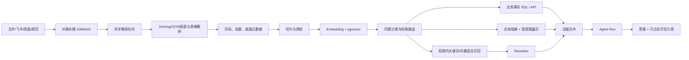

# 企业知识库能力评估与开源方案对照

更新日期：2026-08-04

## 1. 结论

当前知识库已经跑通企业试点所需的基础文档 RAG：文件入库、版本、可配置分块、中文关键词与向量混合召回、BGE Cross Encoder 重排、Agent Run 回答和切片级可信引用均已在当前开发实例实测。同时保留原有租户隔离、部门范围和引用二次校验。本轮没有继续扩展权限模型。

- 当前实例已有 1 个活动知识库、2 个 READY 文档和 2/2 个当前模型向量切片，语义覆盖率为 100%；
- AI Runtime 的本地 `BAAI/bge-small-zh-v1.5` Embedding 与 `BAAI/bge-reranker-base` 均为 `ready`，自然中文问句已通过混合召回和重排实测；
- 当前活动知识库的图谱状态为 `NOT_BUILT`，实体、关系、提及和证据均为 0，现有两跳关系扩展尚无真实图数据可用；
- PDF/DOCX 已能解析，但还没有 OCR、版面、表格和图片语义解析；
- 本地磁盘、同步解析模式适合开发或小规模试点，不满足多副本生产部署；
- 文档预览、切片质检、数据源连接器和知识效果运营仍需持续完善；这些能力在初版作为可选增强，不阻塞功能验证。

因此当前判断为：

| 使用阶段     | 结论     | 前提                                                        |
| ------------ | -------- | ----------------------------------------------------------- |
| 技术验证     | 可用     | 当前本地中文 Embedding、混合检索、重排和可信引用链路已跑通  |
| 小范围试点   | 条件可用 | 完成真实企业问题集验收、切换对象存储与持久异步任务          |
| 企业正式生产 | 暂不建议 | 还需 OCR/复杂文档、连接器、治理、监控、高可用与安全运营闭环 |

## 2. 已有能力

### 安全与权限

- PostgreSQL RLS 租户隔离；
- 知识库部门范围与子部门继承；
- 检索前权限过滤，禁止候选不会发送给 Reranker；
- 引用绑定文档版本与切片，并在查看原文时再次鉴权；
- 仅检索当前已发布且处理成功的版本。

### 文档与版本

- PDF、DOCX、TXT、Markdown 上传；
- 文档解析、确定性切片、内容哈希和 Token 估算；
- 草稿、发布、历史版本、回滚和向量重建；
- 解析或向量失败不会生成部分可用版本；
- 管理员可查看检索分数、检索模式、降级原因和语义覆盖率。

### 检索与回答

- 中文完整词、trigram、bigram 与模糊匹配；
- pgvector 精确/HNSW 向量召回；
- 知识库级全文、向量、混合模式与可配置语义/关键词加权融合；
- 可配置 TopK、最低相关度、单篇文档最多切片和 Cross-Encoder Reranker；
- 相关性阈值和无依据回答策略；
- Agent Run 对知识引用做可信校验。

## 3. 与成熟开源方案的差距

| 能力     | 当前项目                                      | RAGFlow / Dify / FastGPT 等成熟方案常见能力              | 优先级 |
| -------- | --------------------------------------------- | -------------------------------------------------------- | ------ |
| 文档解析 | PDF/DOCX/TXT/MD 基础正文                      | OCR、版面、表格、图片、公式、扫描件、解析预览            | P0     |
| 切片治理 | 可配置目标 Token/重叠的确定性切片             | 切片预览、手工编辑、父子分块、启停、合并拆分、元数据规则 | P0/P1  |
| 语义检索 | 本地 Embedding、加权混合召回、Reranker 已实测 | 多模型运营、查询改写、自动参数调优、规模化索引任务       | P1     |
| 效果评估 | 有离线验收工具                                | 可视化检索调试、测试集、Recall/MRR/nDCG、回归对比        | P0/P1  |
| 数据源   | 本地上传                                      | 网页、飞书文档、网盘、对象存储、数据库、定时同步         | P1     |
| 任务执行 | HTTP 请求内同步解析                           | 队列化解析、断点续传、批量重试、并发与速率控制           | P0     |
| 存储     | 本地文件系统                                  | S3/MinIO、生命周期、校验、病毒扫描、加密                 | P0     |
| 文档治理 | 状态和版本                                    | 负责人、标签、有效期、重复检测、审批发布、影响分析       | P1     |
| 权限     | 租户 + 部门范围，安全底座较强                 | 文档/目录/角色/人员级 ACL、连接器权限继承                | P0/P1  |
| 可观测性 | 基础探针和日志                                | 解析失败率、索引积压、命中率、无答案率、延迟和成本面板   | P1     |
| 引用体验 | 切片级可信引用                                | 原文件页码、版面坐标、高亮跳转、引用快照                 | P0/P1  |
| 生命周期 | 草稿/启用/归档                                | 草稿、测试、审核、灰度、发布、回滚、下线影响分析         | P1     |

与直接嵌入一个开源知识库相比，本项目已有的 RLS、企业组织树、Agent Run 和引用二次鉴权更适合作为“权威业务层”。成熟开源组件更适合承担解析和检索基础设施，而不应绕过本项目的租户和权限模型直接向员工提供结果。

## 4. 推荐架构

建议采用：

- **Docling**：作为 PDF、Office、OCR、版面和表格解析层；
- **pgvector**：继续作为租户数据边界内的向量存储；
- **BGE-M3 / Qwen Embedding**：中文与多语语义向量；
- **BGE Reranker / Qwen Reranker**：候选精排；
- **MinIO 或 S3**：原始文件、解析产物和版本快照；
- **现有 API/RLS**：继续作为唯一权限、发布、引用和审计入口。

RAGFlow 可以作为完整能力参考或独立解析/检索服务，但若直接替换本项目知识层，会引入第二套用户、租户、权限和索引生命周期，必须做严格的 ACL 映射与引用二次鉴权。Dify 和 FastGPT 更适合工作流/应用编排参考，采用前还需单独评估其许可证与多租户限制。

## 5. 初版运行约束与生产验收

### 初版运行约束

- 知识库可以空库启用，文档完成解析和分块后即可直接发布；
- 解析复核、治理审核、评测 Run、Embedding 覆盖和关系图谱状态不再作为知识库启用或文档发布的硬门禁；
- 文件必须通过 MIME/扩展名/大小校验和恶意文件扫描；
- 解析或切片失败必须可见、可重试，失败版本不能发布；Embedding 不可用时允许降级为关键词检索；
- 管理员能查看原文、页码、切片和各模型向量覆盖。

### 检索质量验收（非阻塞）

- 当前 Embedding 模型的向量覆盖率达到 100%，或管理员明确接受降级；
- 企业问题集达到约定的 Recall@5、MRR、nDCG 和无答案准确率；
- 任意越权命中或越权引用数量必须为 0；
- 供应商不可用时显示“仅词法检索”，不得标记为语义检索正常。

### 生产上线验收

- 原文件迁移至对象存储，解析和向量化迁移至持久化异步任务；
- 建立解析积压、失败率、检索 P95、无答案率和模型异常告警；
- 完成备份恢复、索引重建、模型切换和权限回归演练；
- 用真实企业文档和脱敏问题集验收，不能以空知识库或合成数据代替。

## 6. 本轮已补齐的管理闭环

- 草稿知识库可以由管理员在不对员工开放的前提下预览真实检索结果；
- 文档列表支持标题/文件名搜索，以及来源和处理状态筛选；
- 每个文档版本可以分页查看完整切片、章节、页码、Token、哈希和已生成的 Embedding 模型；
- PDF 新入库时保留页级正文，并在切片元数据中记录页码和解析器来源；
- 知识库状态可直接设为 `ACTIVE`；页面同时展示文档、向量和图谱诊断，但不再用诊断结果禁用保存；
- 可见范围改为显式选择“全企业”或“指定部门”，组织树加载失败时不会把空选择误保存为全企业；
- 同名部门显示层级路径，降低管理员选错范围的风险；
- 草稿预览、仅词法降级和 0% 向量覆盖均以明确文案呈现，不再产生“语义 RAG 已可用”的错误预期。

## 7. 本轮参考 Dify 的范围与差异

本轮参考 Dify 已公开的知识库体验，但没有复制 Dify 的完整平台：

- 已参考并实现：知识库级检索模式、向量/全文混合权重、TopK、Score Threshold、模型重排、分块目标与重叠、独立检索测试，以及工作流/Agent 中使用知识检索结果。
- 本项目的不同点：RAG 直接嵌入企业 `Agent Run`，文档版本、切片和回答引用形成同一条可验证血缘；PostgreSQL 仍是企业业务事实账本，不另建一套 Dify 应用、用户和知识生命周期。
- 尚未对齐 Dify：父子分块、通用元数据字段与过滤器、数据源插件生态、网页/云盘定时同步、批量索引运营、可视化评测数据集、应用编排画布和知识流水线。
- 关系检索不应照搬普通向量 RAG。项目、任务、负责人和交付状态优先查询 NestJS 业务 API/参数化 SQL；文档实体关系再走 PostgreSQL 受控图遍历；只有出现跨全库总结需求时才增加 Global GraphRAG。

Dify 参考资料：[分块和清洗](https://docs.dify.ai/en/cloud/use-dify/knowledge/create-knowledge/chunking-and-cleaning-text)、[索引与检索设置](https://docs.dify.ai/en/cloud/use-dify/knowledge/create-knowledge/setting-indexing-methods)、[元数据](https://docs.dify.ai/en/cloud/use-dify/knowledge/metadata)、[检索测试](https://docs.dify.ai/en/cloud/use-dify/knowledge/test-retrieval) 与 [Knowledge Retrieval 节点](https://docs.dify.ai/en/cloud/use-dify/nodes/knowledge-retrieval)。

## 8. 完整 RAG 与关系型检索方案

### 8.1 结论

本项目应实现“问题路由 + 多检索器 + 证据融合”，而不是把所有问题都发送到向量检索或自由生成 SQL：

| 问题类型 | 示例                                   | 权威检索路径                               | 原因                                                               |
| -------- | -------------------------------------- | ------------------------------------------ | ------------------------------------------------------------------ |
| 文档事实 | “差旅报销需要什么材料？”               | BM25/中文词法 + 向量 + RRF + Cross Encoder | 语义表达多样，答案来自文档片段                                     |
| 业务关系 | “哪个项目依赖供应商审批，负责人是谁？” | NestJS 受控业务 API / 参数化 SQL           | 项目、任务、负责人和状态已经是 PostgreSQL 权威事实，不应从文档猜测 |
| 文档关系 | “制度 A 与流程 B 有什么依赖？”         | 实体链接 + 1～2 跳受控图遍历 + 原文证据    | 需要跨片段关系，但每条边仍须有来源                                 |
| 全局分析 | “全部项目风险的共同主题是什么？”       | 结构化聚合 + GraphRAG 社区摘要/分层总结    | 属于全局综合问题，普通 top-k RAG 容易漏掉长尾事实                  |

Microsoft GraphRAG 也明确区分 Local、Global 和 DRIFT Search：Local 将实体图与原始文本片段结合，Global 对社区报告做 map-reduce，DRIFT 用全局信息扩展局部检索。因此 GraphRAG 应作为特定问题类型的检索器，而不是替代全部业务查询。参考：[Microsoft GraphRAG Query Overview](https://microsoft.github.io/graphrag/query/overview/) 和论文 [From Local to Global](https://arxiv.org/abs/2404.16130)。

### 8.2 PostgreSQL 优先的关系检索

当前仓库已经有知识实体、提及、关系、关系证据、本体、冲突治理、时态有效期和最多两跳的递归查询，并且这些表继承租户 RLS。第一阶段应继续使用 PostgreSQL：

1. 将 `Organization`、`User`、`AgentInstance`、`Strategy`、`Objective`、`Project`、`Task`、`Deliverable`、`Evidence` 映射为稳定业务实体，使用业务 UUID 作为 `externalKey`，不靠名称猜测同一实体。
2. 文档入库时用结构化抽取产生候选实体/关系；初版允许有来源证据的活动关系直接参与 1～2 跳检索，本体、谓词、类型、置信度和人工治理作为后续质量诊断与校正能力。
3. 查询规划器只输出受控意图、实体、谓词、方向、时间和组织范围；业务事实查询使用白名单模板/AST 构造器，不让模型直接执行任意 SQL。
4. 图遍历限制为最多两跳，路径上每条边必须有当前版本的可访问证据；租户、知识库和文档证据过滤继续执行，开放冲突和未发布本体仅作为诊断，不阻塞初版关系检索。
5. 最终排序融合实体匹配、路径置信度、来源权威性、时效、词法/向量分数和 Reranker 分数；答案同时返回业务记录引用和文档切片引用。

PostgreSQL 原生递归 CTE 可以处理直接与间接关系；pgvector 继续承担相似度检索，并且现有 exact 模式可作为小规模正确性基线。pgvector 官方说明 exact nearest-neighbor 提供完整召回，而 HNSW/IVFFlat 用召回率换速度；多租户共享近似索引还可能相互影响召回，因此切换 HNSW 前必须完成租户过滤与召回回归。参考：[PostgreSQL Recursive Queries](https://www.postgresql.org/docs/current/queries-with.html) 和 [pgvector](https://github.com/pgvector/pgvector)。

### 8.3 何时引入 Neo4j

Neo4j 官方 GraphRAG 已提供 Vector/Hybrid、VectorCypher/HybridCypher 和 Text2Cypher 等不同 Retriever，证明“语义命中后图遍历”和“结构化关系查询”应是独立路径。参考：[Neo4j GraphRAG User Guide](https://neo4j.com/docs/neo4j-graphrag-python/current/user_guide_rag.html)。

当前阶段不建议让 Neo4j 成为第二个权威账本，因为这会复制租户、ACL、版本和审计状态。满足以下条件时，可以把 Neo4j作为由 Outbox 驱动的只读派生图：

- 大量查询需要三跳以上遍历、路径模式匹配、社区检测或图算法；
- PostgreSQL 递归查询在真实规模和 P95 门禁下已成为明确瓶颈；
- 已完成增量同步、删除传播、版本水位、ACL 投影、重建与灾备演练；
- 所有 Neo4j 结果仍回到 NestJS API 做最终授权和来源校验。

### 8.4 推荐实施顺序

1. 用真实部门资料和问题集完成混合检索、无答案和回归门禁，并按需要从当前中文 n-gram 基线升级为中文 BM25。
2. 增加父子分块、切片预览/重建和自定义元数据过滤，覆盖长制度、长报告与多版本资料。
3. 发布最小企业本体，把组织、战略、项目、任务、交付物和证据的业务 UUID 接入知识实体。
4. 用 1～2 跳关系问题集验收路径准确率和证据完整率，再按需要补齐本体发布、冲突校正和时态治理。
5. 增加问题分类器和白名单查询规划器，融合文档检索、业务 API/SQL 和图检索结果。
6. 只有出现全库综合问题的明确需求后，再增加社区摘要/Global GraphRAG；只有 PostgreSQL 图遍历达到性能边界后，再评估 Neo4j 派生读模型。

关系检索的生产质量验收至少包括：关系问题准确率、路径精确率、证据覆盖率、实体消歧准确率、过期关系拒绝率、无答案准确率、越权命中为 0，以及按问题类型统计的 P95 延迟与成本；初版不把这些指标做成运行时硬门禁。
