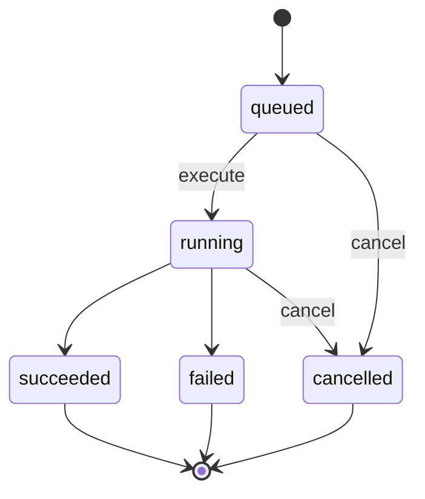

# Enterprise AI Runtime

企业 AI 协同平台的独立模型运行服务。当前实现提供可测试的 Run 执行链、OpenAI-compatible 与 Manus API v2 适配器、开发用内存存储与生产 PostgreSQL RunStore；默认配置为 `noop`，不会发起任何外部模型请求。NestJS API 与桌面端是否调用本服务由上层编排链路决定。

## 安装与运行

要求 Python 3.12 或更高版本。

```bash
# uv
uv sync --extra dev
uv run uvicorn enterprise_ai_runtime.main:app --reload --port 8100

# pip
python -m venv .venv
python -m pip install -e ".[dev]"
uvicorn enterprise_ai_runtime.main:app --reload --port 8100
```

质量检查：

```bash
uv run pytest
uv run ruff check .
```

## 安全配置

开发或测试启动时，模块会查找仓库根 `pnpm-workspace.yaml`，然后从同目录 `.env` 非覆盖式加载 `AI_RUNTIME_*` 与 `MANUS_*` 变量。数据库、认证等其他服务的变量不会进入 AI Runtime 进程；已经由当前进程、容器或 Secret 注入的值优先，dotenv 不会覆盖。`AI_RUNTIME_ENVIRONMENT=production` 时完全跳过 dotenv；dotenv 文件自身也不允许把进程切换为生产模式。仓库根 `.env.example` 仅是配置清单，不得填真实密钥。

| 变量                                   | 默认值                 | 说明                                             |
| -------------------------------------- | ---------------------- | ------------------------------------------------ |
| `AI_RUNTIME_ENVIRONMENT`               | `development`          | `development`、`test` 或 `production`            |
| `AI_RUNTIME_DRIVER`                    | `noop`                 | `noop`、`openai_compatible` 或 `manus`           |
| `AI_RUNTIME_STORE_DRIVER`              | `memory`               | `memory` 或持久化适配器 `postgres`               |
| `AI_RUNTIME_POSTGRES_DSN`              | 无                     | PostgreSQL RunStore 专用连接，选择 postgres 必填 |
| `AI_RUNTIME_SERVICE_TOKEN`             | 无                     | API→Runtime Bearer 凭据，生产至少 32 字符        |
| `AI_RUNTIME_OPENAI_BASE_URL`           | 无                     | OpenAI-compatible `/v1` 根地址                   |
| `AI_RUNTIME_OPENAI_API_KEY`            | 无                     | OpenAI-compatible Secret                         |
| `AI_RUNTIME_OPENAI_MODEL`              | 无                     | 模型或部署名称                                   |
| `AI_RUNTIME_EMBEDDING_DRIVER`          | `disabled`             | `disabled` 或 `openai_compatible`                |
| `AI_RUNTIME_EMBEDDING_BASE_URL`        | 无                     | OpenAI-compatible Embedding API 根地址           |
| `AI_RUNTIME_EMBEDDING_API_KEY`         | 无                     | Embedding Secret，仅供本服务使用                 |
| `AI_RUNTIME_EMBEDDING_MODEL`           | 无                     | Embedding 模型或部署名称                         |
| `AI_RUNTIME_EMBEDDING_DIMENSIONS`      | `1536`                 | 固定为 1536，与 pgvector 数据契约一致            |
| `AI_RUNTIME_EMBEDDING_TIMEOUT_SECONDS` | `30`                   | Embedding 超时，允许 0.1～300 秒                 |
| `AI_RUNTIME_RERANK_DRIVER`             | `disabled`             | `disabled` 或 `cohere_compatible`                |
| `AI_RUNTIME_RERANK_BASE_URL`           | 无                     | Cohere-compatible Rerank API 根地址              |
| `AI_RUNTIME_RERANK_API_KEY`            | 无                     | Rerank Secret，仅供本服务使用                    |
| `AI_RUNTIME_RERANK_MODEL`              | 无                     | Rerank 模型或部署名称                            |
| `AI_RUNTIME_RERANK_TIMEOUT_SECONDS`    | `30`                   | Rerank 超时，允许 0.1～300 秒                    |
| `MANUS_API_KEY`                        | 无                     | Manus Secret，仅供后端运行时使用                 |
| `MANUS_API_BASE_URL`                   | `https://api.manus.ai` | 固定为 Manus 官方 HTTPS API 根地址               |
| `MANUS_AGENT_PROFILE`                  | `manus-1.6-lite`       | `manus-1.6`、`manus-1.6-lite` 或 `manus-1.6-max` |
| `MANUS_PROJECT_ID`                     | 无                     | 可选的已批准 Manus Project ID                    |
| `MANUS_POLL_INTERVAL_SECONDS`          | `2`                    | 状态轮询间隔，允许 1～60 秒                      |
| `MANUS_MAX_WAIT_SECONDS`               | `120`                  | 不小于轮询间隔，最大 3600 秒                     |

安全规则：

- `noop` 是默认驱动且不出网；显式执行会形成 `RUNTIME_NOT_CONFIGURED` 的 `failed` 记录，绝不伪装成模型成功。
- `AI_RUNTIME_ENVIRONMENT=production` 时禁止使用 `noop`，服务会在启动时失败。
- 生产环境禁止 `memory` RunStore；选择 `postgres` 时必须提供专用 `AI_RUNTIME_POSTGRES_DSN`，并显式使用 `sslmode=require`、`verify-ca` 或 `verify-full` 强制 TLS；Run 数据通过租户上下文和 FORCE RLS 隔离。
- 生产环境必须提供至少 32 字符的 `AI_RUNTIME_SERVICE_TOKEN`；所有 `/internal/*` 接口校验 Bearer 凭据，健康探针保持可独立访问。
- `openai_compatible` 缺少 URL、API Key 或模型名称时启动失败。
- `manus` 缺少 `MANUS_API_KEY` 时启动失败；API Base URL 只接受 `https://api.manus.ai`，防止将高权限密钥发送到可配置的第三方主机。
- Embedding 与 Rerank 独立于对话 Run 驱动，默认均为 `disabled`；启用任一能力但缺少 URL、API Key 或模型名称时启动失败。
- Embedding 输出必须恰好 1536 维、覆盖全部输入索引、仅含有限数且不是零向量；Rerank 必须恰好返回 `top_n` 个、只引用请求内唯一索引、分数位于 0～1 并按相关性降序排列。
- 生产环境 Provider URL 必须使用 HTTPS，URL 中不得包含用户名或密码。
- OpenAI-compatible Key、Embedding Key 与 Rerank Key 只进入各自的 `Authorization` 请求头；Manus Key 只进入 `x-manus-api-key`。Provider 异常均经过脱敏映射，不返回响应正文、密钥或底层异常。
- Provider 就绪检查只检查本地配置与生命周期，不发起可能计费的探测请求。

## API 与执行语义

- `GET /health/live`：进程存活检查。
- `GET /health/ready`：RunStore、Runtime 和已启用知识 Provider 的本地就绪检查；默认关闭的知识能力不阻断就绪。
- `GET /health/dependencies`：独立返回 RunStore、模型、Embedding 和 Reranker 的 `ready/degraded/disabled` 状态及降级方式；`external_connectivity_verified=false` 表示该轻量检查不构成真实供应商调用验收。
- `POST /internal/v1/runs`：创建 `queued` Run，返回 HTTP 202。
- `GET /internal/v1/runs/{run_id}`：读取租户内 Run。
- `POST /internal/v1/runs/{run_id}/execute`：显式执行 Run。
- `POST /internal/v1/runs/{run_id}/cancel`：取消 `queued/running` Run。
- `GET /internal/v1/knowledge/capabilities`：返回 Embedding/Rerank 的 `disabled`、`ready` 或 `not_ready` 本地状态，不做计费探测。
- `POST /internal/v1/knowledge/embeddings`：调用独立 OpenAI-compatible `/embeddings`。
- `POST /internal/v1/knowledge/rerank`：调用独立 Cohere-compatible `/rerank`。

所有响应都返回 `X-Request-ID`。调用方传入的合法 Request ID 会向 Provider 透传；缺失或不合法时服务生成 UUID。配置服务凭据后，全部内部接口还要求 `Authorization: Bearer <AI_RUNTIME_SERVICE_TOKEN>`。所有 Run 接口要求 `X-Tenant-ID`，创建接口还会检查请求头与请求体 `tenant_id` 一致。跨租户读取、执行和取消统一返回 404，避免泄露 Run 是否存在。

三个知识接口同样要求 `X-Tenant-ID`；Embedding/Rerank 还会严格检查请求头与请求体 `tenant_id` 一致。请求不会把租户 ID 或供应商响应正文外发/回传。内部契约为：

```json
POST /internal/v1/knowledge/embeddings
{"tenant_id":"tenant-demo","inputs":["第一段","第二段"]}
-> {"model":"embed-model","dimensions":1536,"items":[{"index":0,"embedding":[0.1]}],"usage":{"input_tokens":8,"total_tokens":8}}

POST /internal/v1/knowledge/rerank
{"tenant_id":"tenant-demo","query":"问题","documents":[{"id":"chunk-1","text":"候选内容"}],"top_n":1}
-> {"model":"rerank-model","results":[{"id":"chunk-1","index":0,"relevance_score":0.93}]}
```

示例中的 Embedding 数组为便于阅读而省略；真实响应始终包含 1536 个分量。错误统一返回 `detail: {code, message, retryable}`：上游超时为 HTTP 504，429 保持 HTTP 429，鉴权、请求拒绝、5xx 或无效结构通过 502 脱敏返回；能力未启用时为 503 `KNOWLEDGE_CAPABILITY_DISABLED`。

执行接口是幂等的：

- `queued`：原子迁移到 `running`，调用 Runtime 一次；
- `running`：直接返回当前记录，不重复调用；
- `succeeded/failed/cancelled`：直接返回终态记录；
- 并发执行或执行/取消竞争：只有一个合法状态迁移获胜。

状态机：



Run 会保存 `output`、`usage`、脱敏 `error`、`execution_request_id`、`started_at`、`finished_at` 和递增 `version`。OpenAI-compatible 请求使用 Run 的 `timeout_ms` 与 `max_output_tokens`；Provider 返回后再次核对输入 token、输出 token、工具调用和成本预算。任何可观测到的超限都会形成明确的 `*_BUDGET_EXCEEDED` 失败记录。标准 OpenAI-compatible 响应不包含价格时 `cost_micros` 为 0，生产接入前需增加受版本控制的模型计价表或使用 Provider 返回的可信成本字段。Manus 的计量边界见下文。

HTTP 边界会传播 `X-Request-ID`、`X-Correlation-ID` 和合法 W3C `traceparent`，并输出不含 query、正文、Prompt、Secret 或上游响应的单行 JSON 访问日志。Runtime 已接入 OpenTelemetry SDK、OTLP/HTTP Trace/Metric Exporter、FastAPI、HTTPX 与 asyncpg 埋点；生产默认将遥测设为 readiness 必需能力，未配置 Collector 时返回 503。共享开发 dotenv 应使用 `AI_RUNTIME_OTEL_*` 隔离别名，独立生产进程也可直接注入标准 `OTEL_*`。Header 仅进入 Exporter，不会出现在状态、日志或异常中；Collector/APM 在线采集和跨服务 Trace 仍须以部署环境证据验收。

创建和执行示例：

```bash
curl -X POST http://localhost:8100/internal/v1/runs \
  -H 'Content-Type: application/json' \
  -H 'X-Tenant-ID: tenant-demo' \
  -H 'X-Request-ID: req-create-001' \
  -d '{
    "tenant_id": "tenant-demo",
    "principal": {
      "principal_id": "user-001",
      "principal_type": "user",
      "roles": ["member"],
      "scopes": ["agent:run"]
    },
    "agent_id": "meeting-assistant",
    "agent_version": "2026-07-15.1",
    "input": {
      "messages": [{"role": "user", "content": "整理本周项目进展"}],
      "variables": {"locale": "zh-CN"}
    },
    "budget": {
      "max_input_tokens": 16000,
      "max_output_tokens": 2000,
      "max_tool_calls": 0,
      "timeout_ms": 60000,
      "max_cost_micros": 1000000
    },
    "metadata": {"source": "desktop"}
  }'

curl -X POST http://localhost:8100/internal/v1/runs/<run_id>/execute \
  -H 'X-Tenant-ID: tenant-demo' \
  -H 'X-Request-ID: req-execute-001'
```

附件只接受平台内部 `asset_id`。当前 Provider Runtime 尚未实现内部资产解析，包含附件的 Run 会以 `UNSUPPORTED_RUNTIME_INPUT` 失败，不会直接抓取任意外部 URL。

## OpenAI-compatible 边界

适配器调用非流式 `POST {BASE_URL}/chat/completions`，发送结构化消息、模型、`max_tokens`、超时和 Request ID。HTTP/Provider 错误映射如下：

| 场景                | Run error code                   | 可重试 |
| ------------------- | -------------------------------- | ------ |
| 请求超时            | `PROVIDER_TIMEOUT`               | 是     |
| 401/403             | `PROVIDER_AUTHENTICATION_FAILED` | 否     |
| 429                 | `PROVIDER_RATE_LIMITED`          | 是     |
| 400/404/405/409/422 | `PROVIDER_REQUEST_REJECTED`      | 否     |
| 网络错误或 5xx      | `PROVIDER_UNAVAILABLE`           | 是     |
| JSON/响应结构不合法 | `PROVIDER_INVALID_RESPONSE`      | 是     |
| 未分类 Runtime 异常 | `RUNTIME_EXECUTION_FAILED`       | 是     |

## Manus API v2 边界

`manus` 驱动不会复用账号级 `agent-default-main_task`。每个本地 Run 都执行以下隔离流程：

1. `POST {MANUS_API_BASE_URL}/v2/task.create` 创建独立任务；
2. 请求固定设置 `share_visibility=private`、`hide_in_task_list=true`、`interactive_mode=false`，并显式传入空 `connectors`，不继承 Manus 账号或 Project 的默认连接器；
3. 任务标题为 `enterprise-run-<run_id>`，只包含本地 Run UUID，便于事后对账；
4. `GET /v2/task.listMessages` 轮询独立 `task_id`，每次强校验顶层任务身份、事件唯一性、
   时间顺序和终态答案，不与其他租户或会话共享上下文；
5. `running` 继续轮询，`stopped` 读取最新 `assistant_message`，`waiting` 形成 `PROVIDER_INTERACTION_REQUIRED`，`error` 形成 `PROVIDER_TASK_FAILED`；
6. 本地超时、取消或任务解析失败后，best-effort 调用 `POST /v2/task.stop`，避免远程任务继续运行和计费。

实际最长等待为 `min(Run.budget.timeout_ms, MANUS_MAX_WAIT_SECONDS)`。HTTP 429 会进行有限次指数退避并加入抖动，耗尽后形成 `PROVIDER_RATE_LIMITED`。新建 Task 的事件流可能短暂不可见；读取端会对 404、`not_found` 与 `failed_precondition` 进行最多五次短退避。`task.listMessages` 的无效 JSON、缺失消息数组、不完整状态或答案事件也会在同一 Task 内进行有限次退避重读，任一结构完整的轮询会清零连续异常计数；耗尽后形成 `PROVIDER_INVALID_RESPONSE` 并 best-effort 停止远程任务。所有重读始终复用已经取得的 `task_id`，不会重复创建远程任务。阶段诊断只记录固定的读取阶段、次数与退避时间，不记录 Task ID、响应正文、请求头或密钥。轮询只请求非 verbose 的最近事件，不读取或返回 Manus 内部错误正文。Runtime readiness 使用不创建生成任务的 `GET /v2/task.list?limit=1` 验证真实凭据和响应契约，并缓存成功/失败结果，不能再由“配置了 Key”直接推断模型可用。

Manus v2 当前没有公开的请求幂等键。`task.create` 在响应丢失或超时后存在“远程已创建、本地未收到 task_id”的不确定窗口，调用方不得立即盲目新建 Run 重试，否则可能重复执行和扣费。生产编排需要持久化 dispatch 状态，并使用唯一 Run 标题和任务列表进行 reconciliation；标题只辅助对账，不构成供应商强幂等。

Manus 当前返回 account credits，而不是可直接映射的输入/输出 token 和货币 micros。适配器明确将现有 `RunUsage` 数值保留为 0，不伪造计量。生产启用成本预算前必须扩展 provider-specific usage、credit 计价和对账模型。`max_input_tokens`、`max_output_tokens` 与 `max_cost_micros` 因此不能作为 Manus 的供应商侧硬限制。

MVP 显式传入空 `connectors`，并在任务指令中禁止外部连接器、网站、文件、skills 与 tools；但 Manus v2 当前没有在此调用面提供可验证的“禁用全部内建 skills/tools”硬开关，且本适配器无法从返回值准确计量工具调用。因此 `max_tool_calls=0` 也不是供应商侧硬限制。生产环境应使用无默认连接器/技能的隔离账号或受控 Project，并在供应商能力允许时增加服务端 allowlist 和可核验的工具审计。

所有发送给 Manus 的消息都离开本平台安全边界。生产接入前还必须完成企业数据分级、脱敏、供应商协议、地域与留存策略审查；不得把未授权知识库、附件或敏感聊天直接外发。

## 当前边界与下一步

`InMemoryRunStore` 仅用于开发，进程重启会丢失数据，并受生产启动门禁保护。PostgreSQL RunStore 已实现租户 RLS、状态 CAS、受限 capability role、服务关闭清理及恢复门禁；API 与 Runtime 之间已支持共享 Bearer 服务凭据。进入多实例生产环境前仍需补齐执行租约/接管、Runtime 自身的队列与 Outbox、工作负载身份或 mTLS、供应商计价对账和远端 Manus Task 身份的持久化恢复。OpenAI-compatible 路由可把真实增量传到 API 的事件流；Manus 使用异步任务轮询，因此明确标记为 `terminal_only`，桌面端仍通过同一游标协议获得终态而不会伪造 token 流。
